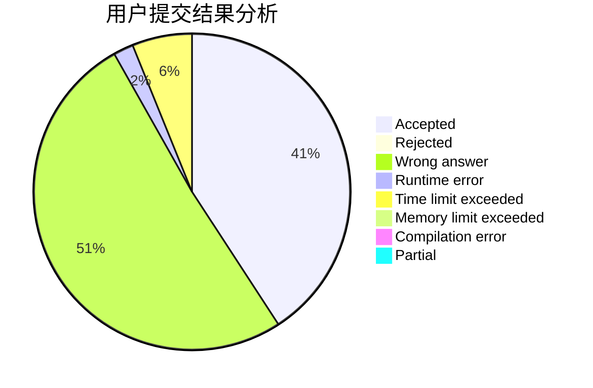
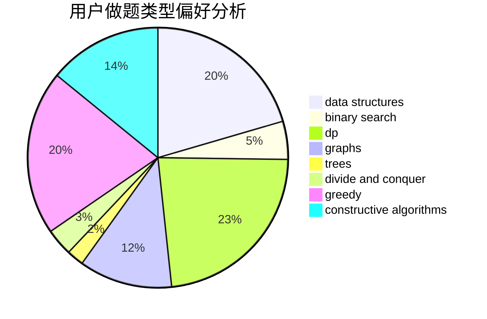
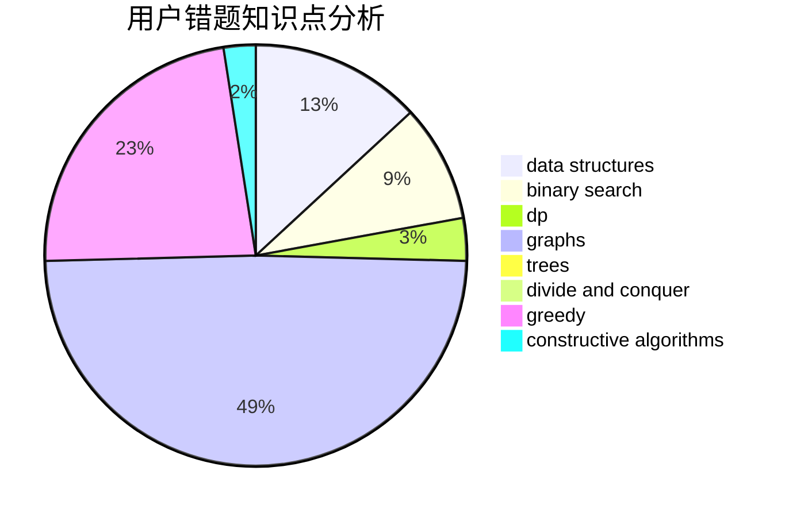

# ArcCCcp
<!-- tabs:start -->
#### **用户提交结果分析**

#### **用户做题类型偏好分析**

#### **用户错题知识点分析**

<!-- tabs:end -->
# 推荐题目
[Fox and Perfect Sets](http://codeforces.com/problemset/problem/388/D)		math		  
[Glider](http://codeforces.com/problemset/problem/1041/D)		binary search,
                        data structures,
                        two pointers		  
[Sereja and Dividing](http://codeforces.com/problemset/problem/380/E)		data structures		  
[Bear in the Field](http://codeforces.com/problemset/problem/385/E)		math,
                        matrices		  
[Tokitsukaze, CSL and Stone Game](http://codeforces.com/problemset/problem/1190/B)		games		  
[Sereja and Cinema](http://codeforces.com/problemset/problem/380/D)		combinatorics,
                        math		  
[Fox and Meteor Shower](http://codeforces.com/problemset/problem/388/E)		geometry		  
[Little Elephant and Broken Sorting](http://codeforces.com/problemset/problem/258/D)		dp,
                        math,
                        probabilities		  
[Sereja and Prefixes](http://codeforces.com/problemset/problem/380/A)		binary search,
                        brute force		  
[SMSC](http://codeforces.com/problemset/problem/292/A)		implementation		  
<!-- tabs:start -->
#### **data structures**
[Fox and Perfect Sets](http://codeforces.com/problemset/problem/1041/D)		binary search,
                        data structures,
                        two pointers		  
[Glider](http://codeforces.com/problemset/problem/380/E)		data structures		  
[Sereja and Dividing](http://codeforces.com/problemset/problem/383/A)		data structures,
                        greedy		  
[Bear in the Field](http://codeforces.com/problemset/problem/1223/F)		data structures,
                        divide and conquer,
                        dp,
                        hashing		  
[Tokitsukaze, CSL and Stone Game](http://codeforces.com/problemset/problem/380/C)		data structures,
                        schedules		  
[Sereja and Cinema](http://codeforces.com/problemset/problem/383/C)		data structures,
                        dfs and similar,
                        trees		  
[Fox and Meteor Shower](http://codeforces.com/problemset/problem/379/F)		data structures,
                        divide and conquer,
                        trees		  
[Little Elephant and Broken Sorting](http://codeforces.com/problemset/problem/1326/E)		data structures,
                        two pointers		  
[Sereja and Prefixes](http://codeforces.com/problemset/problem/1512/D)		constructive algorithms,
                        data structures,
                        greedy		  
[SMSC](http://codeforces.com/problemset/problem/1327/F)		bitmasks,
                        combinatorics,
                        data structures,
                        dp,
                        two pointers		  
#### **binary search**
[Fox and Perfect Sets](http://codeforces.com/problemset/problem/1041/D)		binary search,
                        data structures,
                        two pointers		  
[Glider](http://codeforces.com/problemset/problem/380/A)		binary search,
                        brute force		  
[Sereja and Dividing](http://codeforces.com/problemset/problem/1492/C)		binary search,
                        data structures,
                        dp,
                        greedy,
                        two pointers		  
[Bear in the Field](http://codeforces.com/problemset/problem/1463/D)		binary search,
                        constructive algorithms,
                        greedy,
                        two pointers		  
[Tokitsukaze, CSL and Stone Game](http://codeforces.com/problemset/problem/1490/G)		binary search,
                        data structures,
                        math		  
[Sereja and Cinema](http://codeforces.com/problemset/problem/1479/D)		binary search,
                        bitmasks,
                        brute force,
                        data structures,
                        probabilities,
                        trees		  
[Fox and Meteor Shower](http://codeforces.com/problemset/problem/1436/E)		binary search,
                        data structures,
                        two pointers		  
[Little Elephant and Broken Sorting](http://codeforces.com/problemset/problem/1461/D)		binary search,
                        brute force,
                        data structures,
                        divide and conquer,
                        implementation,
                        sortings		  
[Sereja and Prefixes](http://codeforces.com/problemset/problem/1493/C)		binary search,
                        brute force,
                        constructive algorithms,
                        greedy,
                        strings		  
[SMSC](http://codeforces.com/problemset/problem/1487/D)		binary search,
                        brute force,
                        math,
                        number theory		  
#### **dp**
[Fox and Perfect Sets](http://codeforces.com/problemset/problem/258/D)		dp,
                        math,
                        probabilities		  
[Glider](http://codeforces.com/problemset/problem/379/D)		bitmasks,
                        brute force,
                        dp		  
[Sereja and Dividing](http://codeforces.com/problemset/problem/1223/F)		data structures,
                        divide and conquer,
                        dp,
                        hashing		  
[Bear in the Field](http://codeforces.com/problemset/problem/386/C)		dp,
                        strings,
                        two pointers		  
[Tokitsukaze, CSL and Stone Game](http://codeforces.com/problemset/problem/1305/G)		bitmasks,
                        brute force,
                        dp,
                        dsu,
                        graphs		  
[Sereja and Cinema](http://codeforces.com/problemset/problem/37/D)		combinatorics,
                        dp,
                        math		  
[Fox and Meteor Shower](http://codeforces.com/problemset/problem/382/E)		combinatorics,
                        dp		  
[Little Elephant and Broken Sorting](http://codeforces.com/problemset/problem/383/E)		combinatorics,
                        divide and conquer,
                        dp		  
[Sereja and Prefixes](http://codeforces.com/problemset/problem/1327/F)		bitmasks,
                        combinatorics,
                        data structures,
                        dp,
                        two pointers		  
[SMSC](http://codeforces.com/problemset/problem/383/D)		dp		  
#### **graph**
[Fox and Perfect Sets](http://codeforces.com/problemset/problem/167/E)		dfs and similar,
                        graphs,
                        math,
                        matrices		  
[Glider](http://codeforces.com/problemset/problem/1070/I)		flows,
                        graph matchings,
                        graphs		  
[Sereja and Dividing](http://codeforces.com/problemset/problem/388/B)		bitmasks,
                        constructive algorithms,
                        graphs,
                        implementation,
                        math		  
[Bear in the Field](http://codeforces.com/problemset/problem/1305/G)		bitmasks,
                        brute force,
                        dp,
                        dsu,
                        graphs		  
[Tokitsukaze, CSL and Stone Game](http://codeforces.com/problemset/problem/380/B)		graphs,
                        implementation		  
[Sereja and Cinema](http://codeforces.com/problemset/problem/387/D)		graph matchings		  
[Fox and Meteor Shower](http://codeforces.com/problemset/problem/1325/F)		constructive algorithms,
                        dfs and similar,
                        graphs,
                        greedy		  
[Little Elephant and Broken Sorting](http://codeforces.com/problemset/problem/1494/F)		brute force,
                        constructive algorithms,
                        dfs and similar,
                        graphs,
                        implementation		  
[Sereja and Prefixes](http://codeforces.com/problemset/problem/1487/C)		brute force,
                        constructive algorithms,
                        dfs and similar,
                        graphs,
                        greedy,
                        implementation,
                        math		  
[SMSC](http://codeforces.com/problemset/problem/1437/C)		dp,
                        flows,
                        graph matchings,
                        greedy,
                        math,
                        sortings		  
#### **trees**
[Fox and Perfect Sets](http://codeforces.com/problemset/problem/383/C)		data structures,
                        dfs and similar,
                        trees		  
[Glider](http://codeforces.com/problemset/problem/379/F)		data structures,
                        divide and conquer,
                        trees		  
[Sereja and Dividing](http://codeforces.com/problemset/problem/1325/C)		constructive algorithms,
                        dfs and similar,
                        greedy,
                        trees		  
[Bear in the Field](http://codeforces.com/problemset/problem/1363/E)		dfs and similar,
                        dp,
                        greedy,
                        trees		  
[Tokitsukaze, CSL and Stone Game](http://codeforces.com/problemset/problem/1479/D)		binary search,
                        bitmasks,
                        brute force,
                        data structures,
                        probabilities,
                        trees		  
[Sereja and Cinema](http://codeforces.com/problemset/problem/1511/C)		brute force,
                        data structures,
                        implementation,
                        trees		  
[Fox and Meteor Shower](http://codeforces.com/problemset/problem/1499/F)		combinatorics,
                        dfs and similar,
                        dp,
                        trees		  
[Little Elephant and Broken Sorting](http://codeforces.com/problemset/problem/1491/E)		brute force,
                        dfs and similar,
                        divide and conquer,
                        number theory,
                        trees		  
[Sereja and Prefixes](http://codeforces.com/problemset/problem/1466/D)		data structures,
                        greedy,
                        sortings,
                        trees		  
[SMSC](http://codeforces.com/problemset/problem/1495/D)		combinatorics,
                        dfs and similar,
                        graphs,
                        math,
                        shortest paths,
                        trees		  
#### **divide and conquer**
[Fox and Perfect Sets](http://codeforces.com/problemset/problem/1223/F)		data structures,
                        divide and conquer,
                        dp,
                        hashing		  
[Glider](http://codeforces.com/problemset/problem/379/F)		data structures,
                        divide and conquer,
                        trees		  
[Sereja and Dividing](http://codeforces.com/problemset/problem/383/E)		combinatorics,
                        divide and conquer,
                        dp		  
[Bear in the Field](http://codeforces.com/problemset/problem/1461/D)		binary search,
                        brute force,
                        data structures,
                        divide and conquer,
                        implementation,
                        sortings		  
[Tokitsukaze, CSL and Stone Game](http://codeforces.com/problemset/problem/1466/G)		combinatorics,
                        divide and conquer,
                        hashing,
                        math,
                        string suffix structures,
                        strings		  
[Sereja and Cinema](http://codeforces.com/problemset/problem/1490/D)		dfs and similar,
                        divide and conquer,
                        implementation		  
[Fox and Meteor Shower](https://codeforces.com/contest/1483/problem/C)		data structures,
                        divide and conquer,
                        dp		  
[Little Elephant and Broken Sorting](http://codeforces.com/problemset/problem/1491/E)		brute force,
                        dfs and similar,
                        divide and conquer,
                        number theory,
                        trees		  
[Sereja and Prefixes](http://codeforces.com/problemset/problem/1303/G)		data structures,
                        divide and conquer,
                        geometry,
                        trees		  
[SMSC](http://codeforces.com/problemset/problem/1494/D)		constructive algorithms,
                        data structures,
                        dfs and similar,
                        divide and conquer,
                        dsu,
                        greedy,
                        sortings,
                        trees		  
#### **greedy**
[Fox and Perfect Sets](http://codeforces.com/problemset/problem/383/A)		data structures,
                        greedy		  
[Glider](http://codeforces.com/problemset/problem/37/B)		greedy,
                        implementation		  
[Sereja and Dividing](http://codeforces.com/problemset/problem/381/B)		greedy,
                        implementation,
                        sortings		  
[Bear in the Field](http://codeforces.com/problemset/problem/388/C)		games,
                        greedy,
                        sortings		  
[Tokitsukaze, CSL and Stone Game](http://codeforces.com/problemset/problem/389/A)		greedy,
                        math		  
[Sereja and Cinema](http://codeforces.com/problemset/problem/381/A)		greedy,
                        implementation,
                        two pointers		  
[Fox and Meteor Shower](http://codeforces.com/problemset/problem/387/C)		greedy,
                        implementation		  
[Little Elephant and Broken Sorting](http://codeforces.com/problemset/problem/389/B)		greedy,
                        implementation		  
[Sereja and Prefixes](http://codeforces.com/problemset/problem/388/A)		greedy,
                        sortings		  
[SMSC](http://codeforces.com/problemset/problem/1325/C)		constructive algorithms,
                        dfs and similar,
                        greedy,
                        trees		  
#### **constructive algorithms**
[Fox and Perfect Sets](http://codeforces.com/problemset/problem/388/B)		bitmasks,
                        constructive algorithms,
                        graphs,
                        implementation,
                        math		  
[Glider](https://codeforces.com/contest/1262/problem/C)		constructive algorithms		  
[Sereja and Dividing](http://codeforces.com/problemset/problem/1325/C)		constructive algorithms,
                        dfs and similar,
                        greedy,
                        trees		  
[Bear in the Field](http://codeforces.com/problemset/problem/1325/F)		constructive algorithms,
                        dfs and similar,
                        graphs,
                        greedy		  
[Tokitsukaze, CSL and Stone Game](http://codeforces.com/problemset/problem/1494/F)		brute force,
                        constructive algorithms,
                        dfs and similar,
                        graphs,
                        implementation		  
[Sereja and Cinema](http://codeforces.com/problemset/problem/1512/D)		constructive algorithms,
                        data structures,
                        greedy		  
[Fox and Meteor Shower](http://codeforces.com/problemset/problem/1493/A)		constructive algorithms,
                        greedy		  
[Little Elephant and Broken Sorting](http://codeforces.com/problemset/problem/1463/D)		binary search,
                        constructive algorithms,
                        greedy,
                        two pointers		  
[Sereja and Prefixes](https://codeforces.com/contest/1456/problem/B)		bitmasks,
                        brute force,
                        constructive algorithms		  
[SMSC](http://codeforces.com/problemset/problem/1492/D)		bitmasks,
                        constructive algorithms,
                        greedy,
                        math		  
#### **sortings**
[Fox and Perfect Sets](http://codeforces.com/problemset/problem/381/B)		greedy,
                        implementation,
                        sortings		  
[Glider](http://codeforces.com/problemset/problem/388/C)		games,
                        greedy,
                        sortings		  
[Sereja and Dividing](http://codeforces.com/problemset/problem/37/A)		sortings		  
[Bear in the Field](http://codeforces.com/problemset/problem/388/A)		greedy,
                        sortings		  
[Tokitsukaze, CSL and Stone Game](https://codeforces.com/contest/1496/problem/C)		geometry,
                        greedy,
                        math,
                        sortings		  
[Sereja and Cinema](http://codeforces.com/problemset/problem/1495/A)		geometry,
                        greedy,
                        math,
                        sortings		  
[Fox and Meteor Shower](http://codeforces.com/problemset/problem/1497/A)		brute force,
                        data structures,
                        greedy,
                        sortings		  
[Little Elephant and Broken Sorting](http://codeforces.com/problemset/problem/1427/A)		math,
                        sortings		  
[Sereja and Prefixes](http://codeforces.com/problemset/problem/1461/D)		binary search,
                        brute force,
                        data structures,
                        divide and conquer,
                        implementation,
                        sortings		  
[SMSC](http://codeforces.com/problemset/problem/1437/C)		dp,
                        flows,
                        graph matchings,
                        greedy,
                        math,
                        sortings		  
<!-- tabs:end -->
