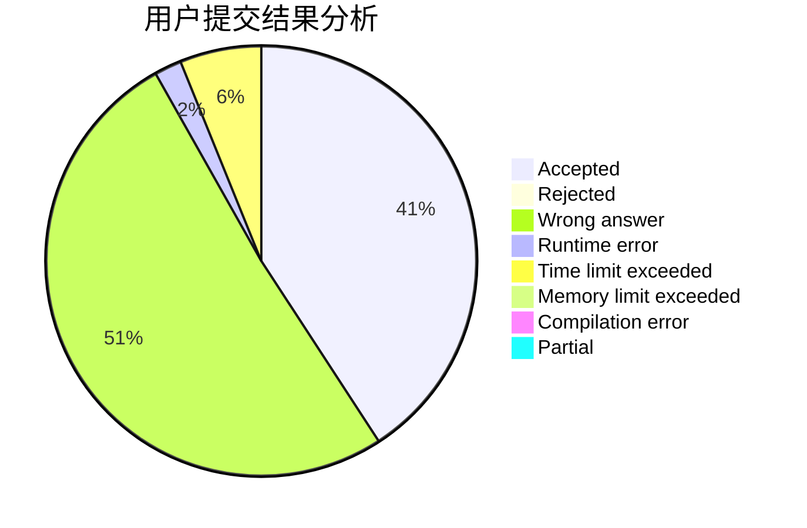
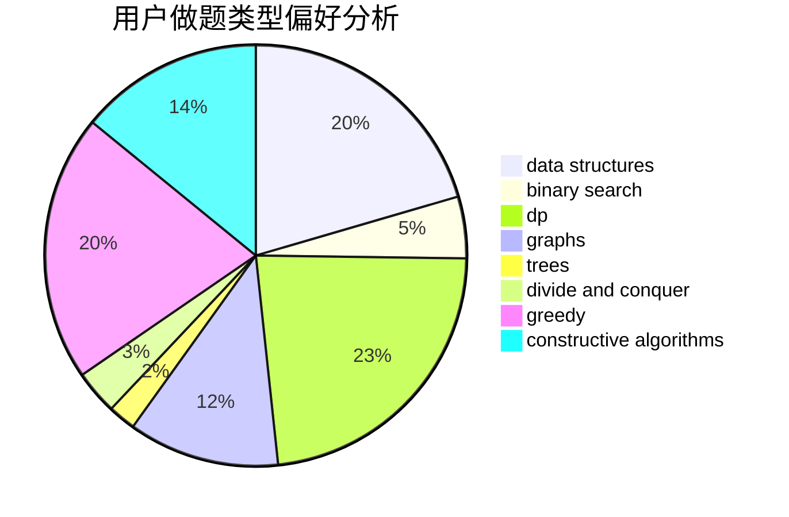
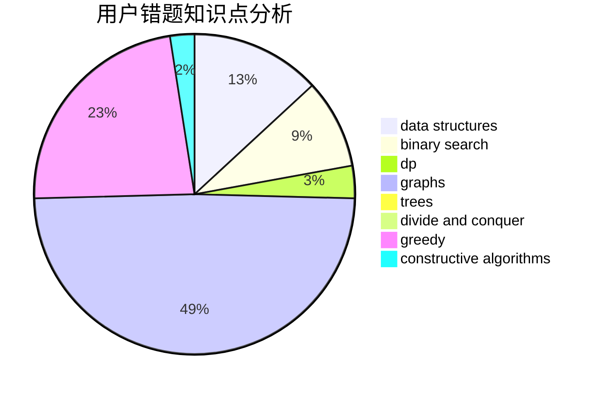

# ArcCCcp

<!-- tabs:start -->

#### **用户提交结果分析**

#### **用户做题类型偏好分析**

#### **用户错题知识点分析**

<!-- tabs:end -->
# 推荐题目
[380E](https://codeforces.com/contest/380/problem/E)		data structures		  
[292A](https://codeforces.com/contest/292/problem/A)		implementation		  
[385E](https://codeforces.com/contest/385/problem/E)		math,
                        matrices		  
[1190B](https://codeforces.com/contest/1190/problem/B)		games		  
[37B](https://codeforces.com/contest/37/problem/B)		greedy,
                        implementation		  
[389B](https://codeforces.com/contest/389/problem/B)		greedy,
                        implementation		  
[386C](https://codeforces.com/contest/386/problem/C)		dp,
                        strings,
                        two pointers		  
[388C](https://codeforces.com/contest/388/problem/C)		games,
                        greedy,
                        sortings		  
[380C](https://codeforces.com/contest/380/problem/C)		data structures,
                        schedules		  
[1305G](https://codeforces.com/contest/1305/problem/G)		bitmasks,
                        brute force,
                        dp,
                        dsu,
                        graphs		  
