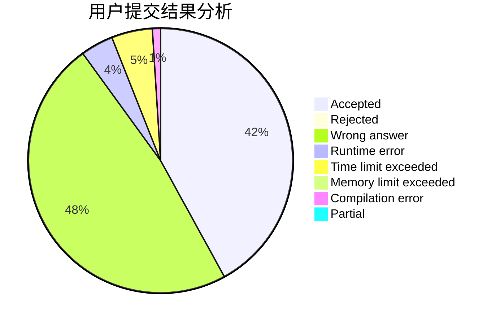
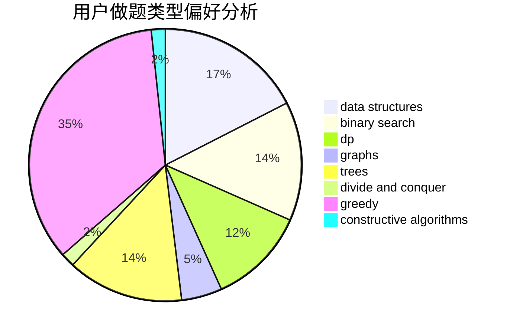
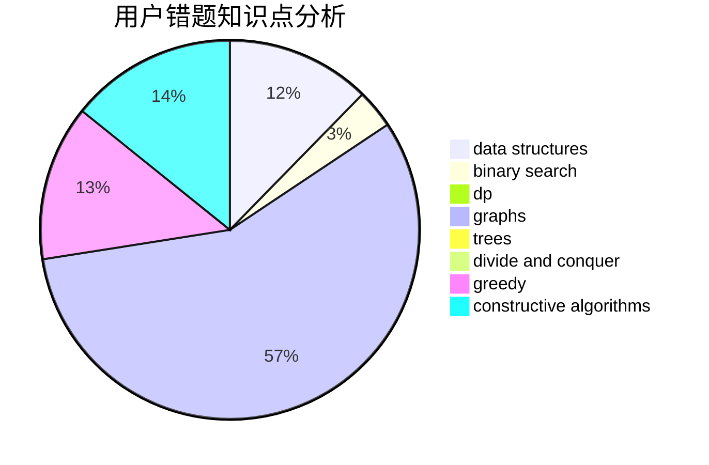

# cui010

<!-- tabs:start -->

#### **用户提交结果分析**

#### **用户做题类型偏好分析**

#### **用户错题知识点分析**

<!-- tabs:end -->
# 推荐题目
[1402B](https://codeforces.com/contest/1402/problem/B)		*special problem,
                        geometry,
                        sortings		  
[55D](https://codeforces.com/contest/55/problem/D)		dp,
                        number theory		  
[714B](https://codeforces.com/contest/714/problem/B)		implementation,
                        sortings		  
[156D](https://codeforces.com/contest/156/problem/D)		combinatorics,
                        graphs		  
[380D](https://codeforces.com/contest/380/problem/D)		combinatorics,
                        math		  
[343A](https://codeforces.com/contest/343/problem/A)		math,
                        number theory		  
[614D](https://codeforces.com/contest/614/problem/D)		dsu,graphs,sortings,trees		  
[1209A](https://codeforces.com/contest/1209/problem/A)		greedy,
                        implementation,
                        math		  
[1012A](https://codeforces.com/contest/1012/problem/A)		brute force,
                        implementation,
                        math,
                        sortings		  
[815C](https://codeforces.com/contest/815/problem/C)		brute force,
                        dp,
                        trees		  
