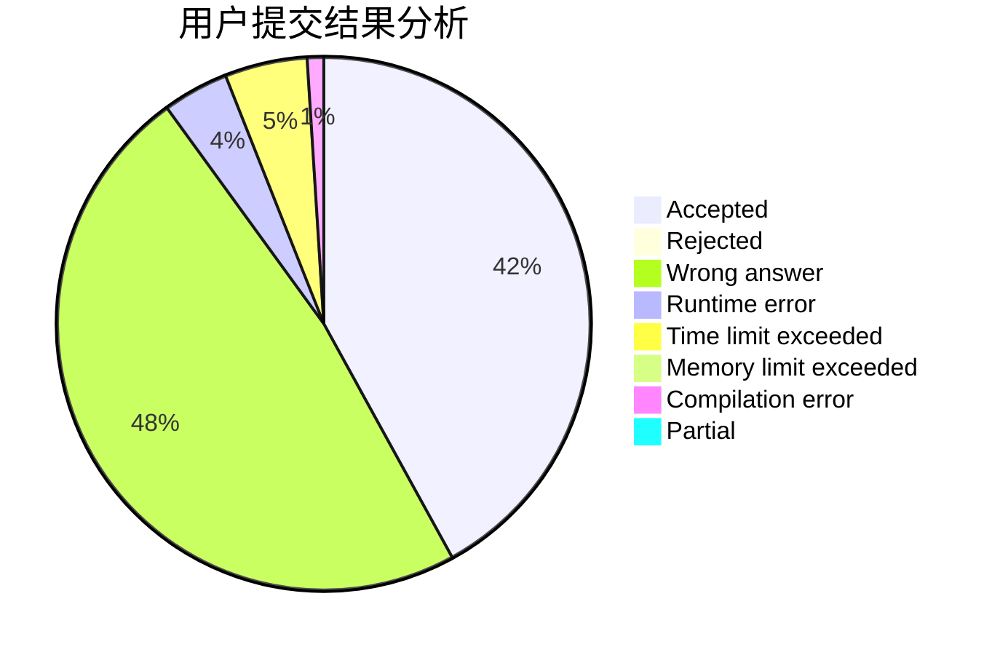
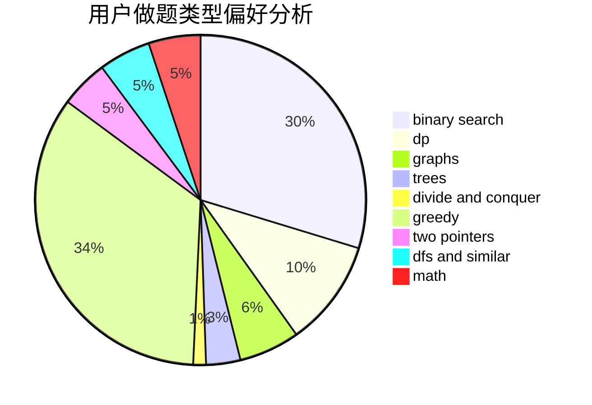

# cui010

<!-- tabs:start -->

#### **用户提交结果分析**

#### **用户做题类型偏好分析**

<!-- tabs:end -->
# 推荐题目
[1413D](https://codeforces.com/contest/1413/problem/D)
[584B](https://codeforces.com/contest/584/problem/B)
[733A](https://codeforces.com/contest/733/problem/A)
[1772](https://codeforces.com/contest/177/problem/2)
[412C](https://codeforces.com/contest/412/problem/C)
[36B](https://codeforces.com/contest/36/problem/B)
[633C](https://codeforces.com/contest/633/problem/C)
[1214E](https://codeforces.com/contest/1214/problem/E)
[1012D](https://codeforces.com/contest/1012/problem/D)
[834C](https://codeforces.com/contest/834/problem/C)
