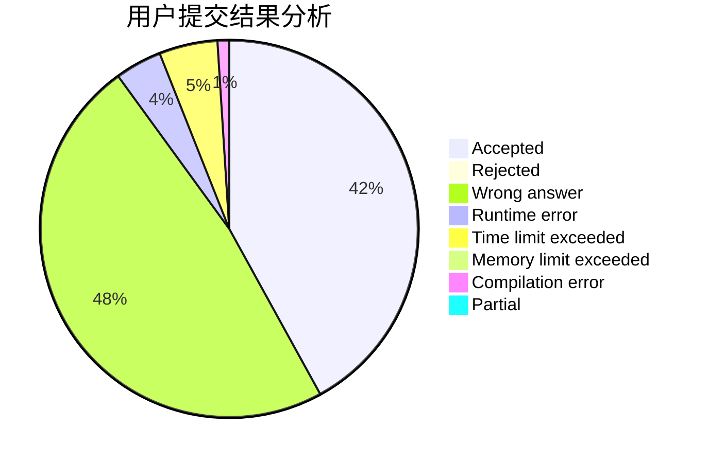
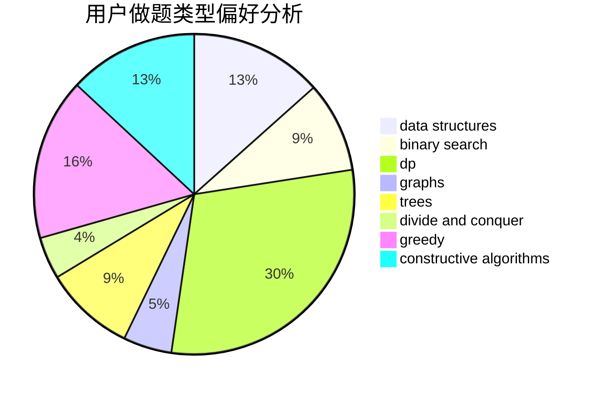
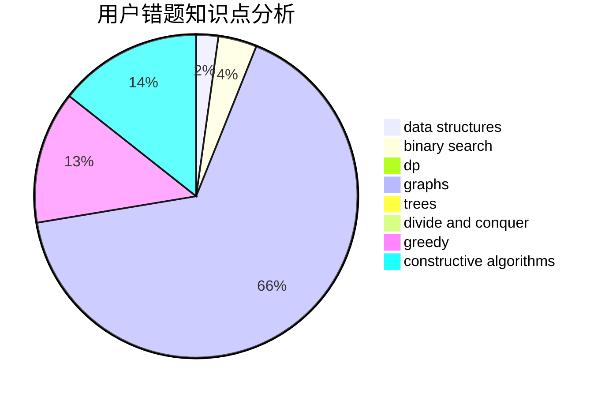

# cui010

<!-- tabs:start -->

#### **用户提交结果分析**

#### **用户做题类型偏好分析**

#### **用户错题知识点分析**

<!-- tabs:end -->
# 推荐题目
[1413D](https://codeforces.com/contest/1413/problem/D)		data structures,
                        greedy,
                        implementation		  
[584B](https://codeforces.com/contest/584/problem/B)		combinatorics		  
[733A](https://codeforces.com/contest/733/problem/A)		implementation		  
[1772](https://codeforces.com/contest/177/problem/2)		dsu,graphs,sortings,trees		  
[412C](https://codeforces.com/contest/412/problem/C)		implementation,
                        strings		  
[36B](https://codeforces.com/contest/36/problem/B)		implementation		  
[633C](https://codeforces.com/contest/633/problem/C)		data structures,
                        dp,
                        hashing,
                        implementation,
                        sortings,
                        string suffix structures,
                        strings		  
[1214E](https://codeforces.com/contest/1214/problem/E)		constructive algorithms,
                        graphs,
                        math,
                        sortings,
                        trees		  
[1012D](https://codeforces.com/contest/1012/problem/D)		constructive algorithms,
                        strings		  
[834C](https://codeforces.com/contest/834/problem/C)		dsu,graphs,sortings,trees		  
