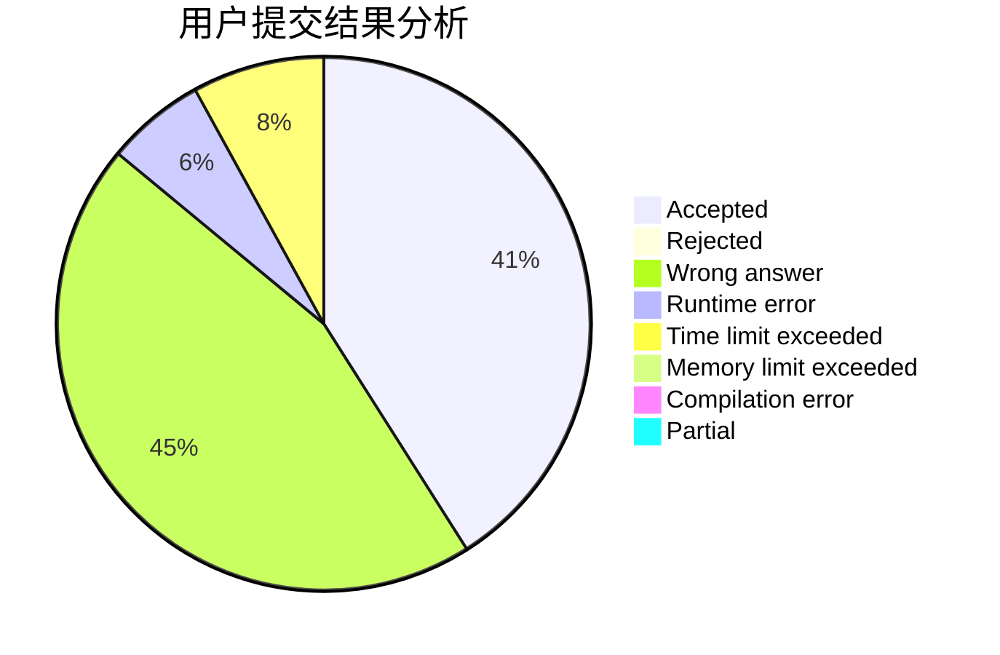
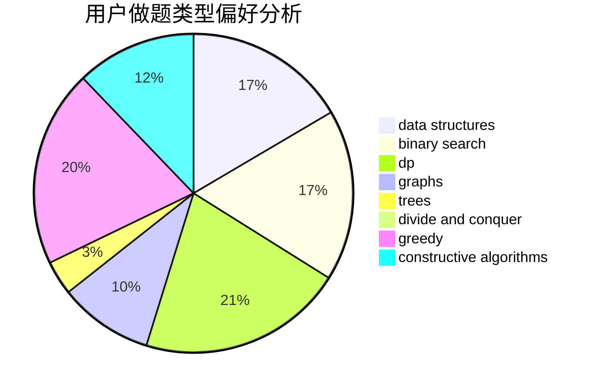
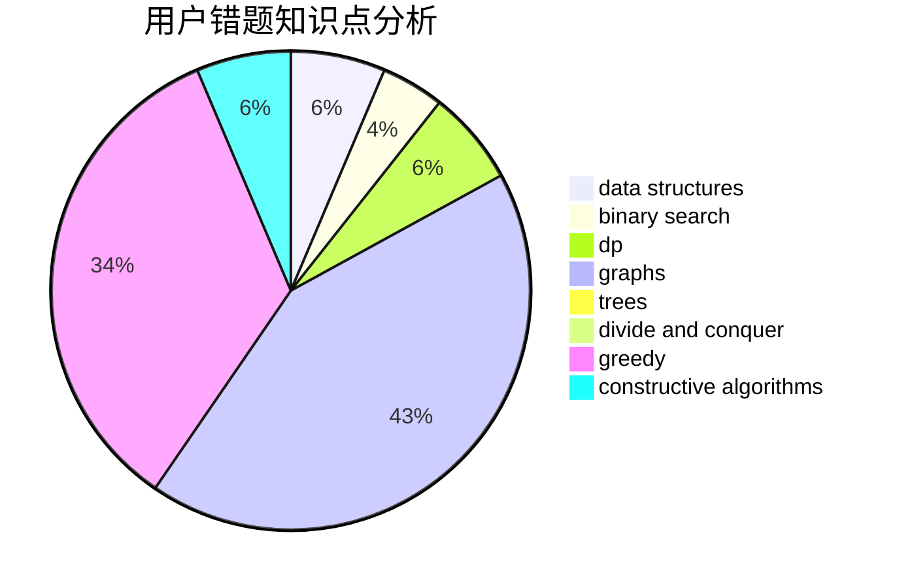

# cunzai_zsy0531

<!-- tabs:start -->

#### **用户提交结果分析**

#### **用户做题类型偏好分析**

#### **用户错题知识点分析**

<!-- tabs:end -->
# 推荐题目
[1297C](https://codeforces.com/contest/1297/problem/C)		*special problem,
                        greedy		  
[732A](https://codeforces.com/contest/732/problem/A)		brute force,
                        constructive algorithms,
                        implementation,
                        math		  
[297B](https://codeforces.com/contest/297/problem/B)		constructive algorithms,
                        greedy		  
[28D](https://codeforces.com/contest/28/problem/D)		binary search,
                        data structures,
                        dp,
                        hashing		  
[475D](https://codeforces.com/contest/475/problem/D)		brute force,
                        data structures,
                        math		  
[939F](https://codeforces.com/contest/939/problem/F)		data structures,
                        dp		  
[1314E](https://codeforces.com/contest/1314/problem/E)		dsu,graphs,sortings,trees		  
[2A](https://codeforces.com/contest/2/problem/A)		hashing,
                        implementation		  
[275B](https://codeforces.com/contest/275/problem/B)		constructive algorithms,
                        implementation		  
[837B](https://codeforces.com/contest/837/problem/B)		brute force,
                        implementation		  
