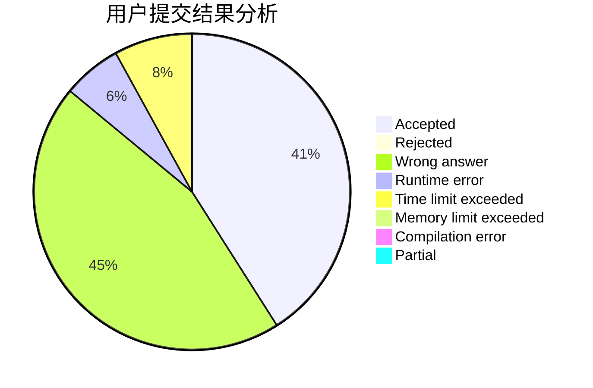
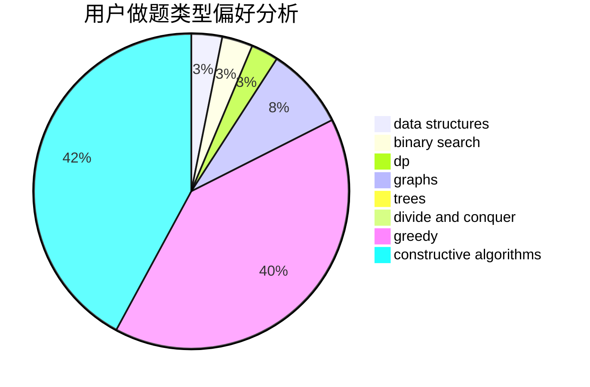
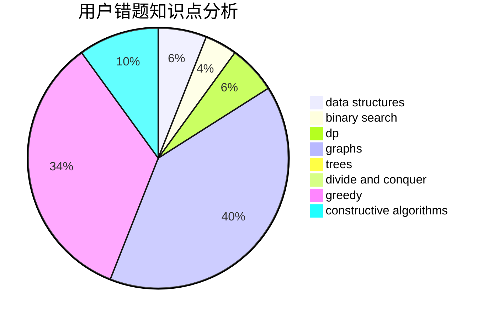

# cunzai_zsy0531

<!-- tabs:start -->

#### **用户提交结果分析**

#### **用户做题类型偏好分析**

#### **用户错题知识点分析**

<!-- tabs:end -->
# 推荐题目
[1290F](https://codeforces.com/contest/1290/problem/F)		dp		  
[712E](https://codeforces.com/contest/712/problem/E)		data structures,
                        math,
                        probabilities		  
[280E](https://codeforces.com/contest/280/problem/E)		data structures,
                        dp,
                        implementation,
                        math		  
[274E](https://codeforces.com/contest/274/problem/E)		data structures,
                        implementation		  
[453D](https://codeforces.com/contest/453/problem/D)		dp,
                        matrices		  
[919E](https://codeforces.com/contest/919/problem/E)		chinese remainder theorem,
                        math,
                        number theory		  
[1305F](https://codeforces.com/contest/1305/problem/F)		math,
                        number theory,
                        probabilities		  
[284B](https://codeforces.com/contest/284/problem/B)		brute force,
                        implementation		  
[258C](https://codeforces.com/contest/258/problem/C)		binary search,
                        combinatorics,
                        dp,
                        math		  
[817B](https://codeforces.com/contest/817/problem/B)		combinatorics,
                        implementation,
                        math,
                        sortings		  
