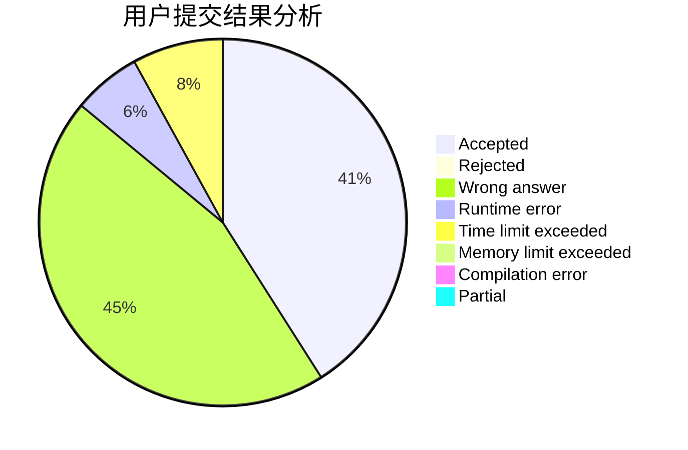
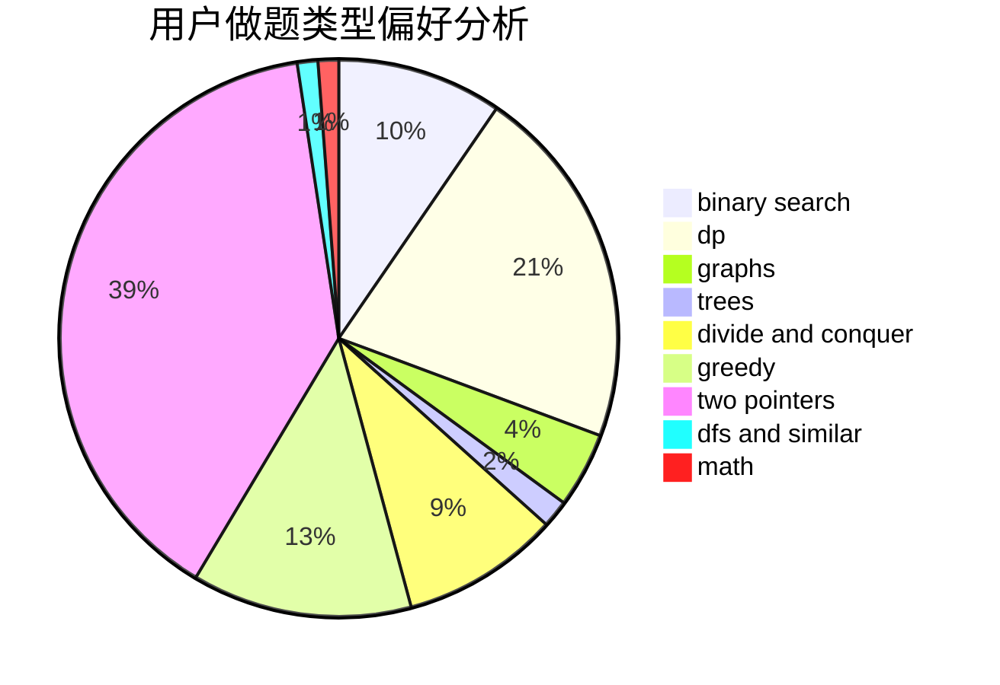

# cunzai_zsy0531

<!-- tabs:start -->

#### **用户提交结果分析**

#### **用户做题类型偏好分析**

<!-- tabs:end -->
# 推荐题目
[1297C](https://codeforces.com/contest/1297/problem/C)
[732A](https://codeforces.com/contest/732/problem/A)
[297B](https://codeforces.com/contest/297/problem/B)
[28D](https://codeforces.com/contest/28/problem/D)
[475D](https://codeforces.com/contest/475/problem/D)
[939F](https://codeforces.com/contest/939/problem/F)
[1314E](https://codeforces.com/contest/1314/problem/E)
[2A](https://codeforces.com/contest/2/problem/A)
[275B](https://codeforces.com/contest/275/problem/B)
[837B](https://codeforces.com/contest/837/problem/B)
