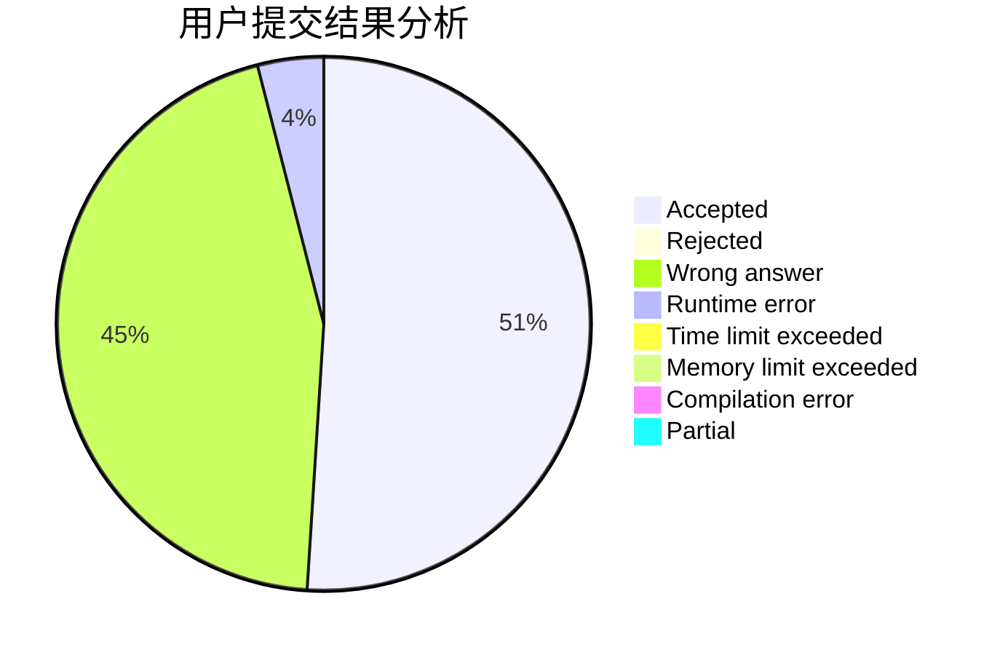
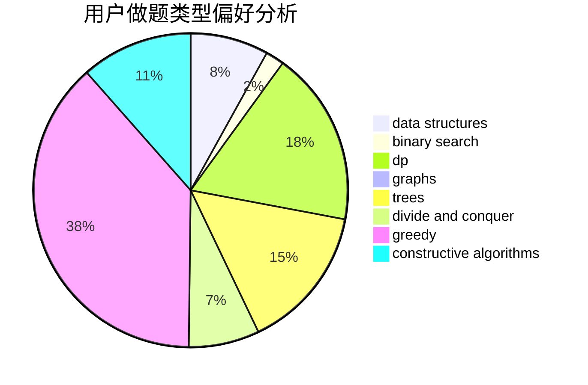
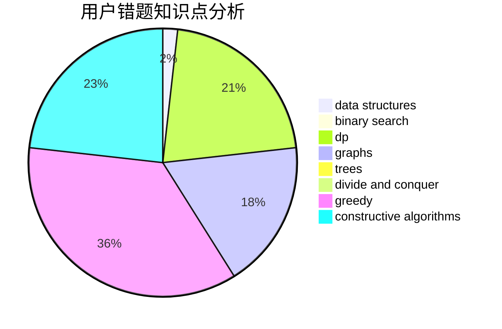

# cwc-cwc

<!-- tabs:start -->

#### **用户提交结果分析**

#### **用户做题类型偏好分析**

#### **用户错题知识点分析**

<!-- tabs:end -->
# 推荐题目
[1184C2](https://codeforces.com/contest/1184C/problem/2)		data structures		  
[983E](https://codeforces.com/contest/983/problem/E)		binary search,
                        data structures,
                        trees		  
[913B](https://codeforces.com/contest/913/problem/B)		implementation,
                        trees		  
[582B](https://codeforces.com/contest/582/problem/B)		constructive algorithms,
                        dp,
                        matrices		  
[1149B](https://codeforces.com/contest/1149/problem/B)		dp,
                        implementation,
                        strings		  
[825B](https://codeforces.com/contest/825/problem/B)		brute force,
                        implementation		  
[632B](https://codeforces.com/contest/632/problem/B)		brute force,
                        constructive algorithms		  
[782A](https://codeforces.com/contest/782/problem/A)		dsu,graphs,sortings,trees		  
[61B](https://codeforces.com/contest/61/problem/B)		strings		  
[682A](https://codeforces.com/contest/682/problem/A)		constructive algorithms,
                        math,
                        number theory		  
