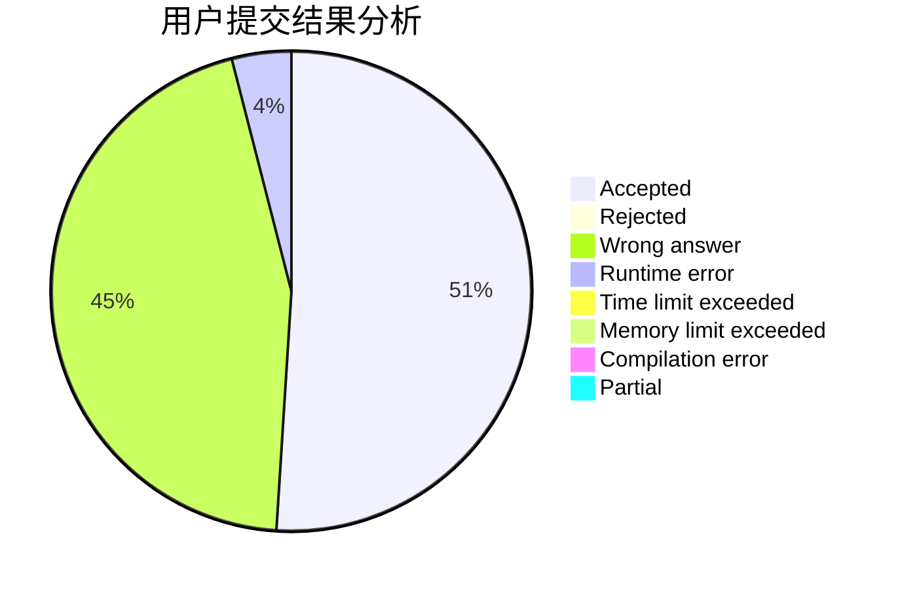
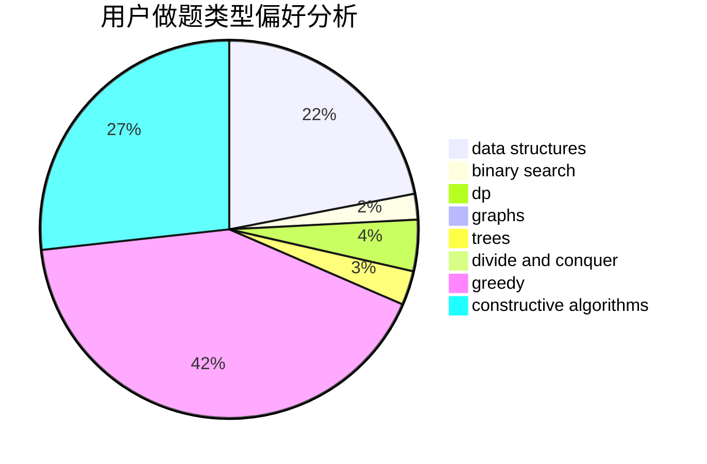
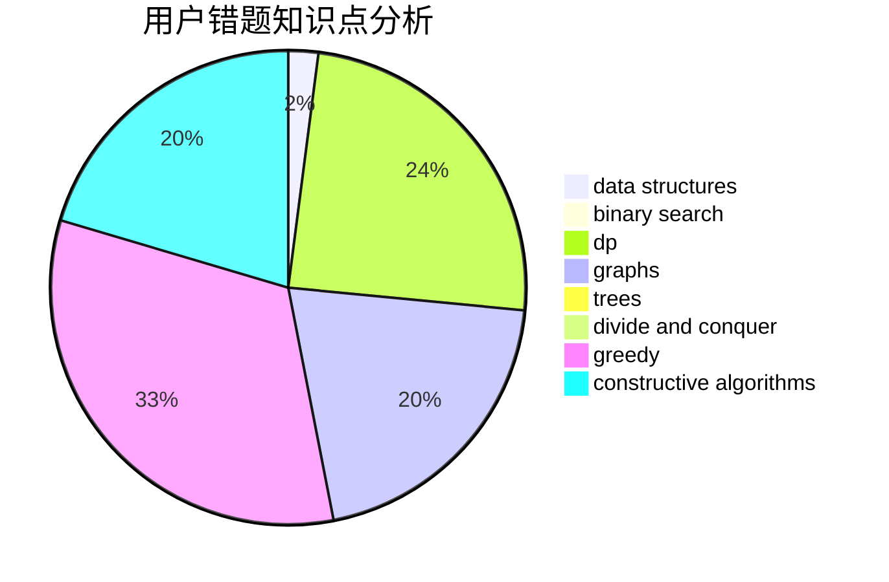

# cwc-cwc

<!-- tabs:start -->

#### **用户提交结果分析**

#### **用户做题类型偏好分析**

#### **用户错题知识点分析**

<!-- tabs:end -->
# 推荐题目
[11881](https://codeforces.com/contest/1188/problem/1)		dsu,graphs,sortings,trees		  
[999D](https://codeforces.com/contest/999/problem/D)		data structures,
                        greedy,
                        implementation		  
[931F](https://codeforces.com/contest/931/problem/F)		dsu,graphs,sortings,trees		  
[603B](https://codeforces.com/contest/603/problem/B)		combinatorics,
                        dfs and similar,
                        dsu,
                        math,
                        number theory		  
[1150E](https://codeforces.com/contest/1150/problem/E)		dsu,graphs,sortings,trees		  
[843B](https://codeforces.com/contest/843/problem/B)		brute force,
                        interactive,
                        probabilities		  
[662E](https://codeforces.com/contest/662/problem/E)		brute force,
                        dp,
                        greedy		  
[7E](https://codeforces.com/contest/7/problem/E)		dp,
                        expression parsing,
                        implementation		  
[641E](https://codeforces.com/contest/641/problem/E)		data structures		  
[706A](https://codeforces.com/contest/706/problem/A)		brute force,
                        geometry,
                        implementation		  
