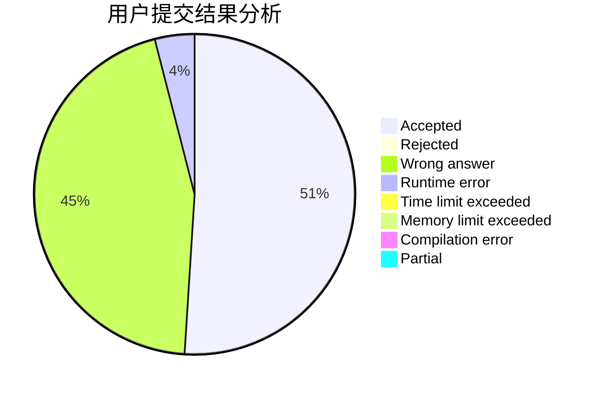
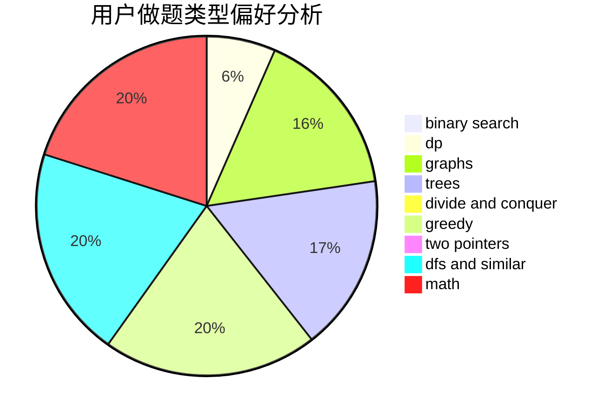

# cwc-cwc

<!-- tabs:start -->

#### **用户提交结果分析**

#### **用户做题类型偏好分析**

<!-- tabs:end -->
# 推荐题目
[11881](https://codeforces.com/contest/1188/problem/1)
[999D](https://codeforces.com/contest/999/problem/D)
[931F](https://codeforces.com/contest/931/problem/F)
[603B](https://codeforces.com/contest/603/problem/B)
[1150E](https://codeforces.com/contest/1150/problem/E)
[843B](https://codeforces.com/contest/843/problem/B)
[662E](https://codeforces.com/contest/662/problem/E)
[7E](https://codeforces.com/contest/7/problem/E)
[641E](https://codeforces.com/contest/641/problem/E)
[706A](https://codeforces.com/contest/706/problem/A)
