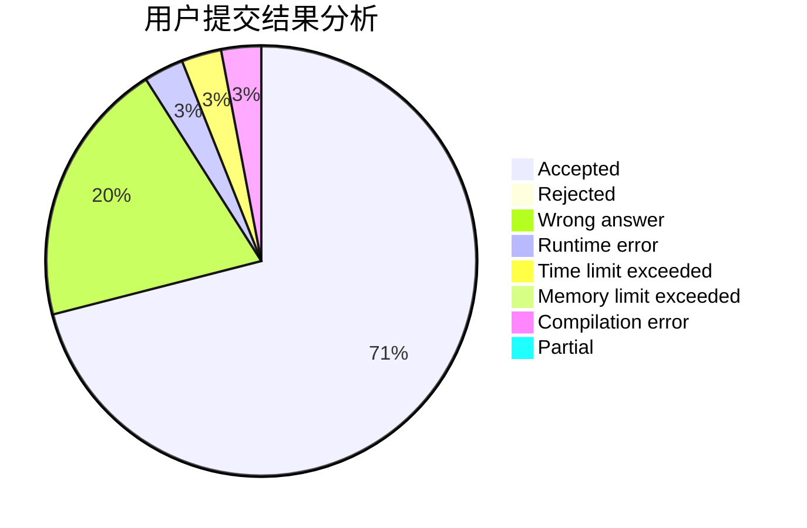
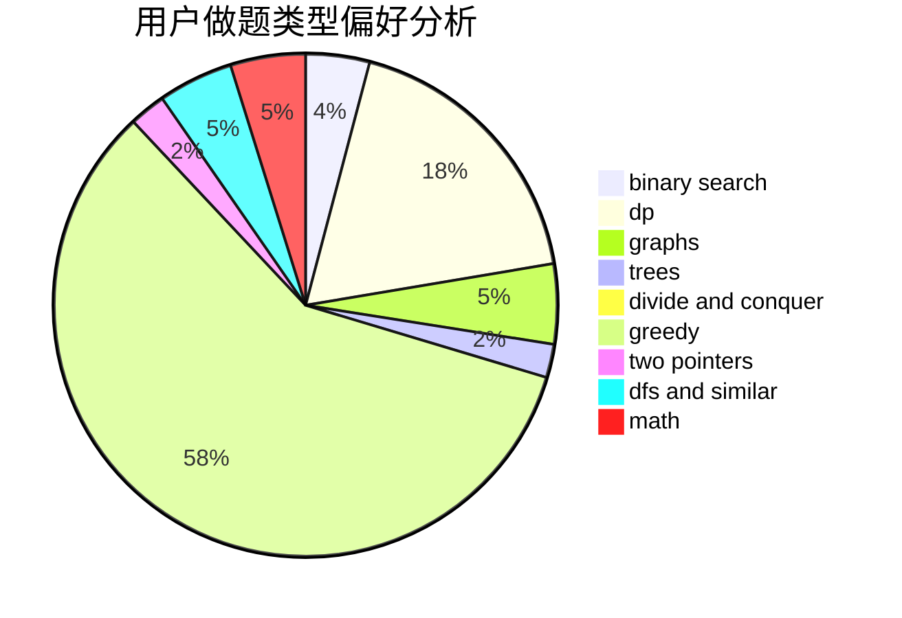

# cwf123

<!-- tabs:start -->

#### **用户提交结果分析**

#### **用户做题类型偏好分析**

<!-- tabs:end -->
# 推荐题目
[1479E](https://codeforces.com/contest/1479/problem/E)
[615D](https://codeforces.com/contest/615/problem/D)
[1089I](https://codeforces.com/contest/1089/problem/I)
[1310B](https://codeforces.com/contest/1310/problem/B)
[1310C](https://codeforces.com/contest/1310/problem/C)
[1061F](https://codeforces.com/contest/1061/problem/F)
[363B](https://codeforces.com/contest/363/problem/B)
[1078D](https://codeforces.com/contest/1078/problem/D)
[8D](https://codeforces.com/contest/8/problem/D)
[1147A](https://codeforces.com/contest/1147/problem/A)
