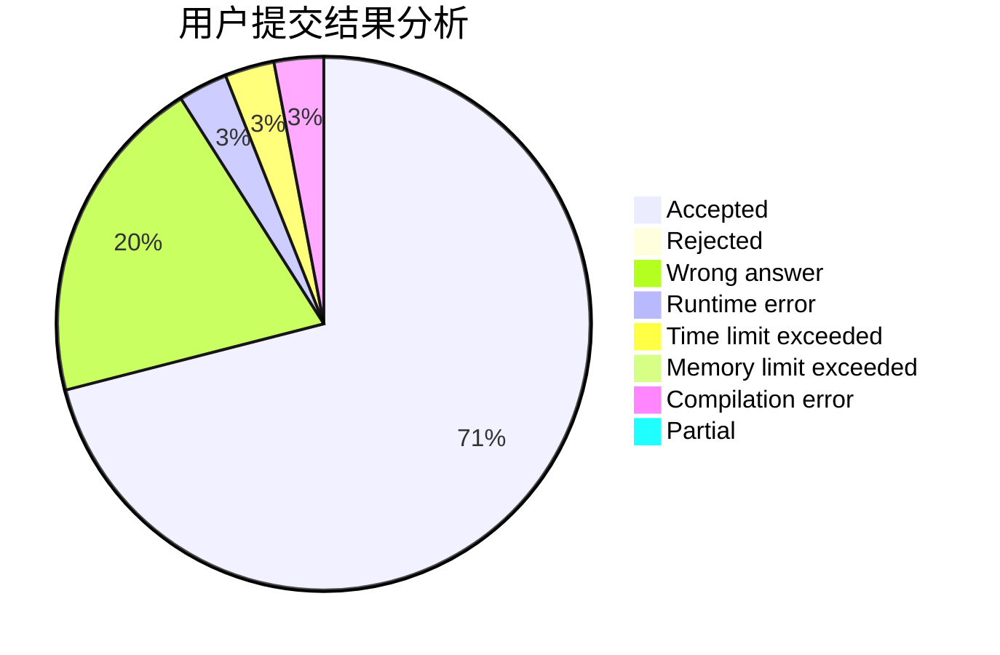
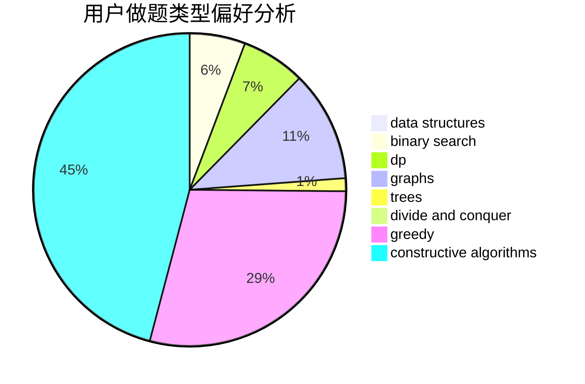
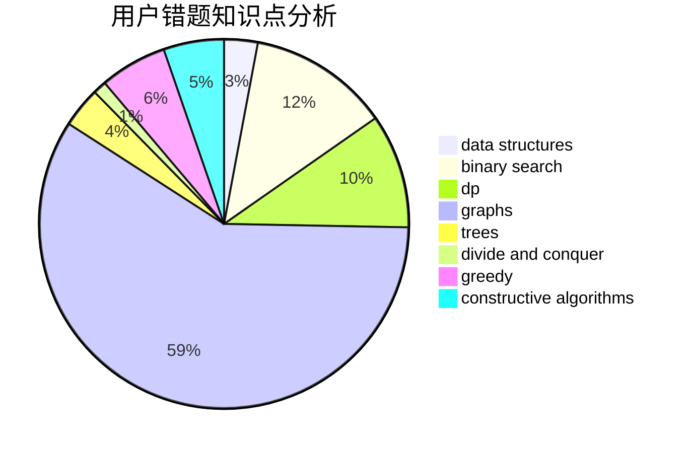

# cwf123

<!-- tabs:start -->

#### **用户提交结果分析**

#### **用户做题类型偏好分析**

#### **用户错题知识点分析**

<!-- tabs:end -->
# 推荐题目
[1471C](https://codeforces.com/contest/1471/problem/C)		dsu,graphs,sortings,trees		  
[598A](https://codeforces.com/contest/598/problem/A)		math		  
[1089E](https://codeforces.com/contest/1089/problem/E)		constructive algorithms		  
[1300D](https://codeforces.com/contest/1300/problem/D)		dsu,graphs,sortings,trees		  
[1300E](https://codeforces.com/contest/1300/problem/E)		dsu,graphs,sortings,trees		  
[1061B](https://codeforces.com/contest/1061/problem/B)		greedy,
                        implementation,
                        sortings		  
[335F](https://codeforces.com/contest/335/problem/F)		dp,
                        greedy		  
[1078A](https://codeforces.com/contest/1078/problem/A)		dsu,graphs,sortings,trees		  
[87C](https://codeforces.com/contest/87/problem/C)		dp,
                        games,
                        math		  
[1144G](https://codeforces.com/contest/1144/problem/G)		dp,
                        greedy		  
