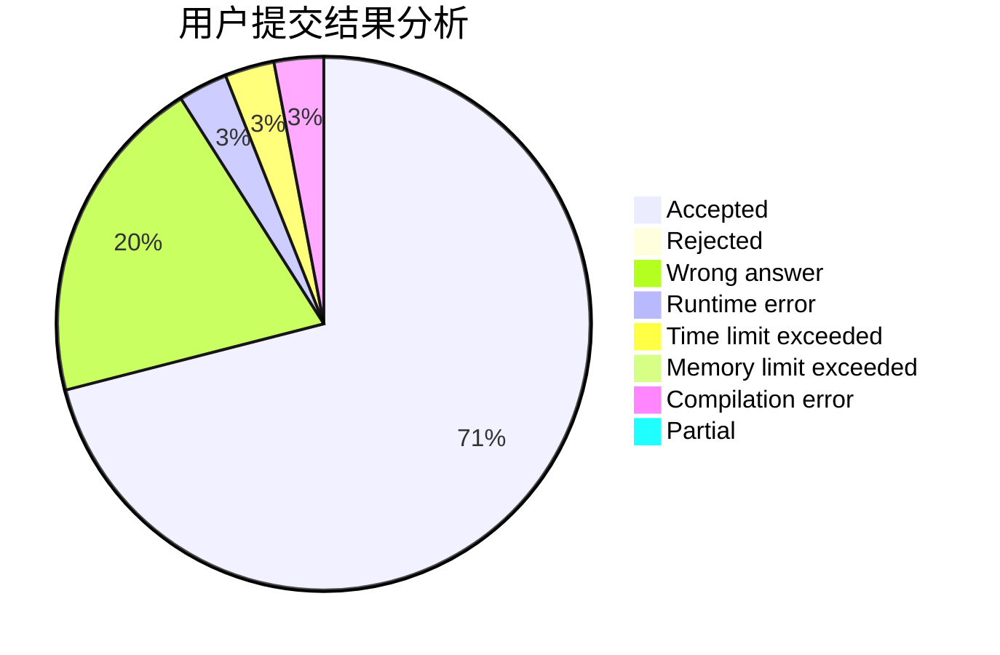
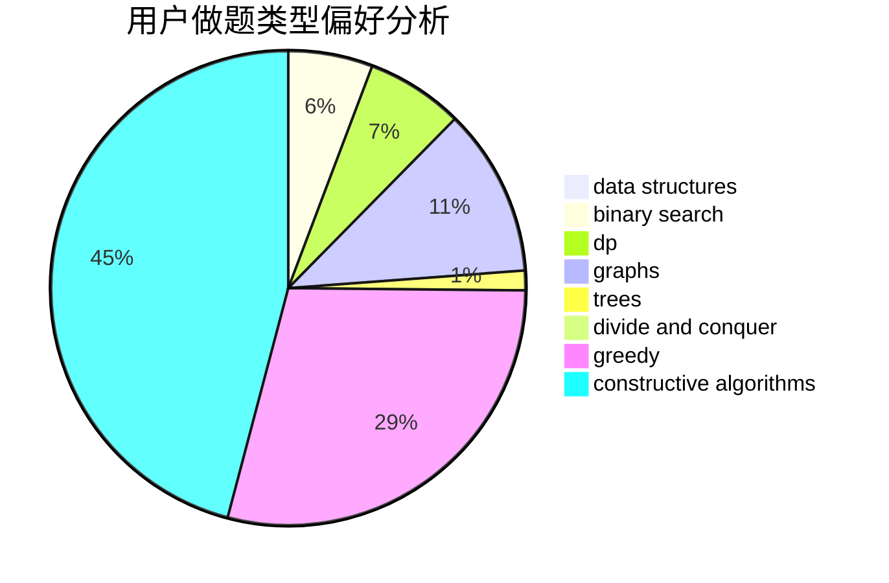
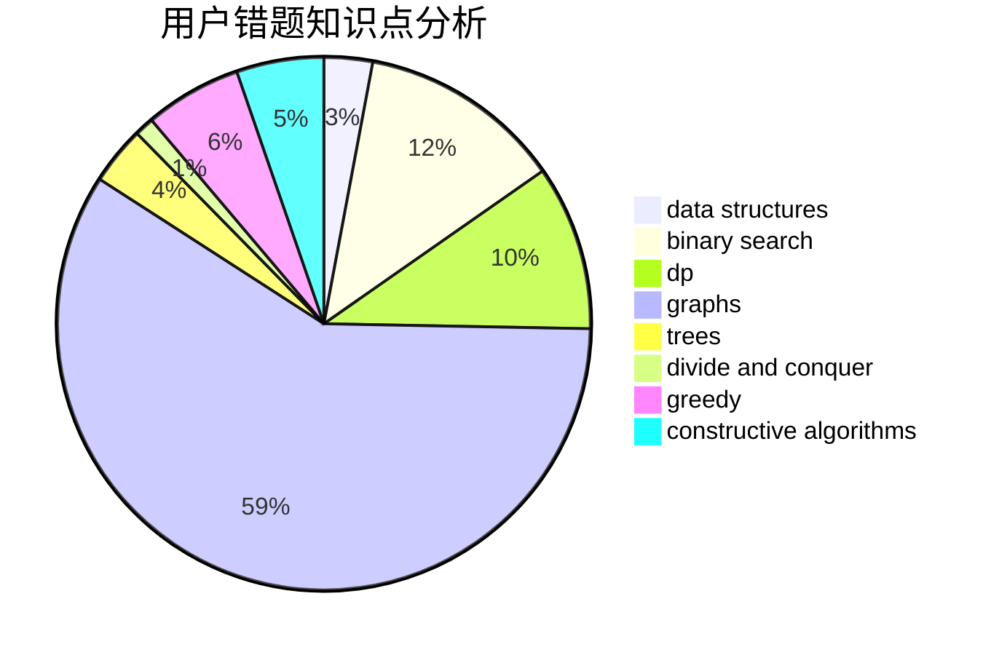

# cwf123
<!-- tabs:start -->
#### **用户提交结果分析**

#### **用户做题类型偏好分析**

#### **用户错题知识点分析**

<!-- tabs:end -->
# 推荐题目
[Strange Birthday Party](https://codeforces.com/contest/1471/problem/C)		binary search,
                        dp,
                        greedy,
                        sortings,
                        two pointers		  
[Two Merged Sequences](http://codeforces.com/problemset/problem/1144/G)		dp,
                        greedy		  
[Aerodynamic](https://codeforces.com/contest/1300/problem/D)		geometry		  
[Tricky Sum](http://codeforces.com/problemset/problem/598/A)		math		  
[Interesting Game](http://codeforces.com/problemset/problem/87/C)		dp,
                        games,
                        math		  
[Barcelonian Distance](https://codeforces.com/contest/1078/problem/A)		geometry,
                        implementation		  
[A Trivial Problem](http://codeforces.com/problemset/problem/633/B)		brute force,
                        constructive algorithms,
                        math,
                        number theory		  
[Pangram](http://codeforces.com/problemset/problem/520/A)		implementation,
                        strings		  
[Buy One, Get One Free](http://codeforces.com/problemset/problem/335/F)		dp,
                        greedy		  
[King of Thieves](http://codeforces.com/problemset/problem/526/A)		brute force,
                        implementation		  
<!-- tabs:start -->
#### **data structures**
[Strange Birthday Party](http://codeforces.com/problemset/problem/1007/D)		2-sat,
                        data structures,
                        trees		  
[Two Merged Sequences](http://codeforces.com/problemset/problem/1039/D)		data structures,
                        dp,
                        trees		  
[Aerodynamic](http://codeforces.com/problemset/problem/939/F)		data structures,
                        dp		  
[Tricky Sum](http://codeforces.com/problemset/problem/1266/E)		data structures,
                        greedy,
                        implementation		  
[Interesting Game](https://codeforces.com/contest/1300/problem/E)		data structures,
                        geometry,
                        greedy		  
[Barcelonian Distance](http://codeforces.com/problemset/problem/870/F)		data structures,
                        number theory		  
[A Trivial Problem](http://codeforces.com/problemset/problem/1182/F)		binary search,
                        data structures,
                        number theory		  
[Pangram](http://codeforces.com/problemset/problem/1418/D)		data structures,
                        implementation		  
[Buy One, Get One Free](https://codeforces.com/contest/948/problem/C)		binary search,
                        data structures		  
[King of Thieves](http://codeforces.com/problemset/problem/1283/C)		constructive algorithms,
                        data structures,
                        math		  
#### **binary search**
[Strange Birthday Party](https://codeforces.com/contest/1471/problem/C)		binary search,
                        dp,
                        greedy,
                        sortings,
                        two pointers		  
[Two Merged Sequences](http://codeforces.com/problemset/problem/50/D)		binary search,
                        dp,
                        probabilities		  
[Aerodynamic](http://codeforces.com/problemset/problem/750/A)		binary search,
                        brute force,
                        implementation,
                        math		  
[Tricky Sum](http://codeforces.com/problemset/problem/883/D)		binary search,
                        dp,
                        math		  
[Interesting Game](http://codeforces.com/problemset/problem/1182/F)		binary search,
                        data structures,
                        number theory		  
[Barcelonian Distance](https://codeforces.com/contest/948/problem/C)		binary search,
                        data structures		  
[A Trivial Problem](http://codeforces.com/problemset/problem/1492/C)		binary search,
                        data structures,
                        dp,
                        greedy,
                        two pointers		  
[Pangram](http://codeforces.com/problemset/problem/1463/D)		binary search,
                        constructive algorithms,
                        greedy,
                        two pointers		  
[Buy One, Get One Free](http://codeforces.com/problemset/problem/1490/G)		binary search,
                        data structures,
                        math		  
[King of Thieves](http://codeforces.com/problemset/problem/1479/D)		binary search,
                        bitmasks,
                        brute force,
                        data structures,
                        probabilities,
                        trees		  
#### **dp**
[Strange Birthday Party](https://codeforces.com/contest/1471/problem/C)		binary search,
                        dp,
                        greedy,
                        sortings,
                        two pointers		  
[Two Merged Sequences](http://codeforces.com/problemset/problem/1144/G)		dp,
                        greedy		  
[Aerodynamic](http://codeforces.com/problemset/problem/87/C)		dp,
                        games,
                        math		  
[Tricky Sum](http://codeforces.com/problemset/problem/335/F)		dp,
                        greedy		  
[Interesting Game](http://codeforces.com/problemset/problem/50/D)		binary search,
                        dp,
                        probabilities		  
[Barcelonian Distance](http://codeforces.com/problemset/problem/958/C2)		dp		  
[A Trivial Problem](http://codeforces.com/problemset/problem/1039/D)		data structures,
                        dp,
                        trees		  
[Pangram](http://codeforces.com/problemset/problem/939/F)		data structures,
                        dp		  
[Buy One, Get One Free](http://codeforces.com/problemset/problem/883/D)		binary search,
                        dp,
                        math		  
[King of Thieves](http://codeforces.com/problemset/problem/848/D)		combinatorics,
                        dp,
                        flows,
                        graphs		  
#### **graph**
[Strange Birthday Party](http://codeforces.com/problemset/problem/939/A)		graphs		  
[Two Merged Sequences](http://codeforces.com/problemset/problem/848/D)		combinatorics,
                        dp,
                        flows,
                        graphs		  
[Aerodynamic](http://codeforces.com/problemset/problem/819/E)		constructive algorithms,
                        graphs		  
[Tricky Sum](https://codeforces.com/contest/1483/problem/D)		graphs,
                        shortest paths		  
[Interesting Game](http://codeforces.com/problemset/problem/1487/C)		brute force,
                        constructive algorithms,
                        dfs and similar,
                        graphs,
                        greedy,
                        implementation,
                        math		  
[Barcelonian Distance](http://codeforces.com/problemset/problem/1437/C)		dp,
                        flows,
                        graph matchings,
                        greedy,
                        math,
                        sortings		  
[A Trivial Problem](http://codeforces.com/problemset/problem/1470/D)		constructive algorithms,
                        dfs and similar,
                        graph matchings,
                        graphs,
                        greedy		  
[Pangram](http://codeforces.com/problemset/problem/1476/C)		dp,
                        graphs,
                        greedy		  
[Buy One, Get One Free](http://codeforces.com/problemset/problem/1304/D)		constructive algorithms,
                        graphs,
                        greedy,
                        two pointers		  
[King of Thieves](http://codeforces.com/problemset/problem/1475/C)		combinatorics,
                        graphs,
                        math		  
#### **trees**
[Strange Birthday Party](http://codeforces.com/problemset/problem/1007/D)		2-sat,
                        data structures,
                        trees		  
[Two Merged Sequences](http://codeforces.com/problemset/problem/1039/D)		data structures,
                        dp,
                        trees		  
[Aerodynamic](https://codeforces.com/contest/1189/problem/D2)		constructive algorithms,
                        dfs and similar,
                        implementation,
                        trees		  
[Tricky Sum](http://codeforces.com/problemset/problem/1396/E)		constructive algorithms,
                        dfs and similar,
                        trees		  
[Interesting Game](http://codeforces.com/problemset/problem/512/D)		dp,
                        trees		  
[Barcelonian Distance](http://codeforces.com/problemset/problem/1479/D)		binary search,
                        bitmasks,
                        brute force,
                        data structures,
                        probabilities,
                        trees		  
[A Trivial Problem](http://codeforces.com/problemset/problem/1511/C)		brute force,
                        data structures,
                        implementation,
                        trees		  
[Pangram](http://codeforces.com/problemset/problem/1499/F)		combinatorics,
                        dfs and similar,
                        dp,
                        trees		  
[Buy One, Get One Free](http://codeforces.com/problemset/problem/1491/E)		brute force,
                        dfs and similar,
                        divide and conquer,
                        number theory,
                        trees		  
[King of Thieves](http://codeforces.com/problemset/problem/1466/D)		data structures,
                        greedy,
                        sortings,
                        trees		  
#### **divide and conquer**
[Strange Birthday Party](http://codeforces.com/problemset/problem/1461/D)		binary search,
                        brute force,
                        data structures,
                        divide and conquer,
                        implementation,
                        sortings		  
[Two Merged Sequences](http://codeforces.com/problemset/problem/1466/G)		combinatorics,
                        divide and conquer,
                        hashing,
                        math,
                        string suffix structures,
                        strings		  
[Aerodynamic](http://codeforces.com/problemset/problem/1490/D)		dfs and similar,
                        divide and conquer,
                        implementation		  
[Tricky Sum](https://codeforces.com/contest/1483/problem/C)		data structures,
                        divide and conquer,
                        dp		  
[Interesting Game](http://codeforces.com/problemset/problem/1491/E)		brute force,
                        dfs and similar,
                        divide and conquer,
                        number theory,
                        trees		  
[Barcelonian Distance](http://codeforces.com/problemset/problem/1303/G)		data structures,
                        divide and conquer,
                        geometry,
                        trees		  
[A Trivial Problem](http://codeforces.com/problemset/problem/1494/D)		constructive algorithms,
                        data structures,
                        dfs and similar,
                        divide and conquer,
                        dsu,
                        greedy,
                        sortings,
                        trees		  
[Pangram](http://codeforces.com/problemset/problem/1482/E)		data structures,
                        divide and conquer,
                        dp		  
[Buy One, Get One Free](http://codeforces.com/problemset/problem/566/C)		dfs and similar,
                        divide and conquer,
                        trees		  
[King of Thieves](http://codeforces.com/problemset/problem/1428/F)		binary search,
                        data structures,
                        divide and conquer,
                        dp,
                        two pointers		  
#### **greedy**
[Strange Birthday Party](https://codeforces.com/contest/1471/problem/C)		binary search,
                        dp,
                        greedy,
                        sortings,
                        two pointers		  
[Two Merged Sequences](http://codeforces.com/problemset/problem/1144/G)		dp,
                        greedy		  
[Aerodynamic](http://codeforces.com/problemset/problem/335/F)		dp,
                        greedy		  
[Tricky Sum](http://codeforces.com/problemset/problem/651/B)		greedy,
                        sortings		  
[Interesting Game](http://codeforces.com/problemset/problem/1061/B)		greedy,
                        implementation,
                        sortings		  
[Barcelonian Distance](http://codeforces.com/problemset/problem/1266/E)		data structures,
                        greedy,
                        implementation		  
[A Trivial Problem](https://codeforces.com/contest/1300/problem/E)		data structures,
                        geometry,
                        greedy		  
[Pangram](http://codeforces.com/problemset/problem/1176/A)		brute force,
                        greedy,
                        implementation		  
[Buy One, Get One Free](http://codeforces.com/problemset/problem/3/D)		greedy		  
[King of Thieves](http://codeforces.com/problemset/problem/1492/C)		binary search,
                        data structures,
                        dp,
                        greedy,
                        two pointers		  
#### **constructive algorithms**
[Strange Birthday Party](http://codeforces.com/problemset/problem/633/B)		brute force,
                        constructive algorithms,
                        math,
                        number theory		  
[Two Merged Sequences](https://codeforces.com/contest/1189/problem/D2)		constructive algorithms,
                        dfs and similar,
                        implementation,
                        trees		  
[Aerodynamic](http://codeforces.com/problemset/problem/1396/E)		constructive algorithms,
                        dfs and similar,
                        trees		  
[Tricky Sum](http://codeforces.com/problemset/problem/1089/E)		constructive algorithms		  
[Interesting Game](https://codeforces.com/contest/1173/problem/F)		constructive algorithms		  
[Barcelonian Distance](http://codeforces.com/problemset/problem/819/E)		constructive algorithms,
                        graphs		  
[A Trivial Problem](http://codeforces.com/problemset/problem/1283/C)		constructive algorithms,
                        data structures,
                        math		  
[Pangram](http://codeforces.com/problemset/problem/1493/A)		constructive algorithms,
                        greedy		  
[Buy One, Get One Free](http://codeforces.com/problemset/problem/1463/D)		binary search,
                        constructive algorithms,
                        greedy,
                        two pointers		  
[King of Thieves](https://codeforces.com/contest/1456/problem/B)		bitmasks,
                        brute force,
                        constructive algorithms		  
#### **sortings**
[Strange Birthday Party](https://codeforces.com/contest/1471/problem/C)		binary search,
                        dp,
                        greedy,
                        sortings,
                        two pointers		  
[Two Merged Sequences](http://codeforces.com/problemset/problem/651/B)		greedy,
                        sortings		  
[Aerodynamic](http://codeforces.com/problemset/problem/1061/B)		greedy,
                        implementation,
                        sortings		  
[Tricky Sum](https://codeforces.com/contest/1496/problem/C)		geometry,
                        greedy,
                        math,
                        sortings		  
[Interesting Game](http://codeforces.com/problemset/problem/1495/A)		geometry,
                        greedy,
                        math,
                        sortings		  
[Barcelonian Distance](http://codeforces.com/problemset/problem/1497/A)		brute force,
                        data structures,
                        greedy,
                        sortings		  
[A Trivial Problem](http://codeforces.com/problemset/problem/1427/A)		math,
                        sortings		  
[Pangram](http://codeforces.com/problemset/problem/1461/D)		binary search,
                        brute force,
                        data structures,
                        divide and conquer,
                        implementation,
                        sortings		  
[Buy One, Get One Free](http://codeforces.com/problemset/problem/1437/C)		dp,
                        flows,
                        graph matchings,
                        greedy,
                        math,
                        sortings		  
[King of Thieves](http://codeforces.com/problemset/problem/1473/A)		greedy,
                        implementation,
                        math,
                        sortings		  
<!-- tabs:end -->
