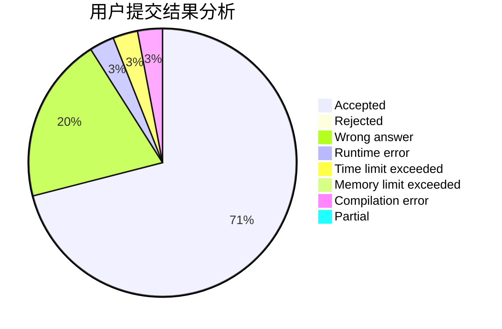
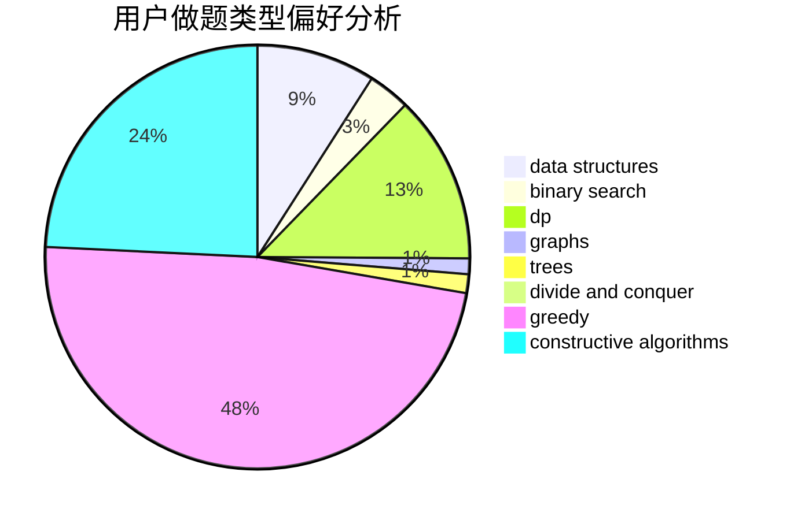
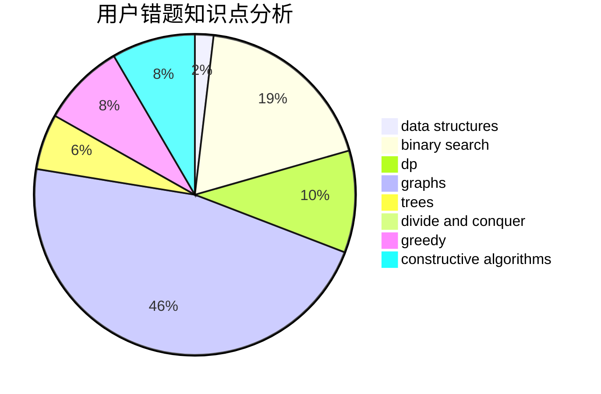

# cwf123

<!-- tabs:start -->

#### **用户提交结果分析**

#### **用户做题类型偏好分析**

#### **用户错题知识点分析**

<!-- tabs:end -->
# 推荐题目
[1479E](https://codeforces.com/contest/1479/problem/E)		dp,
                        fft,
                        math,
                        number theory,
                        probabilities		  
[615D](https://codeforces.com/contest/615/problem/D)		math,
                        number theory		  
[1089I](https://codeforces.com/contest/1089/problem/I)		nan		  
[1310B](https://codeforces.com/contest/1310/problem/B)		dp,
                        implementation		  
[1310C](https://codeforces.com/contest/1310/problem/C)		binary search,
                        dp,
                        strings		  
[1061F](https://codeforces.com/contest/1061/problem/F)		interactive,
                        probabilities		  
[363B](https://codeforces.com/contest/363/problem/B)		brute force,
                        dp		  
[1078D](https://codeforces.com/contest/1078/problem/D)		dsu,graphs,sortings,trees		  
[8D](https://codeforces.com/contest/8/problem/D)		binary search,
                        geometry		  
[1147A](https://codeforces.com/contest/1147/problem/A)		graphs		  
