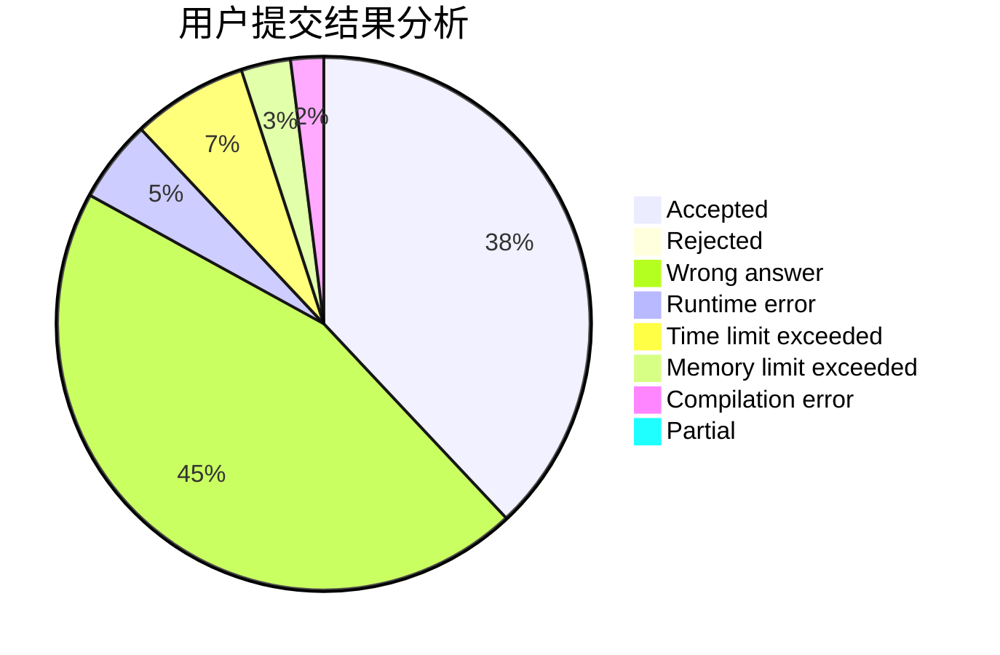
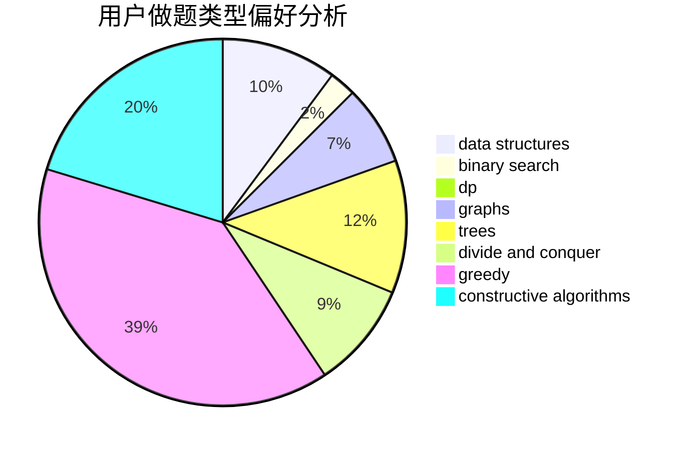
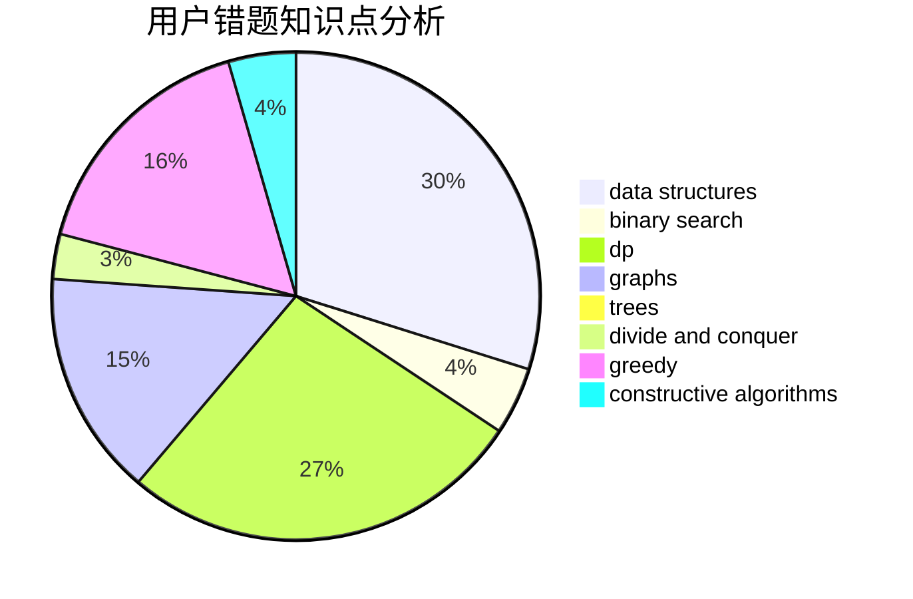

# cwhao

<!-- tabs:start -->

#### **用户提交结果分析**

#### **用户做题类型偏好分析**

#### **用户错题知识点分析**

<!-- tabs:end -->
# 推荐题目
[359B](https://codeforces.com/contest/359/problem/B)		constructive algorithms,
                        dp,
                        math		  
[258C](https://codeforces.com/contest/258/problem/C)		binary search,
                        combinatorics,
                        dp,
                        math		  
[597C](https://codeforces.com/contest/597/problem/C)		data structures,
                        dp		  
[1402B](https://codeforces.com/contest/1402/problem/B)		*special problem,
                        geometry,
                        sortings		  
[802C](https://codeforces.com/contest/802/problem/C)		flows		  
[317E](https://codeforces.com/contest/317/problem/E)		constructive algorithms,
                        shortest paths		  
[672B](https://codeforces.com/contest/672/problem/B)		constructive algorithms,
                        implementation,
                        strings		  
[177B2](https://codeforces.com/contest/177B/problem/2)		number theory		  
[1367D](https://codeforces.com/contest/1367/problem/D)		constructive algorithms,
                        greedy,
                        implementation,
                        sortings		  
[1006B](https://codeforces.com/contest/1006/problem/B)		greedy,
                        implementation,
                        sortings		  
