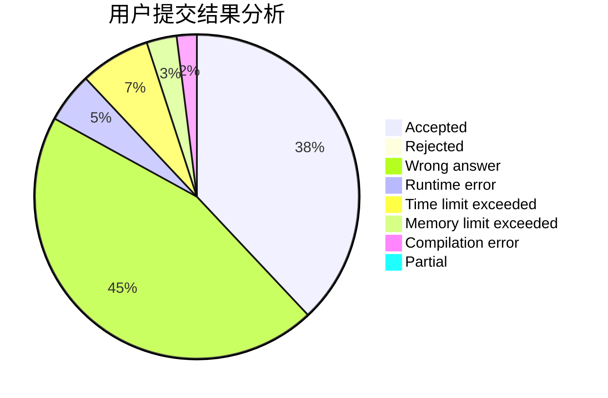
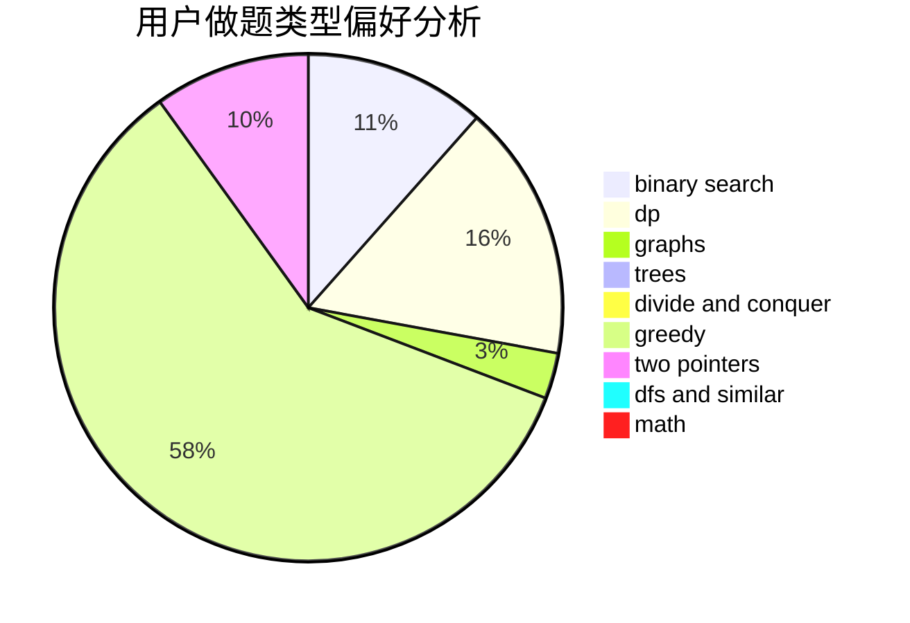

# cwhao

<!-- tabs:start -->

#### **用户提交结果分析**

#### **用户做题类型偏好分析**

<!-- tabs:end -->
# 推荐题目
[385E](https://codeforces.com/contest/385/problem/E)
[275B](https://codeforces.com/contest/275/problem/B)
[614D](https://codeforces.com/contest/614/problem/D)
[1413D](https://codeforces.com/contest/1413/problem/D)
[817B](https://codeforces.com/contest/817/problem/B)
[348A](https://codeforces.com/contest/348/problem/A)
[698C](https://codeforces.com/contest/698/problem/C)
[204C](https://codeforces.com/contest/204/problem/C)
[1374A](https://codeforces.com/contest/1374/problem/A)
[1006E](https://codeforces.com/contest/1006/problem/E)
