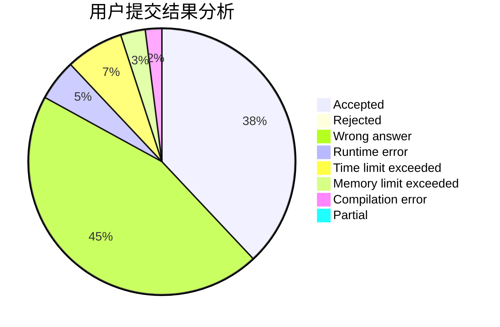
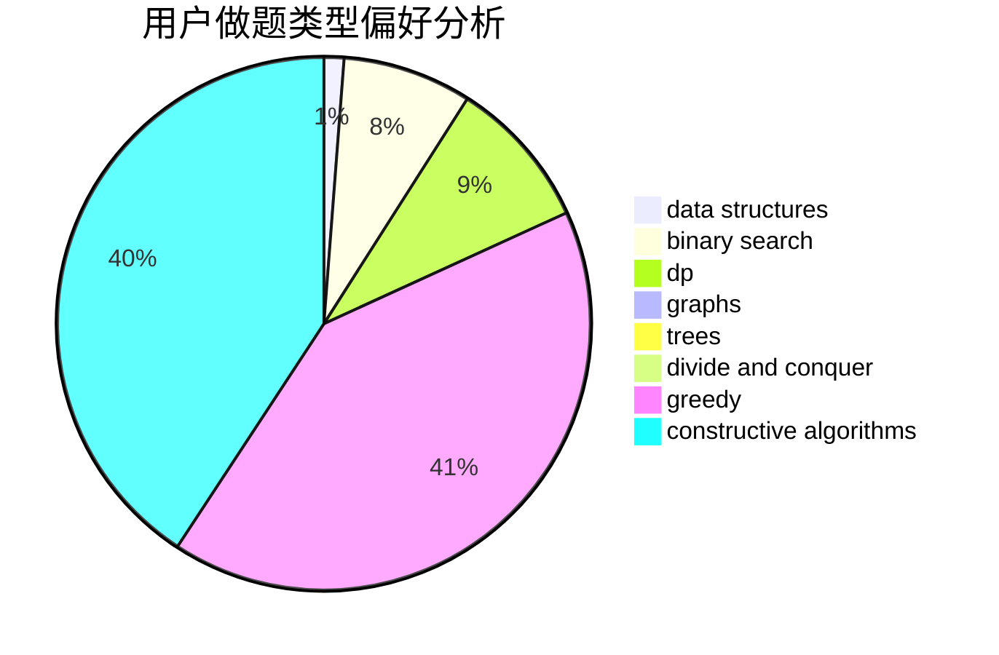
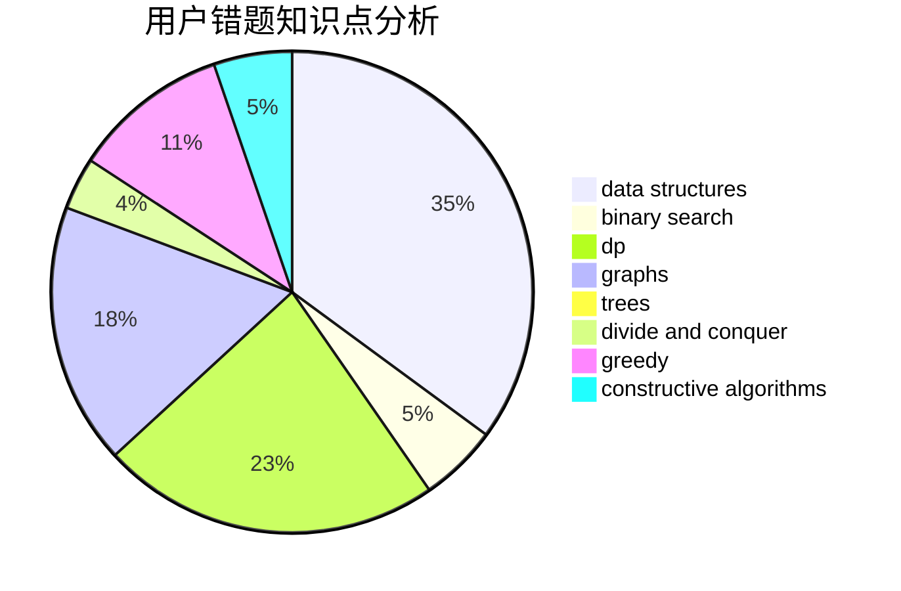

# cwhao

<!-- tabs:start -->

#### **用户提交结果分析**

#### **用户做题类型偏好分析**

#### **用户错题知识点分析**

<!-- tabs:end -->
# 推荐题目
[385E](https://codeforces.com/contest/385/problem/E)		math,
                        matrices		  
[275B](https://codeforces.com/contest/275/problem/B)		constructive algorithms,
                        implementation		  
[614D](https://codeforces.com/contest/614/problem/D)		dsu,graphs,sortings,trees		  
[1413D](https://codeforces.com/contest/1413/problem/D)		data structures,
                        greedy,
                        implementation		  
[817B](https://codeforces.com/contest/817/problem/B)		combinatorics,
                        implementation,
                        math,
                        sortings		  
[348A](https://codeforces.com/contest/348/problem/A)		binary search,
                        math,
                        sortings		  
[698C](https://codeforces.com/contest/698/problem/C)		bitmasks,
                        dp,
                        math,
                        probabilities		  
[204C](https://codeforces.com/contest/204/problem/C)		math,
                        probabilities		  
[1374A](https://codeforces.com/contest/1374/problem/A)		math		  
[1006E](https://codeforces.com/contest/1006/problem/E)		dfs and similar,
                        graphs,
                        trees		  
