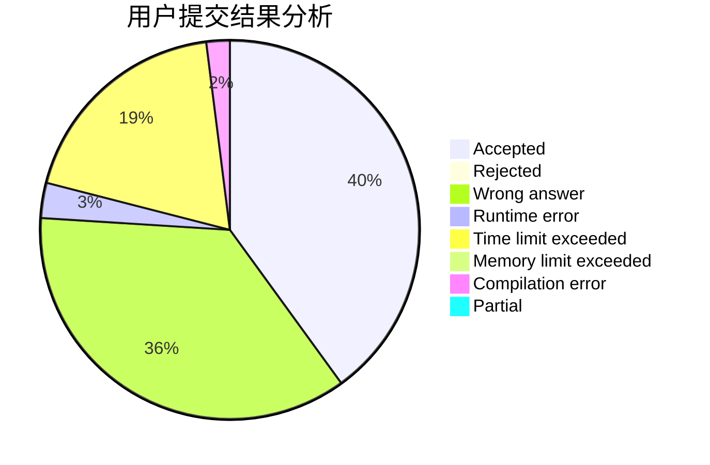
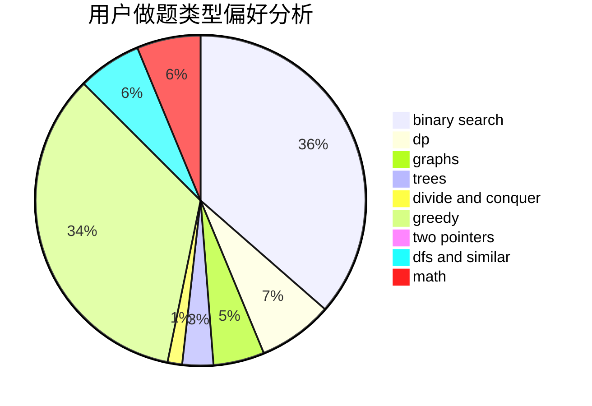

# cwise

<!-- tabs:start -->

#### **用户提交结果分析**

#### **用户做题类型偏好分析**

<!-- tabs:end -->
# 推荐题目
[1156D](https://codeforces.com/contest/1156/problem/D)
[866E](https://codeforces.com/contest/866/problem/E)
[1369F](https://codeforces.com/contest/1369/problem/F)
[1221E](https://codeforces.com/contest/1221/problem/E)
[1182F](https://codeforces.com/contest/1182/problem/F)
[903G](https://codeforces.com/contest/903/problem/G)
[585C](https://codeforces.com/contest/585/problem/C)
[1023G](https://codeforces.com/contest/1023/problem/G)
[216C](https://codeforces.com/contest/216/problem/C)
[759C](https://codeforces.com/contest/759/problem/C)
