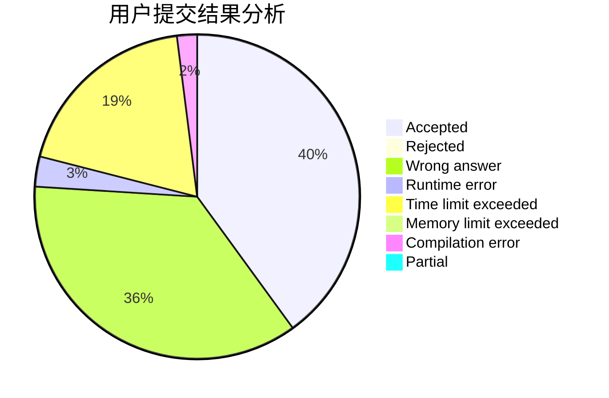
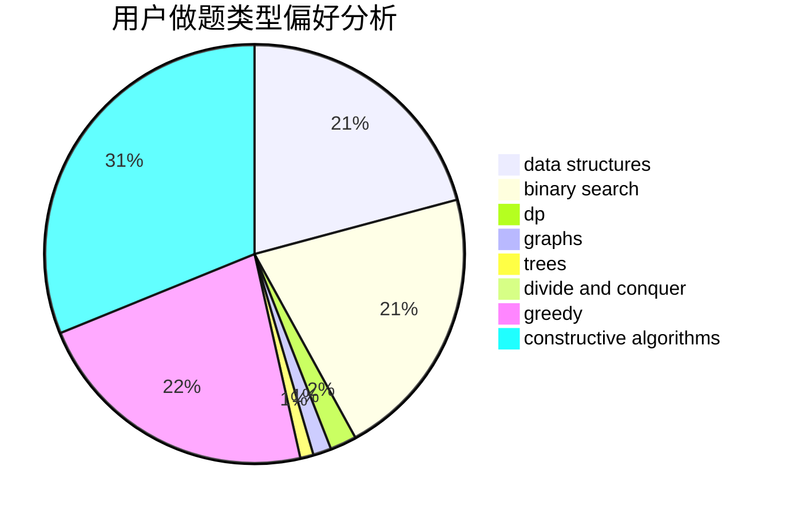
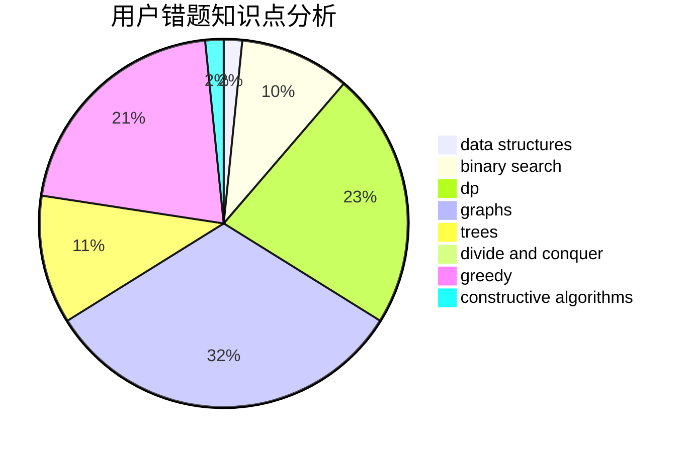

# cwise

<!-- tabs:start -->

#### **用户提交结果分析**

#### **用户做题类型偏好分析**

#### **用户错题知识点分析**

<!-- tabs:end -->
# 推荐题目
[1156D](https://codeforces.com/contest/1156/problem/D)		dfs and similar,
                        divide and conquer,
                        dp,
                        dsu,
                        trees		  
[866E](https://codeforces.com/contest/866/problem/E)		dsu,graphs,sortings,trees		  
[1369F](https://codeforces.com/contest/1369/problem/F)		dfs and similar,
                        dp,
                        games		  
[1221E](https://codeforces.com/contest/1221/problem/E)		games		  
[1182F](https://codeforces.com/contest/1182/problem/F)		binary search,
                        data structures,
                        number theory		  
[903G](https://codeforces.com/contest/903/problem/G)		data structures,
                        flows,
                        graphs		  
[585C](https://codeforces.com/contest/585/problem/C)		number theory		  
[1023G](https://codeforces.com/contest/1023/problem/G)		data structures,
                        flows,
                        trees		  
[216C](https://codeforces.com/contest/216/problem/C)		greedy		  
[759C](https://codeforces.com/contest/759/problem/C)		dsu,graphs,sortings,trees		  
