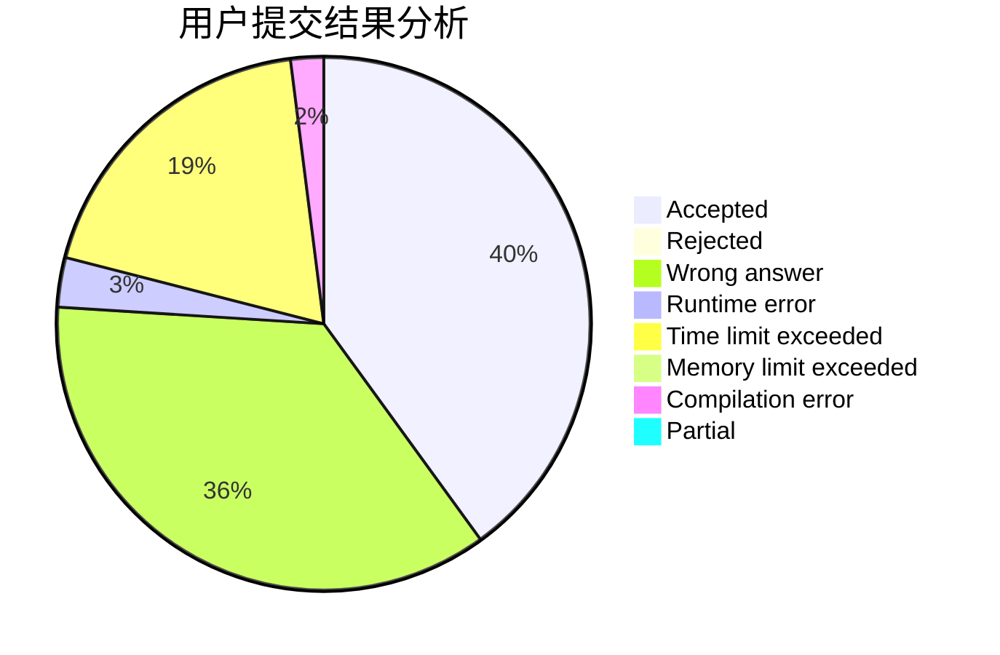
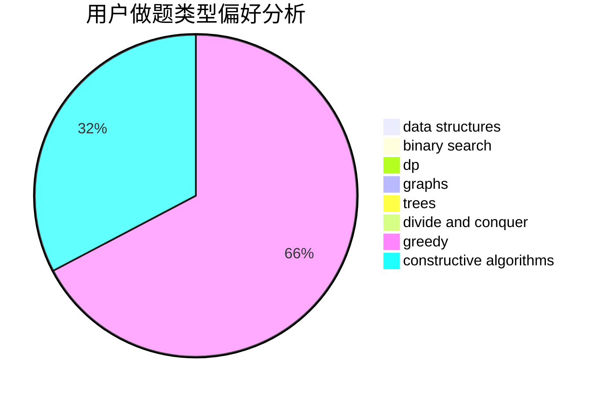
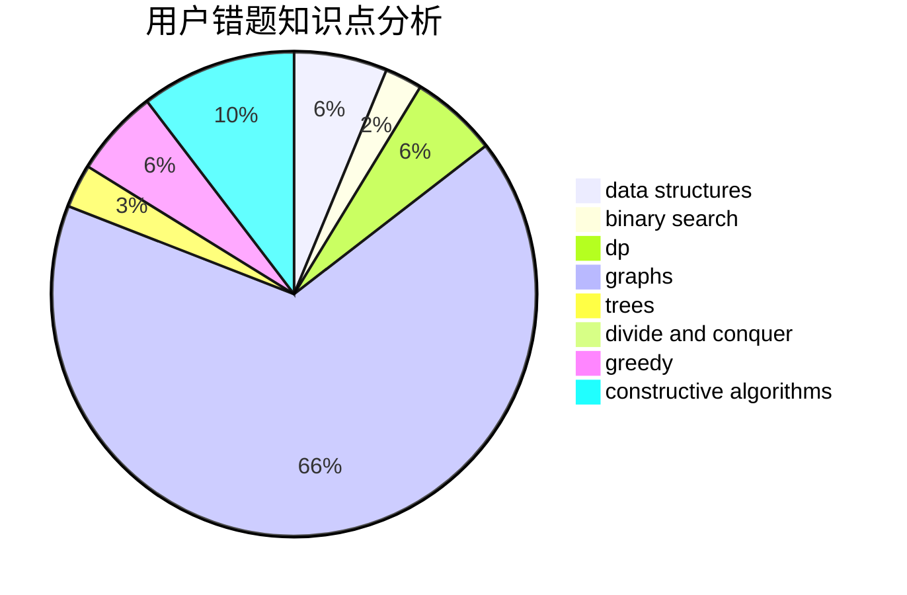

# cwise

<!-- tabs:start -->

#### **用户提交结果分析**

#### **用户做题类型偏好分析**

#### **用户错题知识点分析**

<!-- tabs:end -->
# 推荐题目
[1154D](https://codeforces.com/contest/1154/problem/D)		greedy		  
[848B](https://codeforces.com/contest/848/problem/B)		constructive algorithms,
                        data structures,
                        geometry,
                        implementation,
                        sortings,
                        two pointers		  
[1362A](https://codeforces.com/contest/1362/problem/A)		implementation		  
[1216A](https://codeforces.com/contest/1216/problem/A)		strings		  
[117D](https://codeforces.com/contest/117/problem/D)		divide and conquer,
                        math		  
[886E](https://codeforces.com/contest/886/problem/E)		combinatorics,
                        dp,
                        math		  
[566D](https://codeforces.com/contest/566/problem/D)		data structures,
                        dsu		  
[1023D](https://codeforces.com/contest/1023/problem/D)		constructive algorithms,
                        data structures		  
[193B](https://codeforces.com/contest/193/problem/B)		brute force		  
[737F](https://codeforces.com/contest/737/problem/F)		constructive algorithms,
                        math		  
