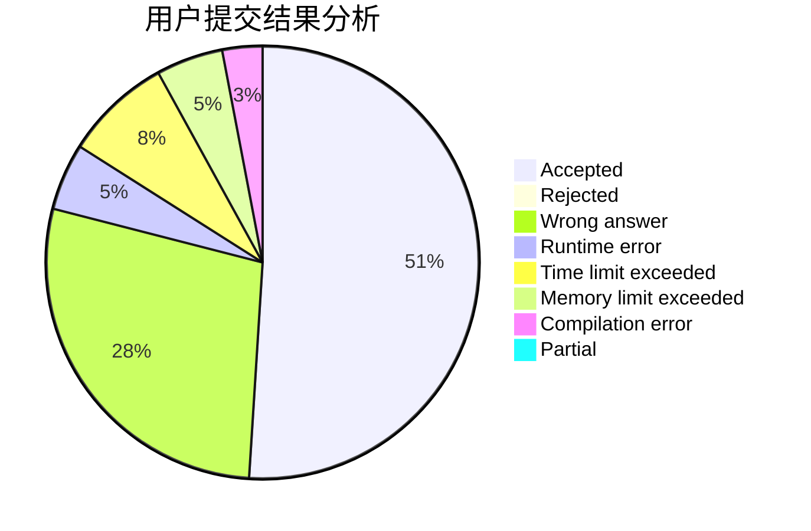
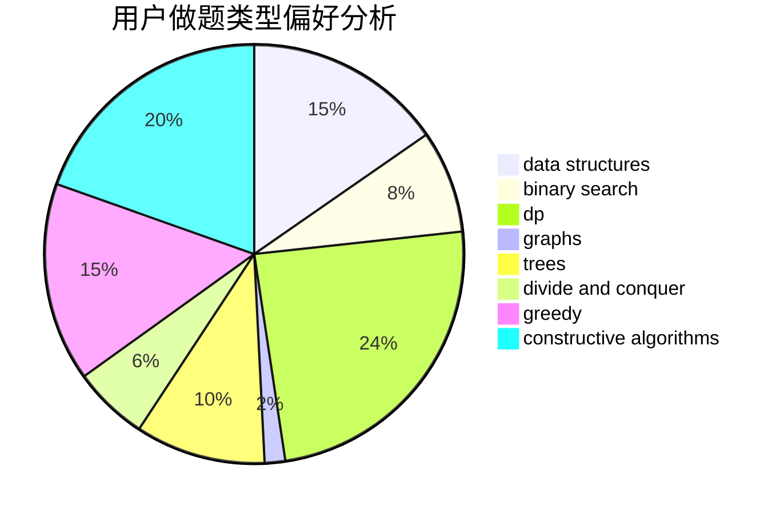

# cwolf9

<!-- tabs:start -->

#### **用户提交结果分析**

#### **用户做题类型偏好分析**

#### **用户错题知识点分析**

<!-- tabs:end -->
# 推荐题目
[1067B](https://codeforces.com/contest/1067/problem/B)		dfs and similar,
                        graphs,
                        shortest paths		  
[449D](https://codeforces.com/contest/449/problem/D)		bitmasks,
                        combinatorics,
                        dp		  
[996B](https://codeforces.com/contest/996/problem/B)		binary search,
                        math		  
[354D](https://codeforces.com/contest/354/problem/D)		dp		  
[804C](https://codeforces.com/contest/804/problem/C)		constructive algorithms,
                        dfs and similar,
                        greedy		  
[819B](https://codeforces.com/contest/819/problem/B)		data structures,
                        implementation,
                        math		  
[703C](https://codeforces.com/contest/703/problem/C)		geometry,
                        implementation		  
[300E](https://codeforces.com/contest/300/problem/E)		binary search,
                        math,
                        number theory		  
[801A](https://codeforces.com/contest/801/problem/A)		brute force		  
[1305H](https://codeforces.com/contest/1305/problem/H)		binary search,
                        greedy		  
