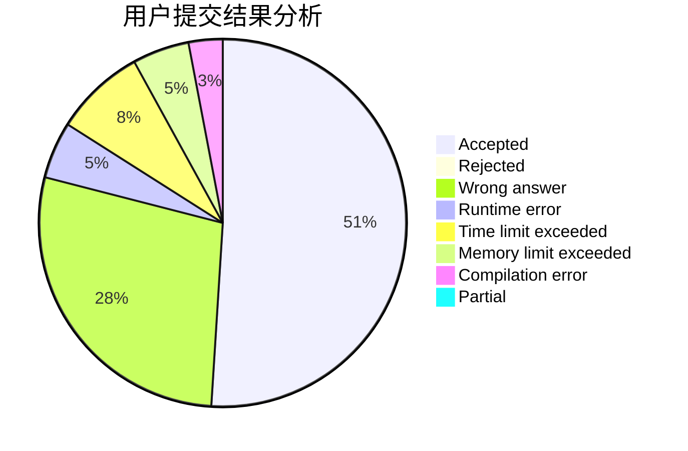
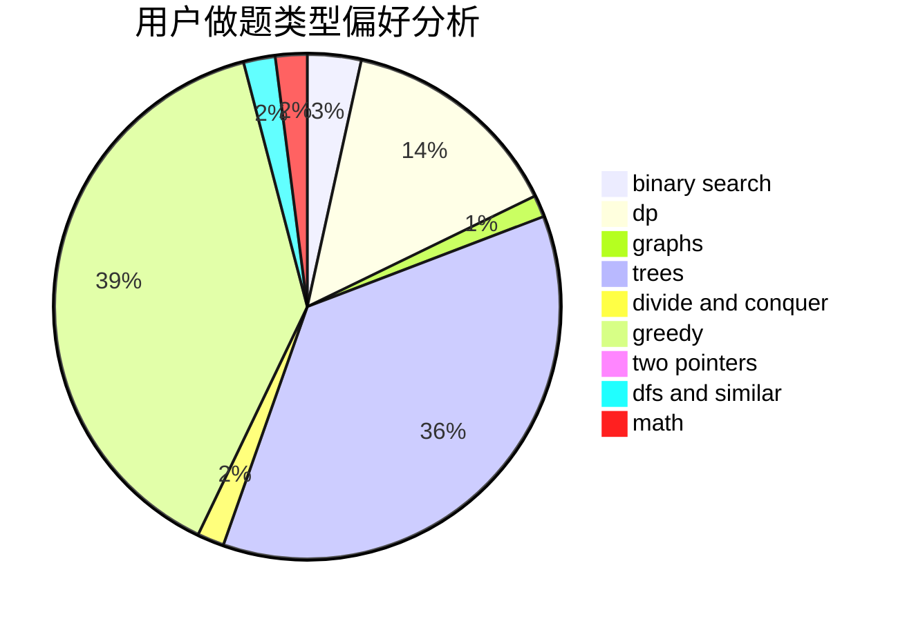

# cwolf9

<!-- tabs:start -->

#### **用户提交结果分析**

#### **用户做题类型偏好分析**

<!-- tabs:end -->
# 推荐题目
[1067B](https://codeforces.com/contest/1067/problem/B)
[449D](https://codeforces.com/contest/449/problem/D)
[996B](https://codeforces.com/contest/996/problem/B)
[354D](https://codeforces.com/contest/354/problem/D)
[804C](https://codeforces.com/contest/804/problem/C)
[819B](https://codeforces.com/contest/819/problem/B)
[703C](https://codeforces.com/contest/703/problem/C)
[300E](https://codeforces.com/contest/300/problem/E)
[801A](https://codeforces.com/contest/801/problem/A)
[1305H](https://codeforces.com/contest/1305/problem/H)
