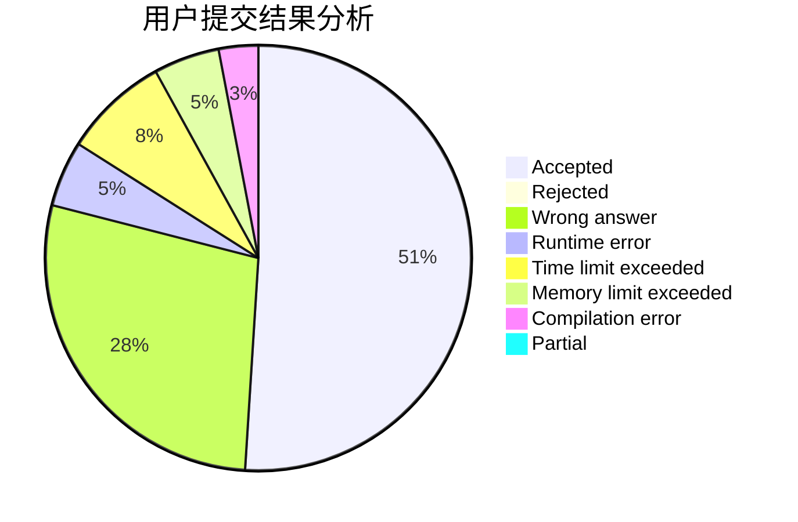
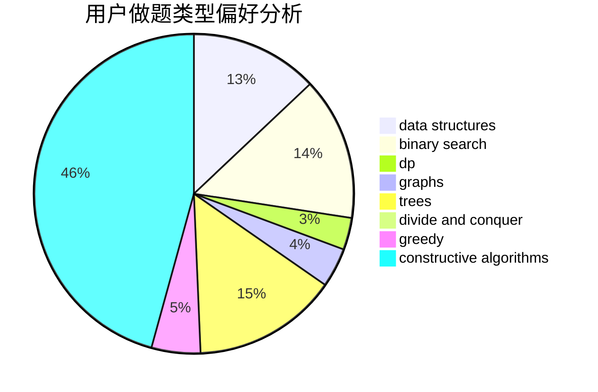

# cwolf9

<!-- tabs:start -->

#### **用户提交结果分析**

#### **用户做题类型偏好分析**

#### **用户错题知识点分析**

<!-- tabs:end -->
# 推荐题目
[1066E](https://codeforces.com/contest/1066/problem/E)		data structures,
                        implementation,
                        math		  
[426B](https://codeforces.com/contest/426/problem/B)		implementation		  
[981A](https://codeforces.com/contest/981/problem/A)		brute force,
                        implementation,
                        strings		  
[325C](https://codeforces.com/contest/325/problem/C)		dfs and similar,
                        graphs,
                        shortest paths		  
[789A](https://codeforces.com/contest/789/problem/A)		implementation,
                        math		  
[803D](https://codeforces.com/contest/803/problem/D)		binary search,
                        greedy		  
[679E](https://codeforces.com/contest/679/problem/E)		data structures		  
[286D](https://codeforces.com/contest/286/problem/D)		data structures,
                        sortings		  
[784A](https://codeforces.com/contest/784/problem/A)		*special problem		  
[1299D](https://codeforces.com/contest/1299/problem/D)		bitmasks,
                        combinatorics,
                        dfs and similar,
                        dp,
                        graphs,
                        graphs,
                        math,
                        trees		  
