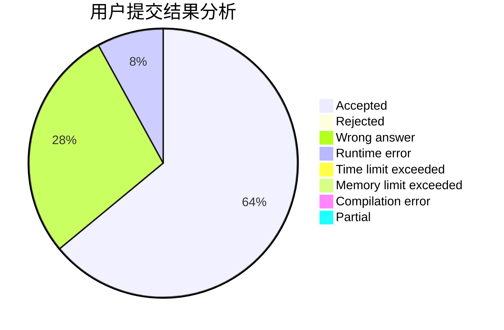
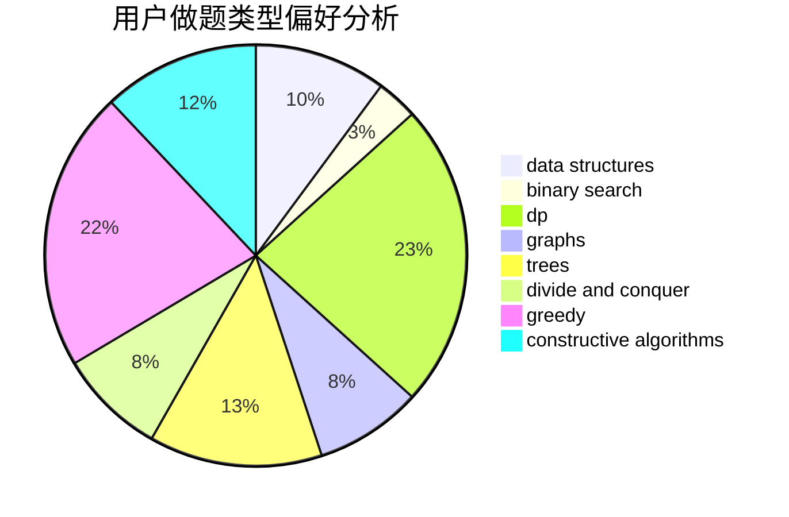
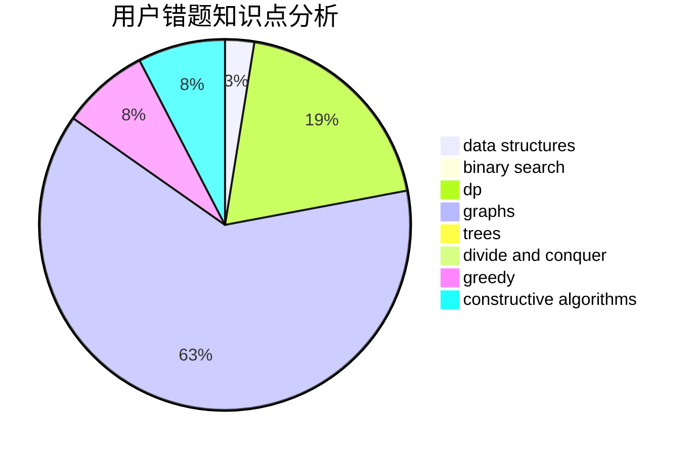

# cwystc

<!-- tabs:start -->

#### **用户提交结果分析**

#### **用户做题类型偏好分析**

#### **用户错题知识点分析**

<!-- tabs:end -->
# 推荐题目
[1490C](https://codeforces.com/contest/1490/problem/C)		binary search,
                        brute force,
                        brute force,
                        math		  
[497D](https://codeforces.com/contest/497/problem/D)		brute force,
                        geometry,
                        math		  
[1020A](https://codeforces.com/contest/1020/problem/A)		math		  
[1292E](https://codeforces.com/contest/1292/problem/E)		constructive algorithms,
                        greedy,
                        interactive,
                        math		  
[1418G](https://codeforces.com/contest/1418/problem/G)		data structures,
                        divide and conquer,
                        hashing,
                        two pointers		  
[295C](https://codeforces.com/contest/295/problem/C)		combinatorics,
                        dp,
                        graphs,
                        shortest paths		  
[1040A](https://codeforces.com/contest/1040/problem/A)		greedy		  
[1424J](https://codeforces.com/contest/1424/problem/J)		dsu,graphs,sortings,trees		  
[807B](https://codeforces.com/contest/807/problem/B)		brute force,
                        implementation		  
[1161B](https://codeforces.com/contest/1161/problem/B)		dsu,graphs,sortings,trees		  
