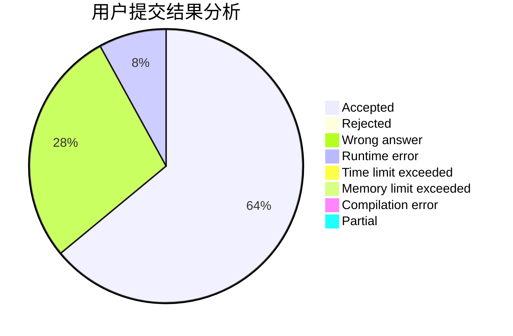
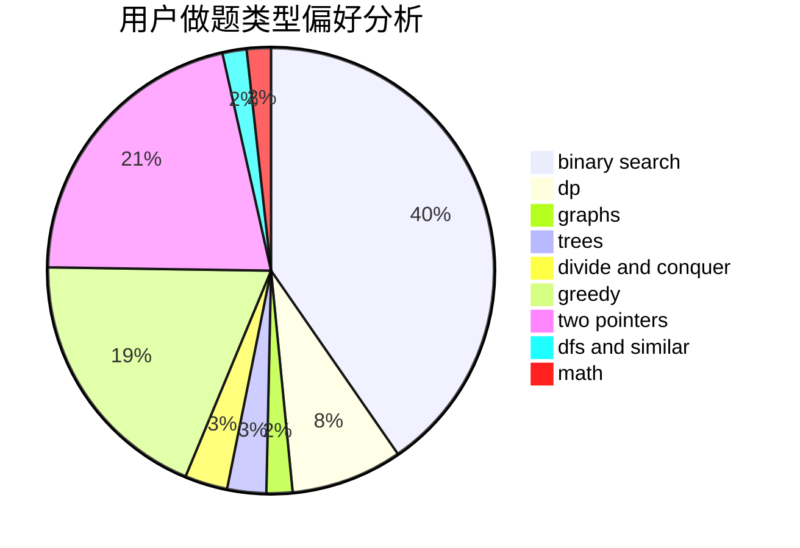

# cwystc

<!-- tabs:start -->

#### **用户提交结果分析**

#### **用户做题类型偏好分析**

<!-- tabs:end -->
# 推荐题目
[1490C](https://codeforces.com/contest/1490/problem/C)
[497D](https://codeforces.com/contest/497/problem/D)
[1020A](https://codeforces.com/contest/1020/problem/A)
[1292E](https://codeforces.com/contest/1292/problem/E)
[1418G](https://codeforces.com/contest/1418/problem/G)
[295C](https://codeforces.com/contest/295/problem/C)
[1040A](https://codeforces.com/contest/1040/problem/A)
[1424J](https://codeforces.com/contest/1424/problem/J)
[807B](https://codeforces.com/contest/807/problem/B)
[1161B](https://codeforces.com/contest/1161/problem/B)
