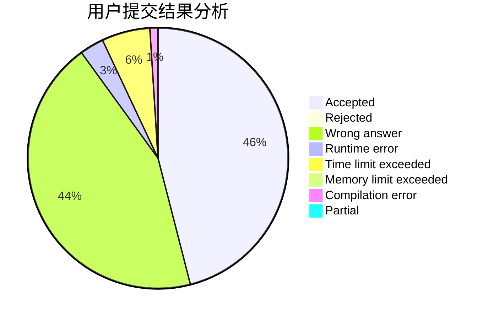
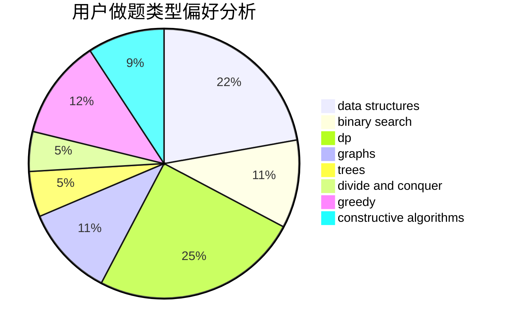

# cxaphoenix

<!-- tabs:start -->

#### **用户提交结果分析**

#### **用户做题类型偏好分析**

#### **用户错题知识点分析**

<!-- tabs:end -->
# 推荐题目
[1070H](https://codeforces.com/contest/1070/problem/H)		brute force,
                        implementation		  
[98E](https://codeforces.com/contest/98/problem/E)		dp,
                        games,
                        math,
                        probabilities		  
[138D](https://codeforces.com/contest/138/problem/D)		dp,
                        games		  
[11571](https://codeforces.com/contest/1157/problem/1)		dsu,graphs,sortings,trees		  
[1333D](https://codeforces.com/contest/1333/problem/D)		brute force,
                        constructive algorithms,
                        games,
                        graphs,
                        greedy,
                        implementation,
                        sortings		  
[376A](https://codeforces.com/contest/376/problem/A)		implementation,
                        math		  
[33D](https://codeforces.com/contest/33/problem/D)		geometry,
                        graphs,
                        shortest paths,
                        sortings		  
[631D](https://codeforces.com/contest/631/problem/D)		data structures,
                        hashing,
                        implementation,
                        string suffix structures,
                        strings		  
[991A](https://codeforces.com/contest/991/problem/A)		implementation		  
[471A](https://codeforces.com/contest/471/problem/A)		implementation		  
