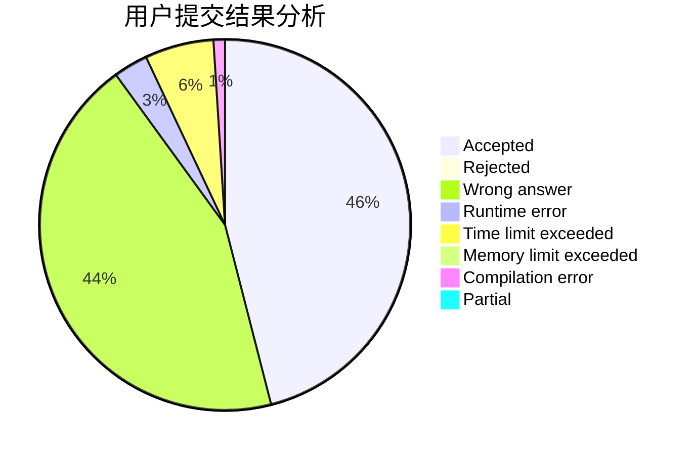
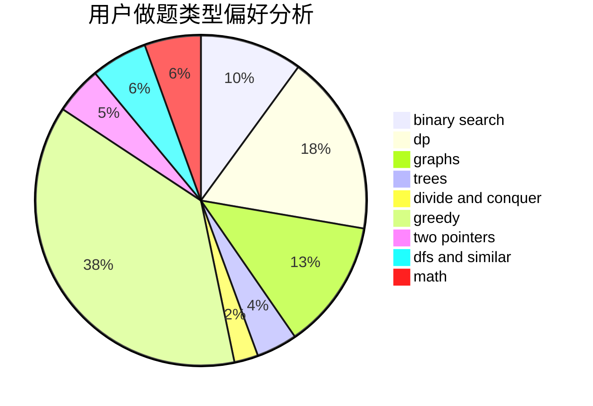

# cxaphoenix

<!-- tabs:start -->

#### **用户提交结果分析**

#### **用户做题类型偏好分析**

<!-- tabs:end -->
# 推荐题目
[1070H](https://codeforces.com/contest/1070/problem/H)
[98E](https://codeforces.com/contest/98/problem/E)
[138D](https://codeforces.com/contest/138/problem/D)
[11571](https://codeforces.com/contest/1157/problem/1)
[1333D](https://codeforces.com/contest/1333/problem/D)
[376A](https://codeforces.com/contest/376/problem/A)
[33D](https://codeforces.com/contest/33/problem/D)
[631D](https://codeforces.com/contest/631/problem/D)
[991A](https://codeforces.com/contest/991/problem/A)
[471A](https://codeforces.com/contest/471/problem/A)
