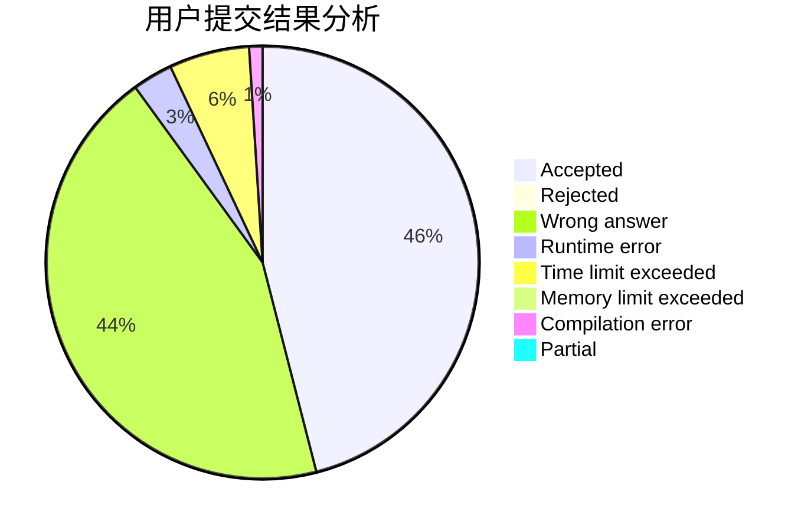
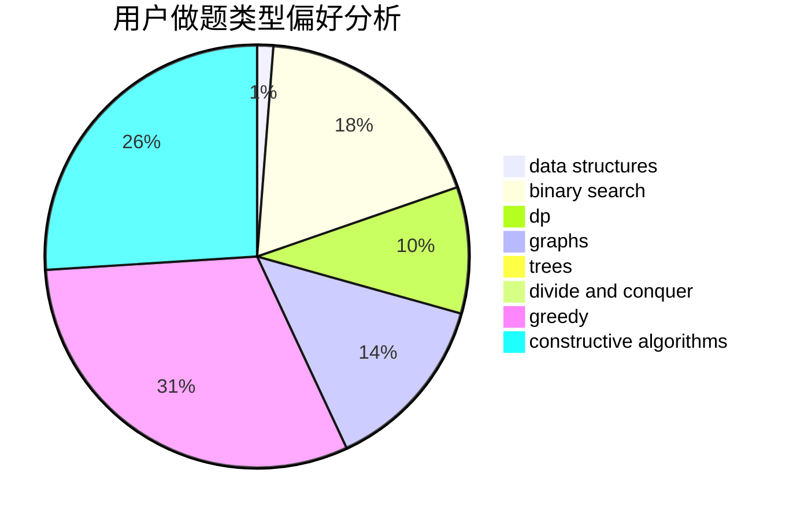

# cxaphoenix

<!-- tabs:start -->

#### **用户提交结果分析**

#### **用户做题类型偏好分析**

#### **用户错题知识点分析**

<!-- tabs:end -->
# 推荐题目
[1070E](https://codeforces.com/contest/1070/problem/E)		binary search,
                        data structures		  
[976A](https://codeforces.com/contest/976/problem/A)		implementation		  
[1380F](https://codeforces.com/contest/1380/problem/F)		data structures,
                        dp,
                        matrices		  
[1155A](https://codeforces.com/contest/1155/problem/A)		implementation,
                        sortings,
                        strings		  
[1327A](https://codeforces.com/contest/1327/problem/A)		math		  
[349B](https://codeforces.com/contest/349/problem/B)		data structures,
                        dp,
                        greedy,
                        implementation		  
[316B2](https://codeforces.com/contest/316B/problem/2)		dfs and similar,
                        dp		  
[612B](https://codeforces.com/contest/612/problem/B)		implementation,
                        math		  
[977C](https://codeforces.com/contest/977/problem/C)		sortings		  
[44B](https://codeforces.com/contest/44/problem/B)		implementation		  
