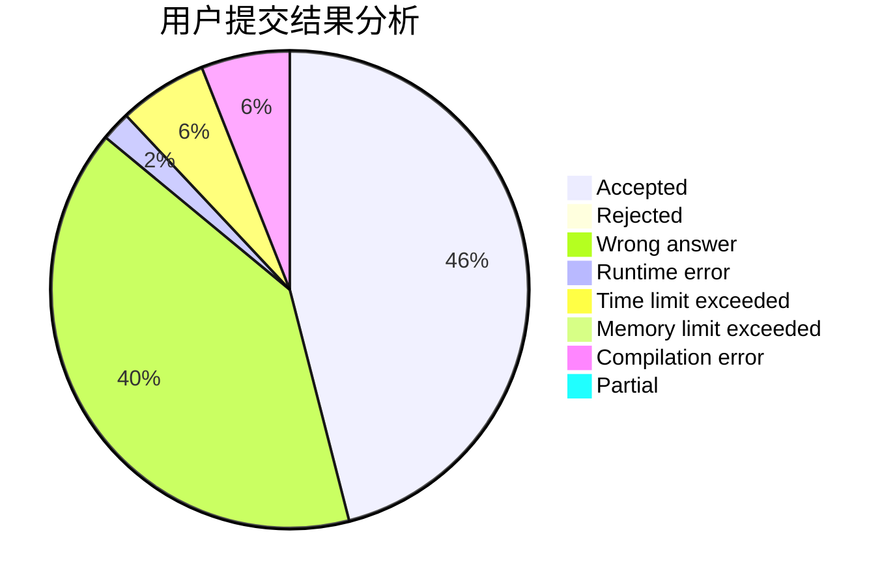
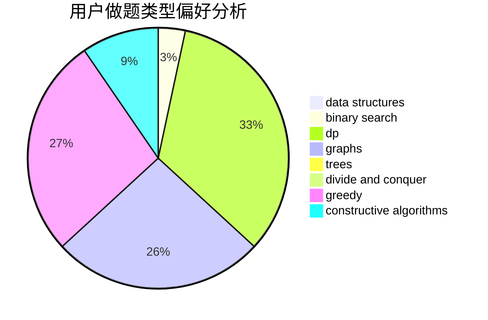
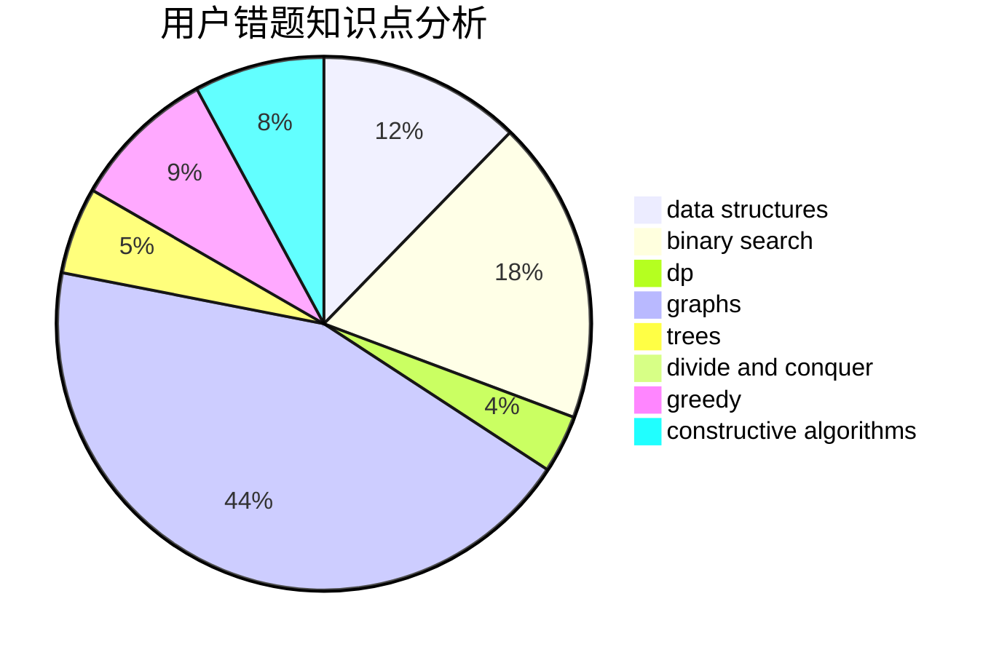

# cxcxcx

<!-- tabs:start -->

#### **用户提交结果分析**

#### **用户做题类型偏好分析**

#### **用户错题知识点分析**

<!-- tabs:end -->
# 推荐题目
[1313E](https://codeforces.com/contest/1313/problem/E)		data structures,
                        hashing,
                        strings,
                        two pointers		  
[1250M](https://codeforces.com/contest/1250/problem/M)		constructive algorithms,
                        divide and conquer		  
[405B](https://codeforces.com/contest/405/problem/B)		nan		  
[820D](https://codeforces.com/contest/820/problem/D)		dsu,graphs,sortings,trees		  
[709B](https://codeforces.com/contest/709/problem/B)		greedy,
                        implementation,
                        sortings		  
[462C](https://codeforces.com/contest/462/problem/C)		dsu,graphs,sortings,trees		  
[915G](https://codeforces.com/contest/915/problem/G)		math,
                        number theory		  
[94C](https://codeforces.com/contest/94/problem/C)		dsu,graphs,sortings,trees		  
[924D](https://codeforces.com/contest/924/problem/D)		nan		  
[505E](https://codeforces.com/contest/505/problem/E)		binary search,
                        greedy		  
