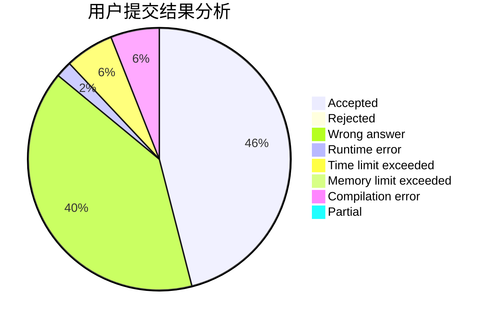
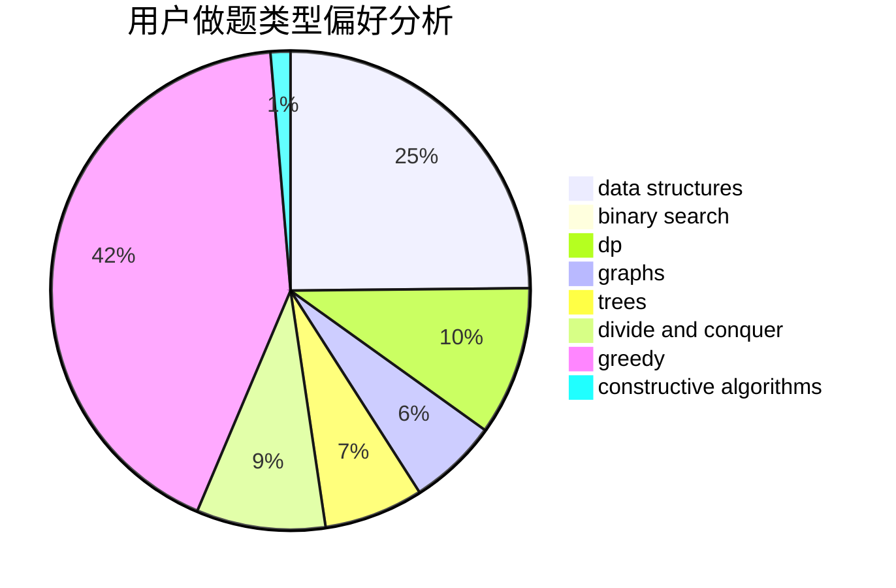
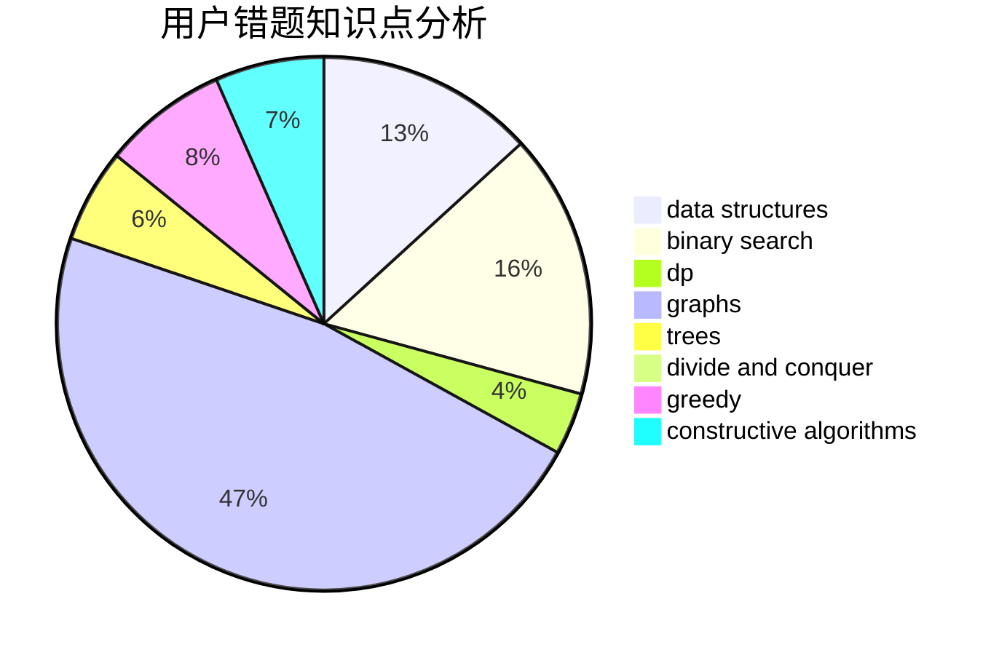

# cxcxcx

<!-- tabs:start -->

#### **用户提交结果分析**

#### **用户做题类型偏好分析**

#### **用户错题知识点分析**

<!-- tabs:end -->
# 推荐题目
[1323C](https://codeforces.com/contest/1323/problem/C)		dsu,graphs,sortings,trees		  
[1255D](https://codeforces.com/contest/1255/problem/D)		dsu,graphs,sortings,trees		  
[434B](https://codeforces.com/contest/434/problem/B)		dsu,graphs,sortings,trees		  
[840D](https://codeforces.com/contest/840/problem/D)		data structures,
                        probabilities		  
[729C](https://codeforces.com/contest/729/problem/C)		binary search,
                        greedy,
                        sortings		  
[482C](https://codeforces.com/contest/482/problem/C)		bitmasks,
                        dp,
                        probabilities		  
[935F](https://codeforces.com/contest/935/problem/F)		data structures,
                        greedy		  
[967B](https://codeforces.com/contest/967/problem/B)		math,
                        sortings		  
[948B](https://codeforces.com/contest/948/problem/B)		dsu,graphs,sortings,trees		  
[526B](https://codeforces.com/contest/526/problem/B)		dfs and similar,
                        greedy,
                        implementation		  
