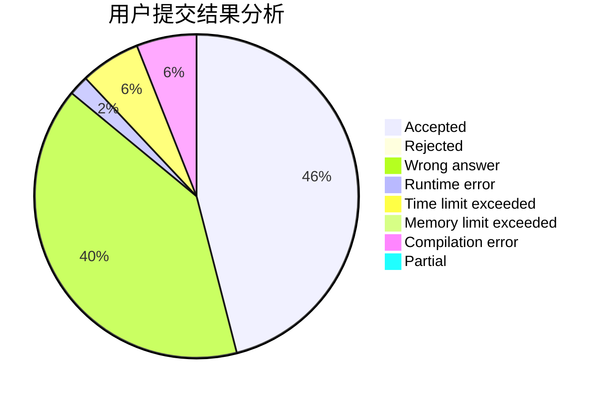
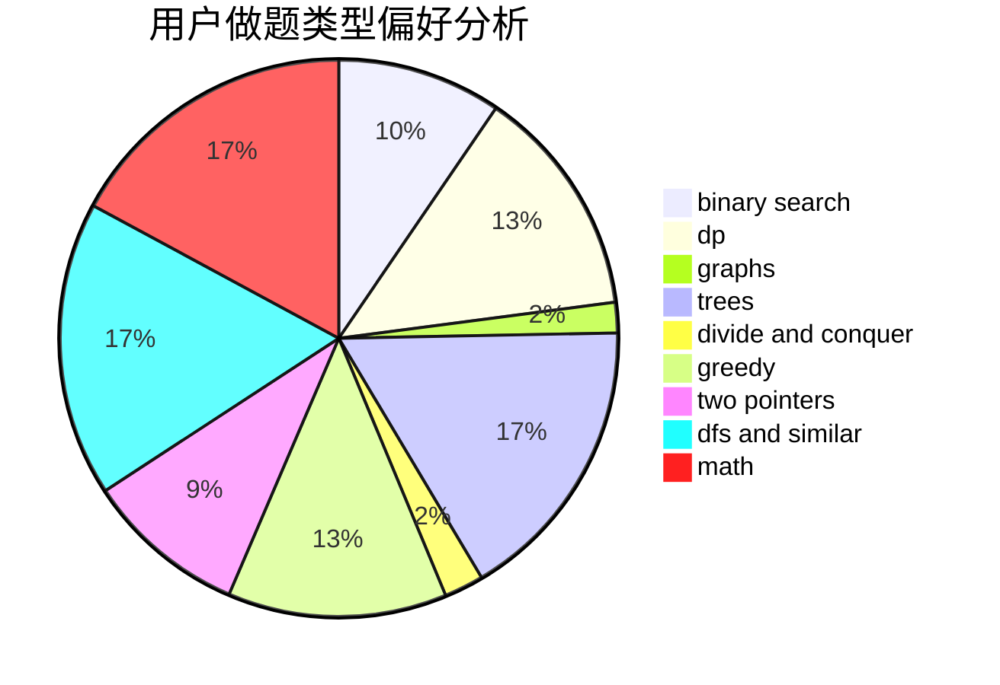

# cxcxcx

<!-- tabs:start -->

#### **用户提交结果分析**

#### **用户做题类型偏好分析**

<!-- tabs:end -->
# 推荐题目
[1323C](https://codeforces.com/contest/1323/problem/C)
[1255D](https://codeforces.com/contest/1255/problem/D)
[434B](https://codeforces.com/contest/434/problem/B)
[840D](https://codeforces.com/contest/840/problem/D)
[729C](https://codeforces.com/contest/729/problem/C)
[482C](https://codeforces.com/contest/482/problem/C)
[935F](https://codeforces.com/contest/935/problem/F)
[967B](https://codeforces.com/contest/967/problem/B)
[948B](https://codeforces.com/contest/948/problem/B)
[526B](https://codeforces.com/contest/526/problem/B)
