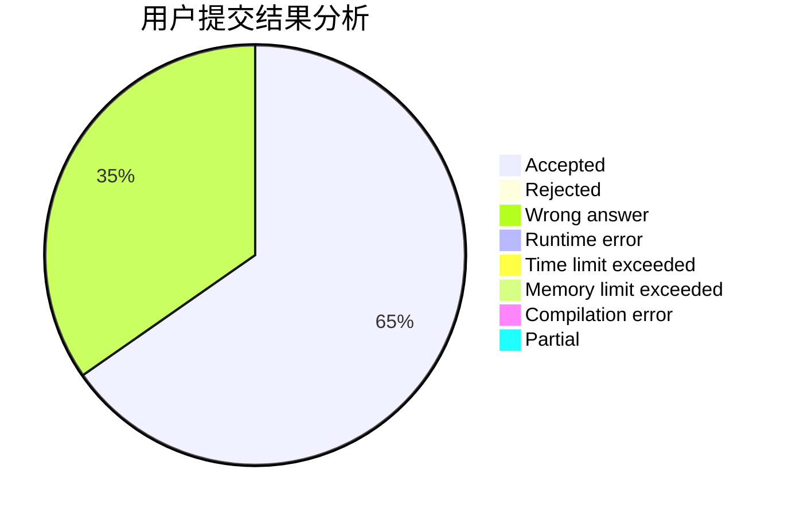
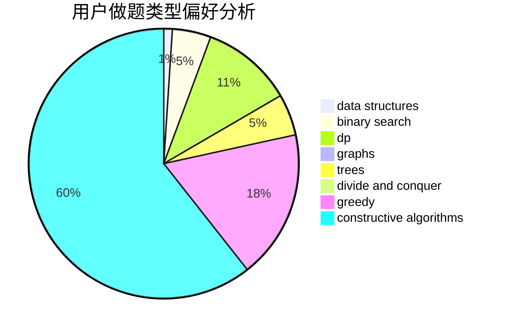

# Arcahv

<!-- tabs:start -->

#### **用户提交结果分析**

#### **用户做题类型偏好分析**

#### **用户错题知识点分析**

<!-- tabs:end -->
# 推荐题目
[1467D](https://codeforces.com/contest/1467/problem/D)		combinatorics,
                        dp,
                        math		  
[1107F](https://codeforces.com/contest/1107/problem/F)		dp,
                        flows,
                        graph matchings,
                        graphs,
                        sortings		  
[393C](https://codeforces.com/contest/393/problem/C)		dsu,graphs,sortings,trees		  
[200C](https://codeforces.com/contest/200/problem/C)		brute force,
                        implementation		  
[392B](https://codeforces.com/contest/392/problem/B)		dp		  
[1047A](https://codeforces.com/contest/1047/problem/A)		math		  
[394C](https://codeforces.com/contest/394/problem/C)		constructive algorithms,
                        greedy		  
[38A](https://codeforces.com/contest/38/problem/A)		implementation		  
[392A](https://codeforces.com/contest/392/problem/A)		math		  
[1141E](https://codeforces.com/contest/1141/problem/E)		math		  
