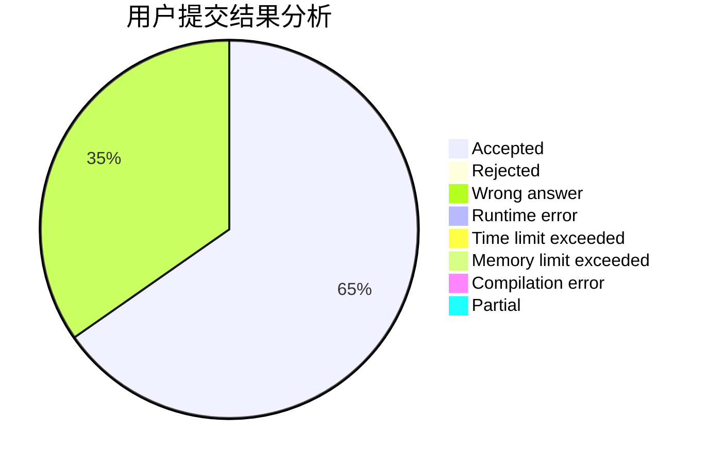
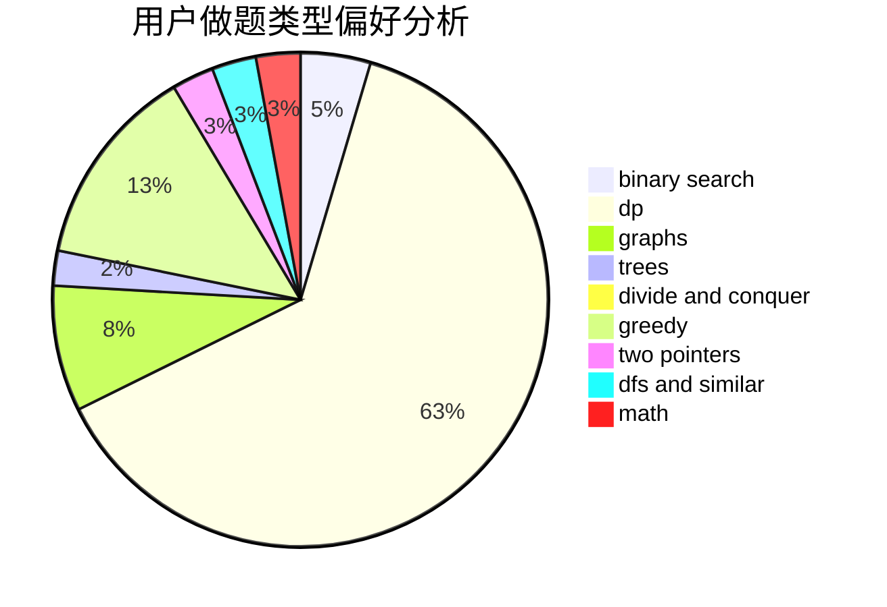

# Arcahv

<!-- tabs:start -->

#### **用户提交结果分析**

#### **用户做题类型偏好分析**

<!-- tabs:end -->
# 推荐题目
[1474F](https://codeforces.com/contest/1474/problem/F)
[1108A](https://codeforces.com/contest/1108/problem/A)
[421B](https://codeforces.com/contest/421/problem/B)
[225E](https://codeforces.com/contest/225/problem/E)
[421A](https://codeforces.com/contest/421/problem/A)
[1047D](https://codeforces.com/contest/1047/problem/D)
[424A](https://codeforces.com/contest/424/problem/A)
[418E](https://codeforces.com/contest/418/problem/E)
[420D](https://codeforces.com/contest/420/problem/D)
[1143E](https://codeforces.com/contest/1143/problem/E)
