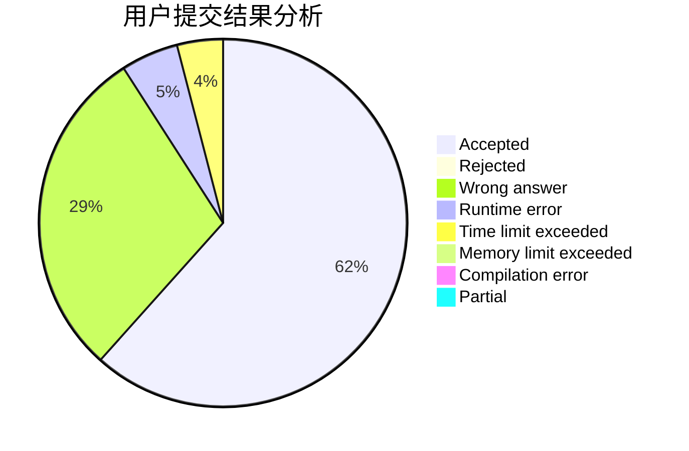
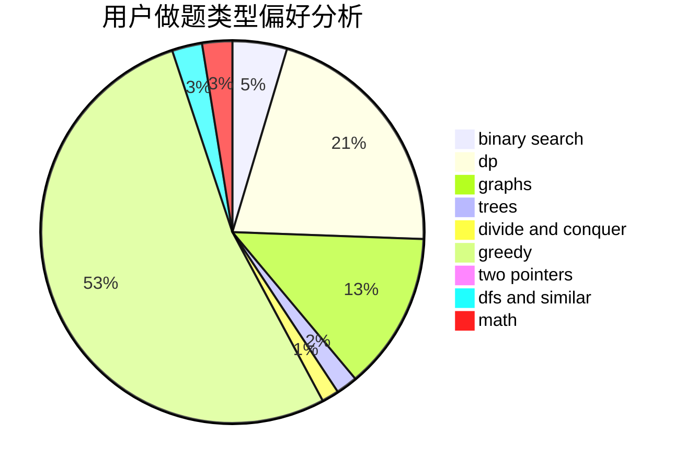

# cxr_o__o_cxr

<!-- tabs:start -->

#### **用户提交结果分析**

#### **用户做题类型偏好分析**

<!-- tabs:end -->
# 推荐题目
[491B](https://codeforces.com/contest/491/problem/B)
[228B](https://codeforces.com/contest/228/problem/B)
[594D](https://codeforces.com/contest/594/problem/D)
[1190E](https://codeforces.com/contest/1190/problem/E)
[955B](https://codeforces.com/contest/955/problem/B)
[327D](https://codeforces.com/contest/327/problem/D)
[167E](https://codeforces.com/contest/167/problem/E)
[871E](https://codeforces.com/contest/871/problem/E)
[1169C](https://codeforces.com/contest/1169/problem/C)
[667C](https://codeforces.com/contest/667/problem/C)
