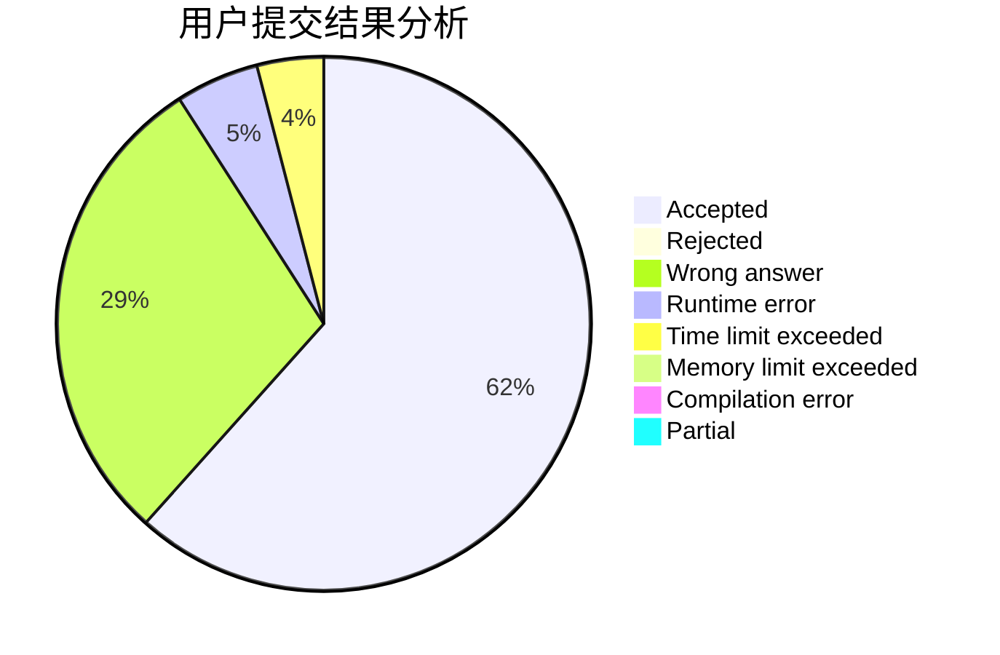
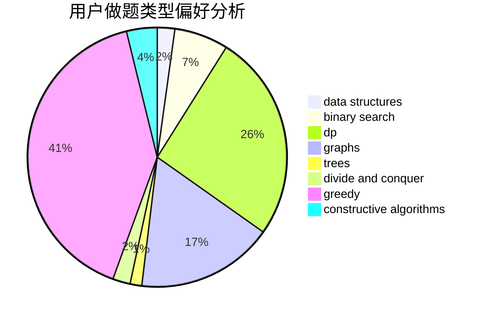
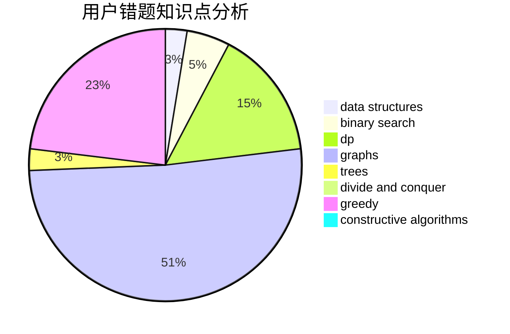

# cxr_o__o_cxr

<!-- tabs:start -->

#### **用户提交结果分析**

#### **用户做题类型偏好分析**

#### **用户错题知识点分析**

<!-- tabs:end -->
# 推荐题目
[491B](https://codeforces.com/contest/491/problem/B)		greedy,
                        math		  
[228B](https://codeforces.com/contest/228/problem/B)		brute force,
                        implementation		  
[594D](https://codeforces.com/contest/594/problem/D)		data structures,
                        number theory		  
[1190E](https://codeforces.com/contest/1190/problem/E)		binary search,
                        greedy		  
[955B](https://codeforces.com/contest/955/problem/B)		implementation		  
[327D](https://codeforces.com/contest/327/problem/D)		constructive algorithms,
                        dfs and similar,
                        graphs		  
[167E](https://codeforces.com/contest/167/problem/E)		dfs and similar,
                        graphs,
                        math,
                        matrices		  
[871E](https://codeforces.com/contest/871/problem/E)		graphs,
                        greedy,
                        trees		  
[1169C](https://codeforces.com/contest/1169/problem/C)		dsu,graphs,sortings,trees		  
[667C](https://codeforces.com/contest/667/problem/C)		dsu,graphs,sortings,trees		  
