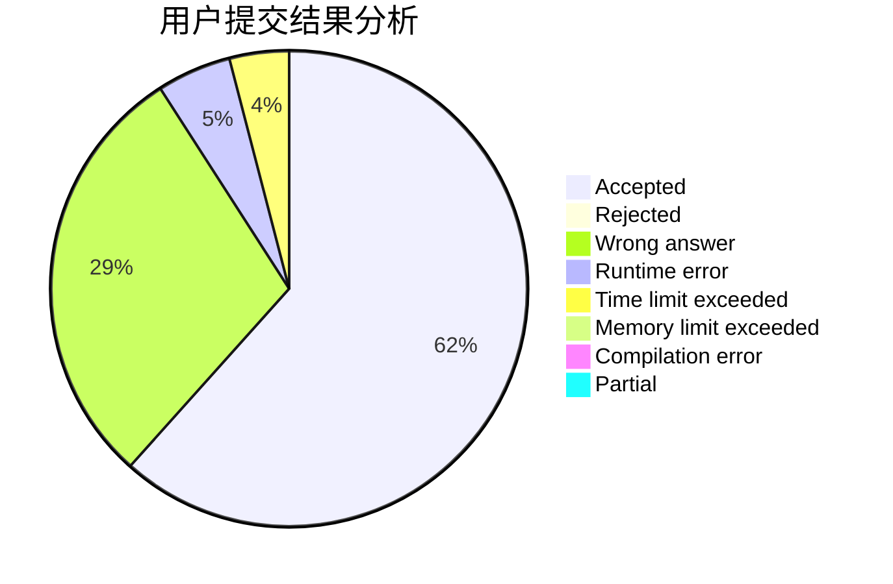
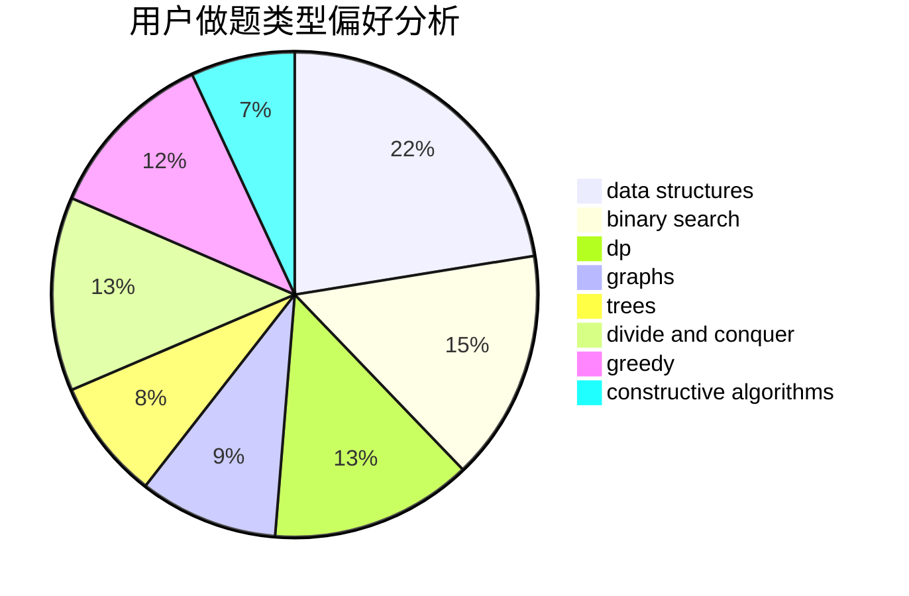
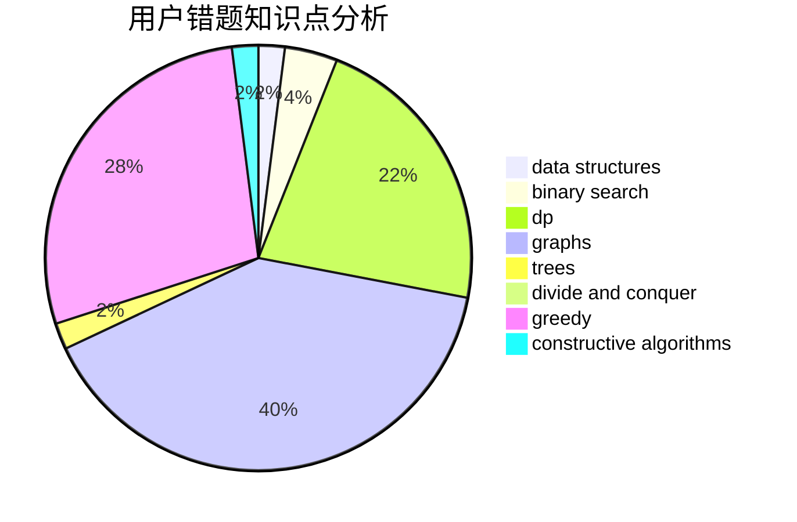

# cxr_o__o_cxr

<!-- tabs:start -->

#### **用户提交结果分析**

#### **用户做题类型偏好分析**

#### **用户错题知识点分析**

<!-- tabs:end -->
# 推荐题目
[472D](https://codeforces.com/contest/472/problem/D)		dfs and similar,
                        dsu,
                        shortest paths,
                        trees		  
[204C](https://codeforces.com/contest/204/problem/C)		math,
                        probabilities		  
[574C](https://codeforces.com/contest/574/problem/C)		dsu,graphs,sortings,trees		  
[1187C](https://codeforces.com/contest/1187/problem/C)		constructive algorithms,
                        greedy,
                        implementation		  
[933B](https://codeforces.com/contest/933/problem/B)		math		  
[306B](https://codeforces.com/contest/306/problem/B)		data structures,
                        greedy,
                        sortings		  
[1511C](https://codeforces.com/contest/1511/problem/C)		brute force,
                        data structures,
                        implementation,
                        trees		  
[853C](https://codeforces.com/contest/853/problem/C)		data structures		  
[1166D](https://codeforces.com/contest/1166/problem/D)		binary search,
                        brute force,
                        greedy,
                        math		  
[635A](https://codeforces.com/contest/635/problem/A)		brute force,
                        implementation		  
