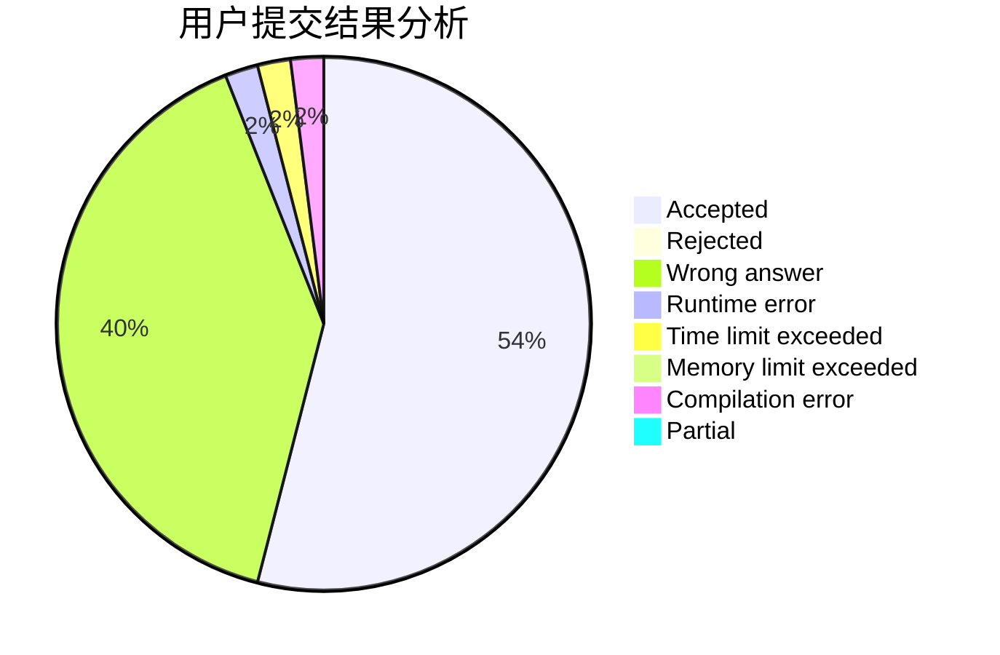
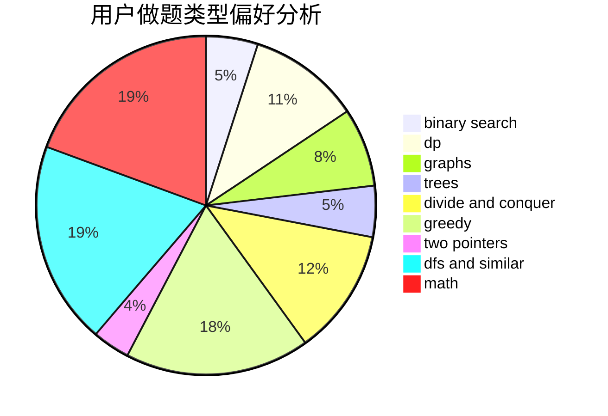

# cxzxlj

<!-- tabs:start -->

#### **用户提交结果分析**

#### **用户做题类型偏好分析**

<!-- tabs:end -->
# 推荐题目
[804F](https://codeforces.com/contest/804/problem/F)
[581B](https://codeforces.com/contest/581/problem/B)
[1339C](https://codeforces.com/contest/1339/problem/C)
[219D](https://codeforces.com/contest/219/problem/D)
[312A](https://codeforces.com/contest/312/problem/A)
[1287B](https://codeforces.com/contest/1287/problem/B)
[845A](https://codeforces.com/contest/845/problem/A)
[92B](https://codeforces.com/contest/92/problem/B)
[987F](https://codeforces.com/contest/987/problem/F)
[339A](https://codeforces.com/contest/339/problem/A)
