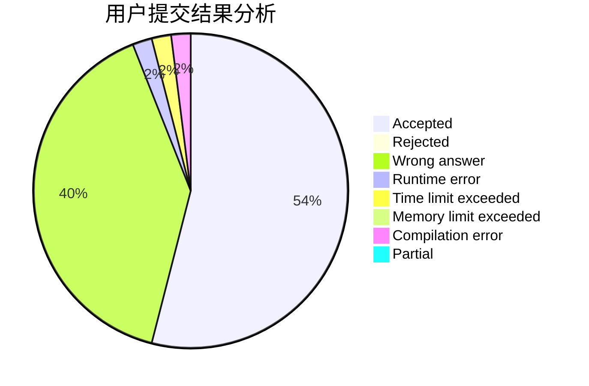
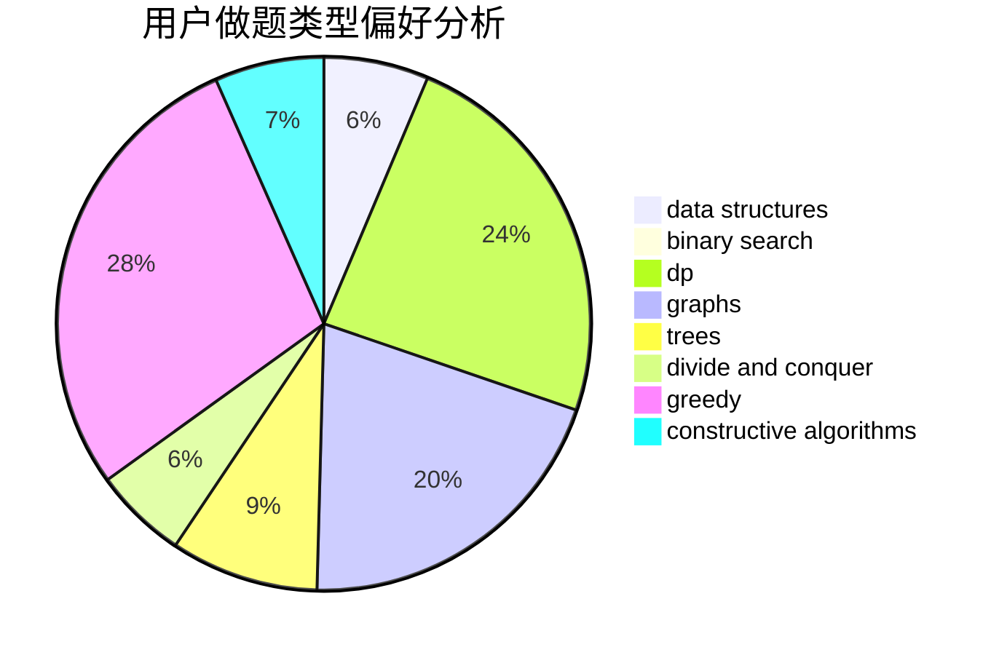

# cxzxlj

<!-- tabs:start -->

#### **用户提交结果分析**

#### **用户做题类型偏好分析**

#### **用户错题知识点分析**

<!-- tabs:end -->
# 推荐题目
[789D](https://codeforces.com/contest/789/problem/D)		dsu,graphs,sortings,trees		  
[558D](https://codeforces.com/contest/558/problem/D)		data structures,
                        implementation,
                        sortings		  
[1332F](https://codeforces.com/contest/1332/problem/F)		dfs and similar,
                        dp,
                        trees		  
[198B](https://codeforces.com/contest/198/problem/B)		shortest paths		  
[295C](https://codeforces.com/contest/295/problem/C)		combinatorics,
                        dp,
                        graphs,
                        shortest paths		  
[1281B](https://codeforces.com/contest/1281/problem/B)		greedy		  
[825E](https://codeforces.com/contest/825/problem/E)		data structures,
                        dfs and similar,
                        graphs,
                        greedy		  
[911D](https://codeforces.com/contest/911/problem/D)		brute force,
                        math		  
[966A](https://codeforces.com/contest/966/problem/A)		dsu,graphs,sortings,trees		  
[314B](https://codeforces.com/contest/314/problem/B)		binary search,
                        dfs and similar,
                        strings		  
