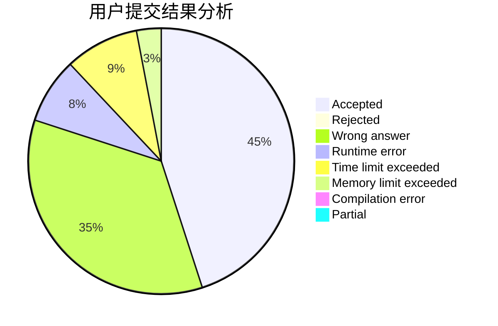
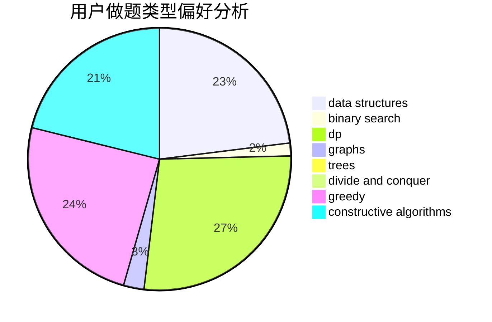
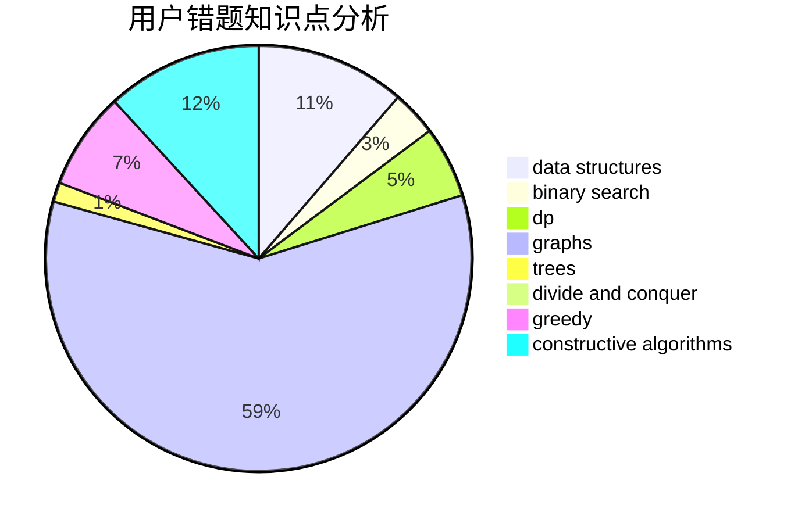

# cyc4188

<!-- tabs:start -->

#### **用户提交结果分析**

#### **用户做题类型偏好分析**

#### **用户错题知识点分析**

<!-- tabs:end -->
# 推荐题目
[1179D](https://codeforces.com/contest/1179/problem/D)		data structures,
                        dp,
                        trees		  
[320B](https://codeforces.com/contest/320/problem/B)		dfs and similar,
                        graphs		  
[526B](https://codeforces.com/contest/526/problem/B)		dfs and similar,
                        greedy,
                        implementation		  
[899C](https://codeforces.com/contest/899/problem/C)		constructive algorithms,
                        graphs,
                        math		  
[594D](https://codeforces.com/contest/594/problem/D)		data structures,
                        number theory		  
[815D](https://codeforces.com/contest/815/problem/D)		binary search,
                        combinatorics,
                        data structures,
                        geometry		  
[979E](https://codeforces.com/contest/979/problem/E)		dp		  
[489A](https://codeforces.com/contest/489/problem/A)		greedy,
                        implementation,
                        sortings		  
[1081F](https://codeforces.com/contest/1081/problem/F)		constructive algorithms,
                        implementation,
                        interactive		  
[1072C](https://codeforces.com/contest/1072/problem/C)		dsu,graphs,sortings,trees		  
