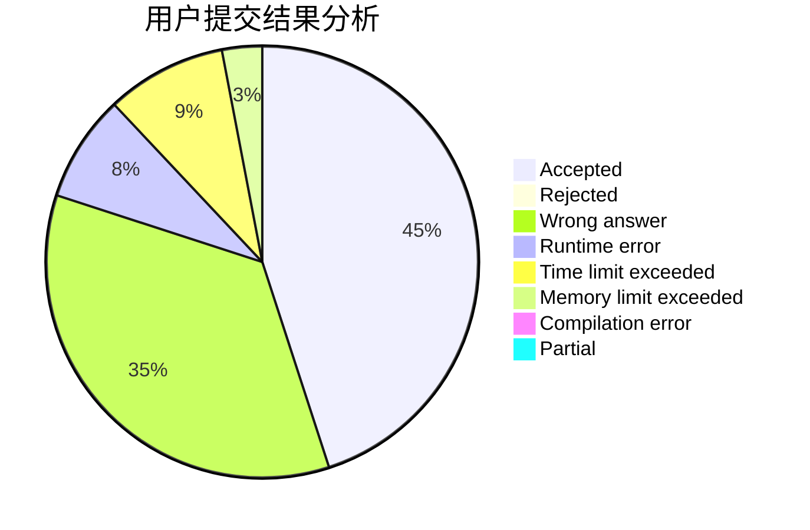
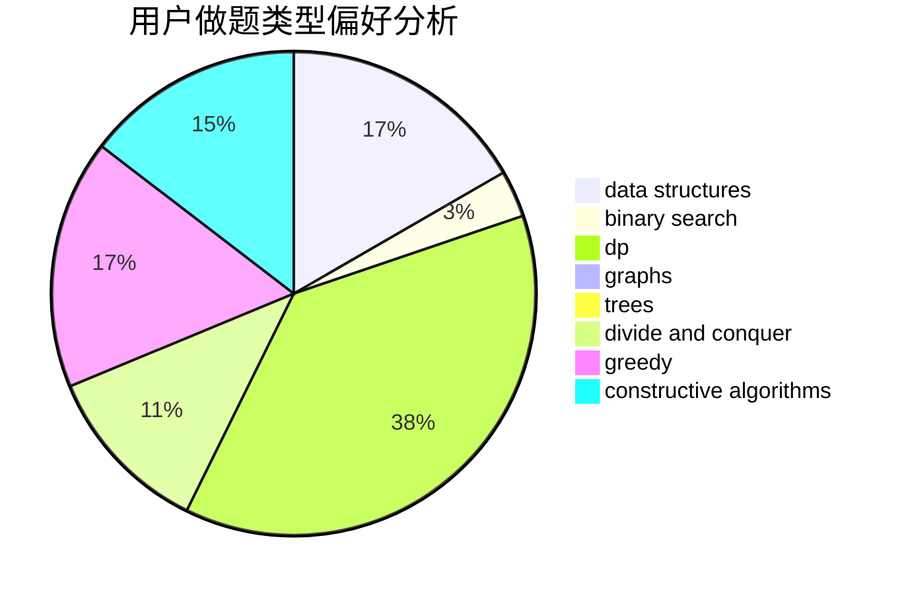
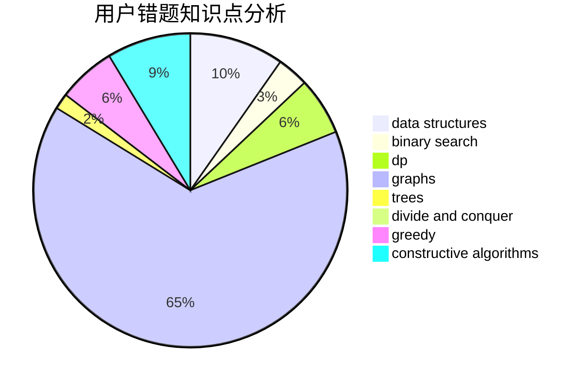

# cyc4188

<!-- tabs:start -->

#### **用户提交结果分析**

#### **用户做题类型偏好分析**

#### **用户错题知识点分析**

<!-- tabs:end -->
# 推荐题目
[1182C](https://codeforces.com/contest/1182/problem/C)		data structures,
                        greedy,
                        strings		  
[351C](https://codeforces.com/contest/351/problem/C)		dp,
                        matrices		  
[550B](https://codeforces.com/contest/550/problem/B)		bitmasks,
                        brute force		  
[915C](https://codeforces.com/contest/915/problem/C)		dp,
                        greedy		  
[612E](https://codeforces.com/contest/612/problem/E)		combinatorics,
                        constructive algorithms,
                        dfs and similar,
                        graphs,
                        math		  
[834D](https://codeforces.com/contest/834/problem/D)		dsu,graphs,sortings,trees		  
[993E](https://codeforces.com/contest/993/problem/E)		chinese remainder theorem,
                        fft,
                        math		  
[509A](https://codeforces.com/contest/509/problem/A)		brute force,
                        implementation		  
[1082B](https://codeforces.com/contest/1082/problem/B)		greedy		  
[1073B](https://codeforces.com/contest/1073/problem/B)		implementation,
                        math		  
