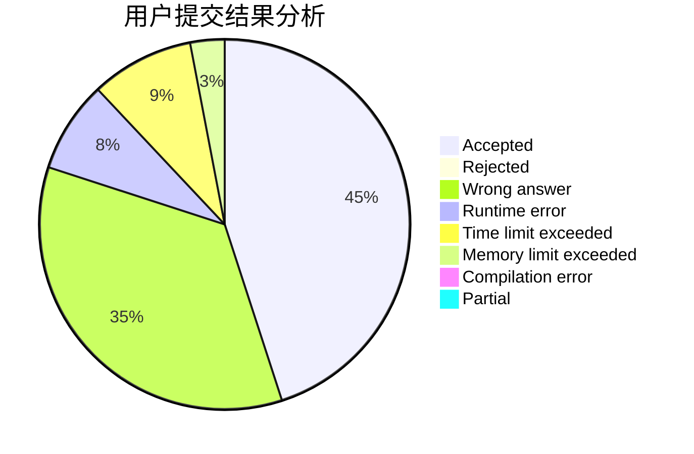
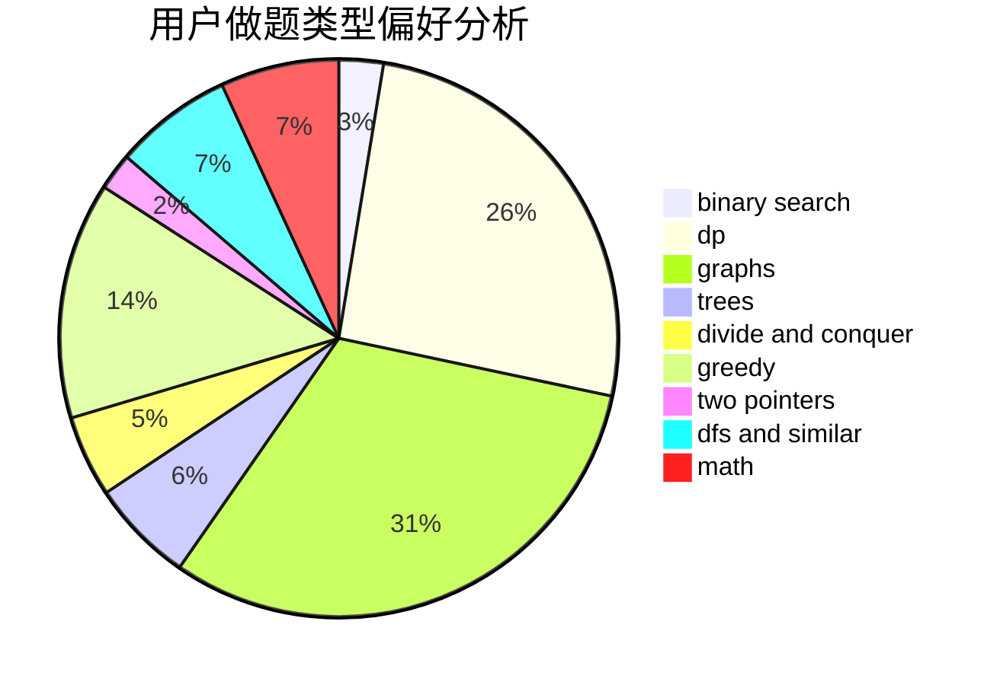

# cyc4188

<!-- tabs:start -->

#### **用户提交结果分析**

#### **用户做题类型偏好分析**

<!-- tabs:end -->
# 推荐题目
[1182C](https://codeforces.com/contest/1182/problem/C)
[351C](https://codeforces.com/contest/351/problem/C)
[550B](https://codeforces.com/contest/550/problem/B)
[915C](https://codeforces.com/contest/915/problem/C)
[612E](https://codeforces.com/contest/612/problem/E)
[834D](https://codeforces.com/contest/834/problem/D)
[993E](https://codeforces.com/contest/993/problem/E)
[509A](https://codeforces.com/contest/509/problem/A)
[1082B](https://codeforces.com/contest/1082/problem/B)
[1073B](https://codeforces.com/contest/1073/problem/B)
