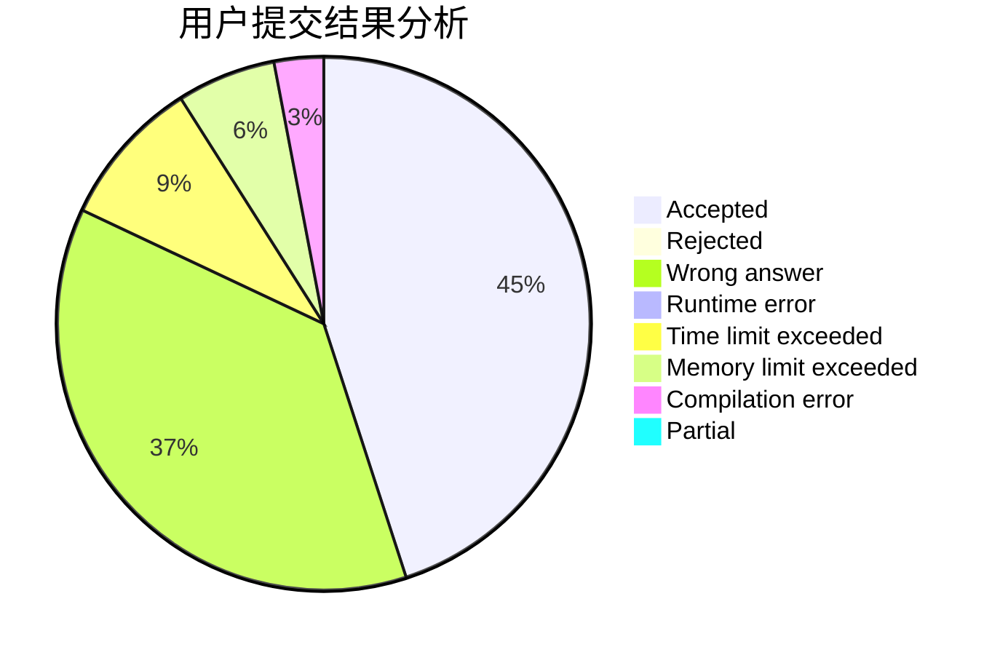
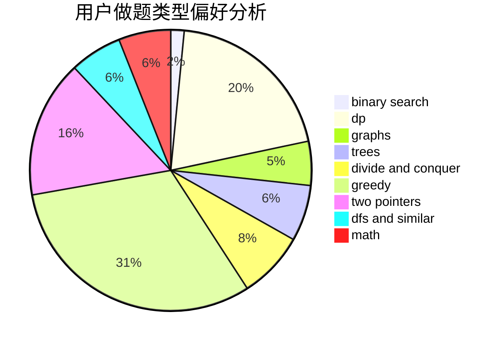

# cycl

<!-- tabs:start -->

#### **用户提交结果分析**

#### **用户做题类型偏好分析**

<!-- tabs:end -->
# 推荐题目
[13822](https://codeforces.com/contest/1382/problem/2)
[467A](https://codeforces.com/contest/467/problem/A)
[699C](https://codeforces.com/contest/699/problem/C)
[918D](https://codeforces.com/contest/918/problem/D)
[1156F](https://codeforces.com/contest/1156/problem/F)
[740D](https://codeforces.com/contest/740/problem/D)
[363B](https://codeforces.com/contest/363/problem/B)
[815A](https://codeforces.com/contest/815/problem/A)
[931A](https://codeforces.com/contest/931/problem/A)
[35C](https://codeforces.com/contest/35/problem/C)
