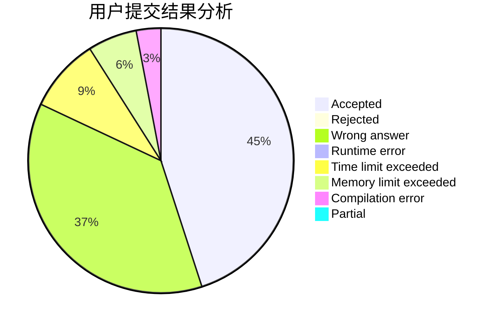
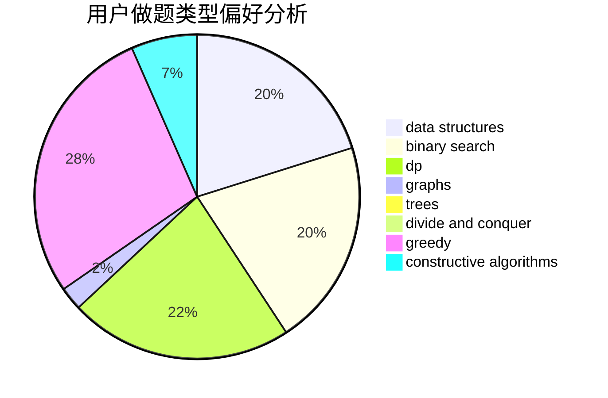
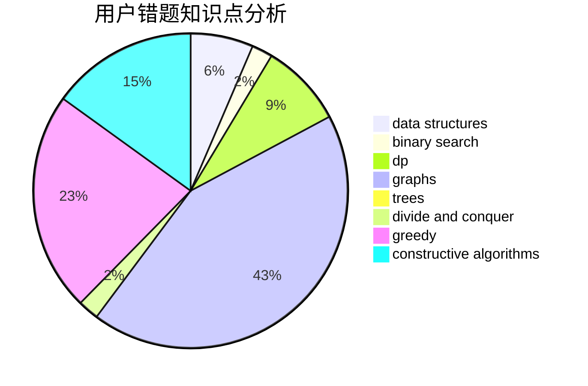

# cycl

<!-- tabs:start -->

#### **用户提交结果分析**

#### **用户做题类型偏好分析**

#### **用户错题知识点分析**

<!-- tabs:end -->
# 推荐题目
[1373D](https://codeforces.com/contest/1373/problem/D)		divide and conquer,
                        dp,
                        greedy,
                        implementation		  
[446E](https://codeforces.com/contest/446/problem/E)		math,
                        matrices		  
[674F](https://codeforces.com/contest/674/problem/F)		dsu,graphs,sortings,trees		  
[902B](https://codeforces.com/contest/902/problem/B)		dfs and similar,
                        dsu,
                        greedy		  
[1154F](https://codeforces.com/contest/1154/problem/F)		dp,
                        greedy,
                        sortings		  
[723C](https://codeforces.com/contest/723/problem/C)		greedy		  
[335F](https://codeforces.com/contest/335/problem/F)		dp,
                        greedy		  
[7E](https://codeforces.com/contest/7/problem/E)		dp,
                        expression parsing,
                        implementation		  
[912C](https://codeforces.com/contest/912/problem/C)		brute force,
                        greedy,
                        sortings		  
[331E2](https://codeforces.com/contest/331E/problem/2)		constructive algorithms,
                        dp		  
