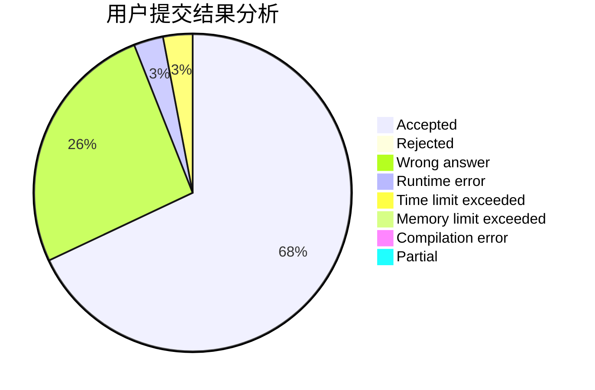
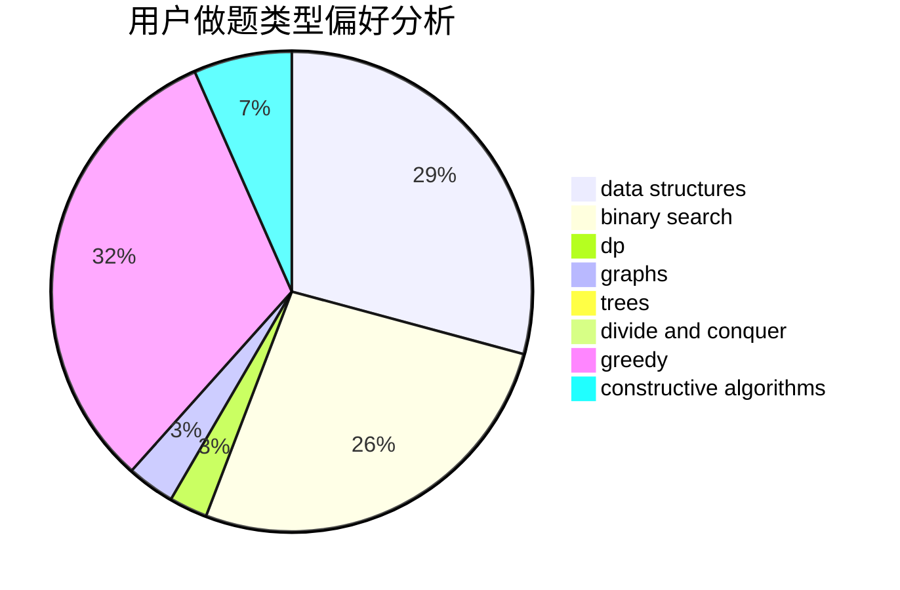
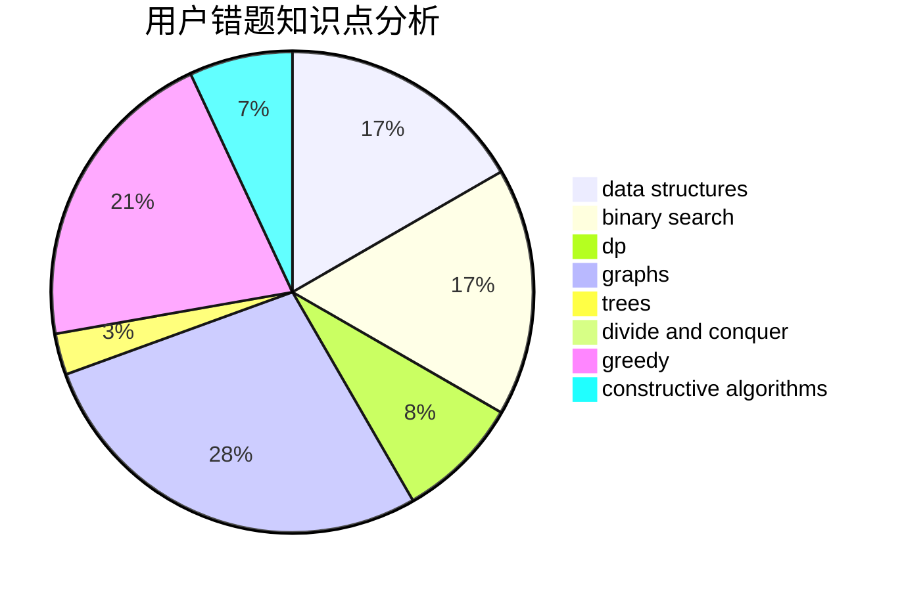

# cyh_toby

<!-- tabs:start -->

#### **用户提交结果分析**

#### **用户做题类型偏好分析**

#### **用户错题知识点分析**

<!-- tabs:end -->
# 推荐题目
[682D](https://codeforces.com/contest/682/problem/D)		dp,
                        strings		  
[254A](https://codeforces.com/contest/254/problem/A)		constructive algorithms,
                        sortings		  
[743E](https://codeforces.com/contest/743/problem/E)		binary search,
                        bitmasks,
                        brute force,
                        dp		  
[1013A](https://codeforces.com/contest/1013/problem/A)		math		  
[669D](https://codeforces.com/contest/669/problem/D)		dsu,graphs,sortings,trees		  
[827F](https://codeforces.com/contest/827/problem/F)		data structures,
                        dp,
                        graphs,
                        shortest paths		  
[873B](https://codeforces.com/contest/873/problem/B)		dp,
                        implementation		  
[1442D](https://codeforces.com/contest/1442/problem/D)		data structures,
                        divide and conquer,
                        dp,
                        greedy		  
[1221G](https://codeforces.com/contest/1221/problem/G)		bitmasks,
                        brute force,
                        combinatorics,
                        dp,
                        meet-in-the-middle		  
[436E](https://codeforces.com/contest/436/problem/E)		data structures,
                        greedy		  
