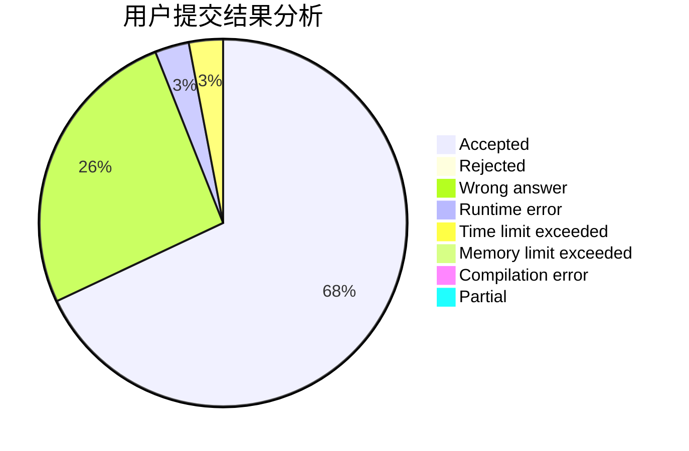
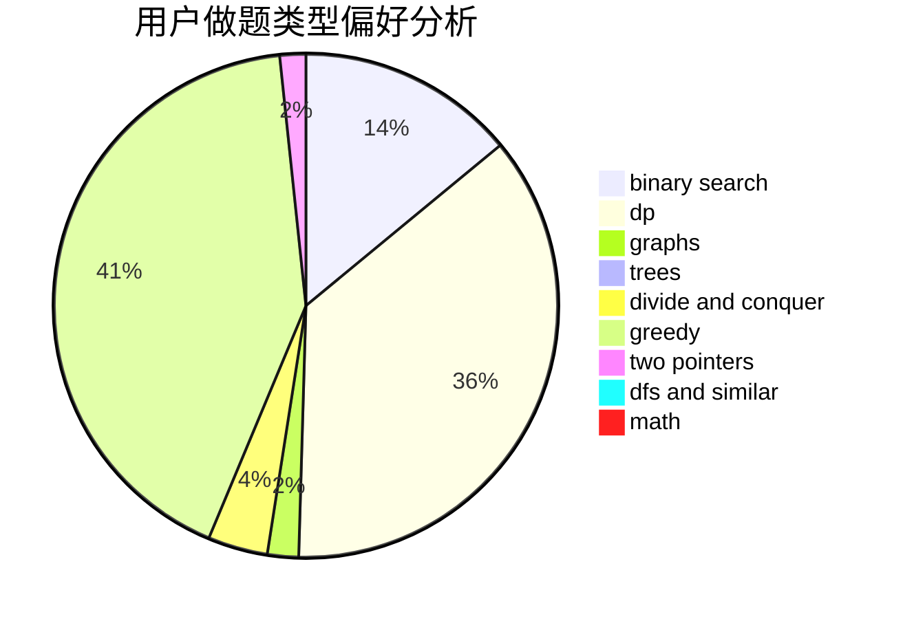

# cyh_toby

<!-- tabs:start -->

#### **用户提交结果分析**

#### **用户做题类型偏好分析**

<!-- tabs:end -->
# 推荐题目
[682D](https://codeforces.com/contest/682/problem/D)
[254A](https://codeforces.com/contest/254/problem/A)
[743E](https://codeforces.com/contest/743/problem/E)
[1013A](https://codeforces.com/contest/1013/problem/A)
[669D](https://codeforces.com/contest/669/problem/D)
[827F](https://codeforces.com/contest/827/problem/F)
[873B](https://codeforces.com/contest/873/problem/B)
[1442D](https://codeforces.com/contest/1442/problem/D)
[1221G](https://codeforces.com/contest/1221/problem/G)
[436E](https://codeforces.com/contest/436/problem/E)
