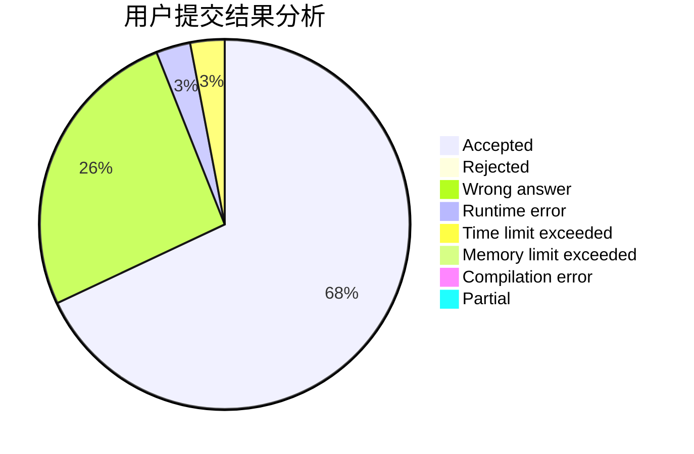
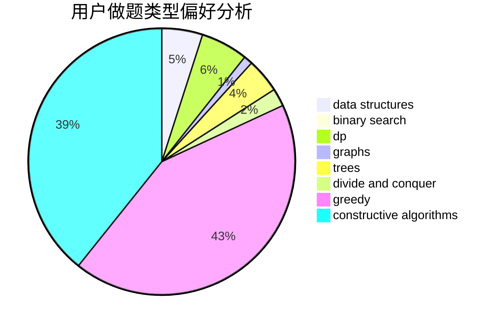
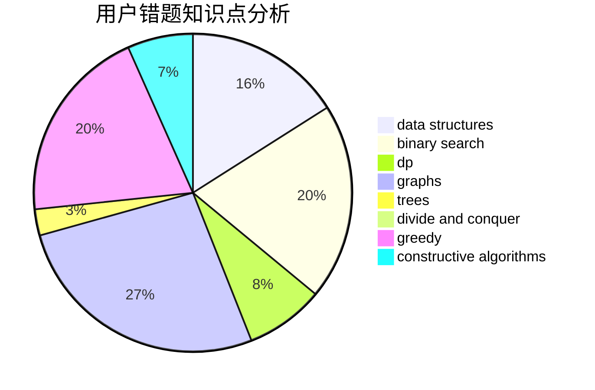

# cyh_toby

<!-- tabs:start -->

#### **用户提交结果分析**

#### **用户做题类型偏好分析**

#### **用户错题知识点分析**

<!-- tabs:end -->
# 推荐题目
[662D](https://codeforces.com/contest/662/problem/D)		constructive algorithms,
                        greedy,
                        implementation,
                        math		  
[232B](https://codeforces.com/contest/232/problem/B)		bitmasks,
                        combinatorics,
                        dp,
                        math		  
[725E](https://codeforces.com/contest/725/problem/E)		brute force,
                        greedy		  
[1012C](https://codeforces.com/contest/1012/problem/C)		dp		  
[639F](https://codeforces.com/contest/639/problem/F)		data structures,
                        dfs and similar,
                        graphs,
                        trees		  
[80B](https://codeforces.com/contest/80/problem/B)		geometry,
                        math		  
[855A](https://codeforces.com/contest/855/problem/A)		brute force,
                        implementation,
                        strings		  
[1432E](https://codeforces.com/contest/1432/problem/E)		dsu,graphs,sortings,trees		  
[1216C](https://codeforces.com/contest/1216/problem/C)		geometry,
                        math		  
[409D](https://codeforces.com/contest/409/problem/D)		*special problem		  
