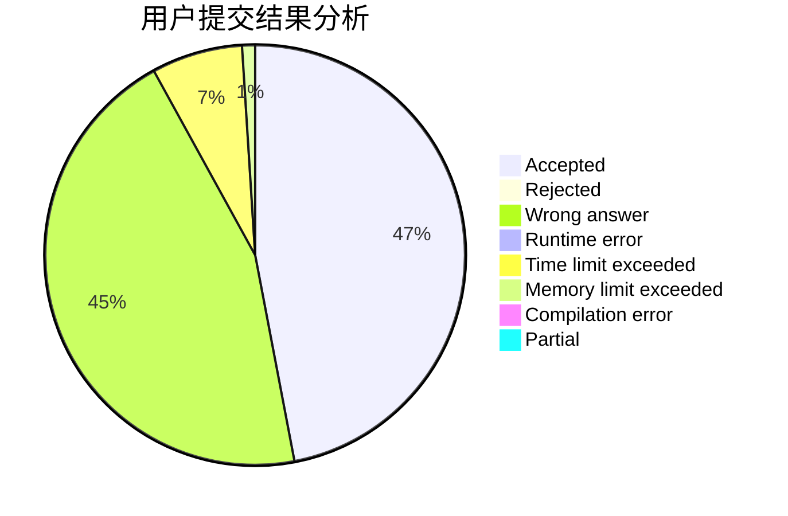
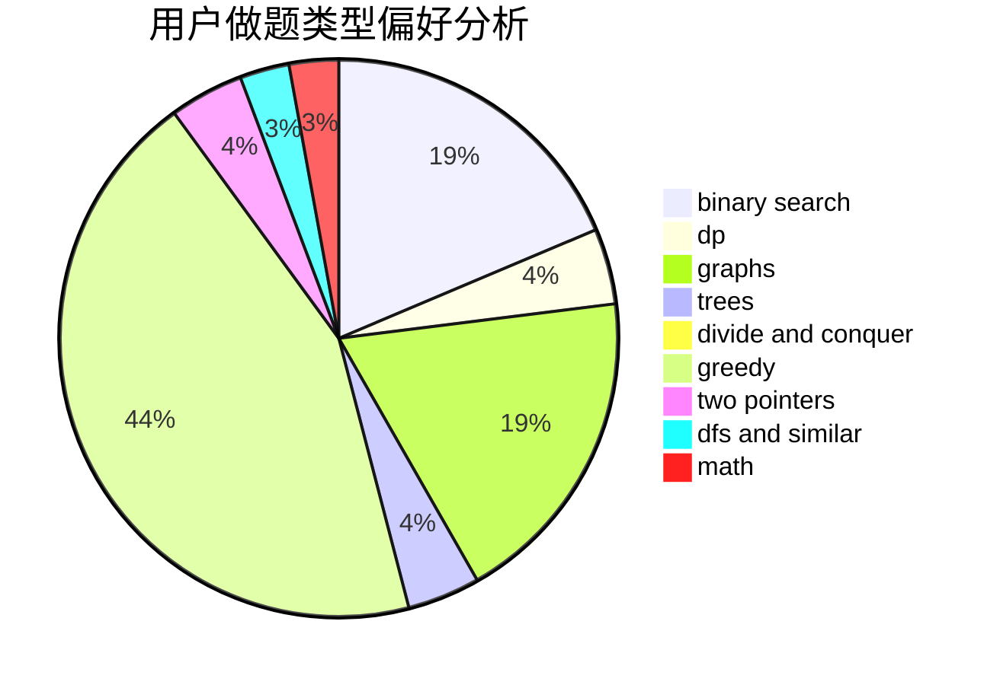

# cym_

<!-- tabs:start -->

#### **用户提交结果分析**

#### **用户做题类型偏好分析**

<!-- tabs:end -->
# 推荐题目
[1510K](https://codeforces.com/contest/1510/problem/K)
[1488C](https://codeforces.com/contest/1488/problem/C)
[868D](https://codeforces.com/contest/868/problem/D)
[1015D](https://codeforces.com/contest/1015/problem/D)
[870A](https://codeforces.com/contest/870/problem/A)
[285E](https://codeforces.com/contest/285/problem/E)
[1425A](https://codeforces.com/contest/1425/problem/A)
[723C](https://codeforces.com/contest/723/problem/C)
[1246C](https://codeforces.com/contest/1246/problem/C)
[1013A](https://codeforces.com/contest/1013/problem/A)
