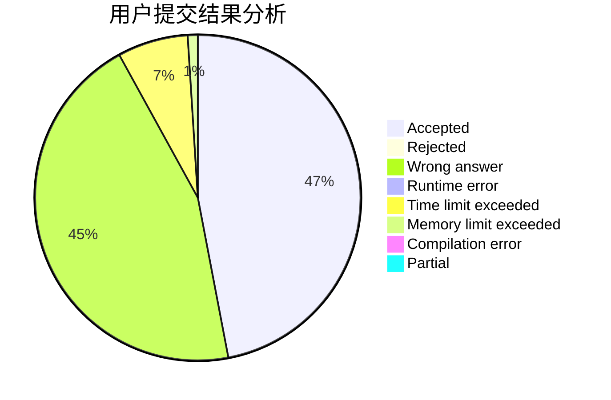
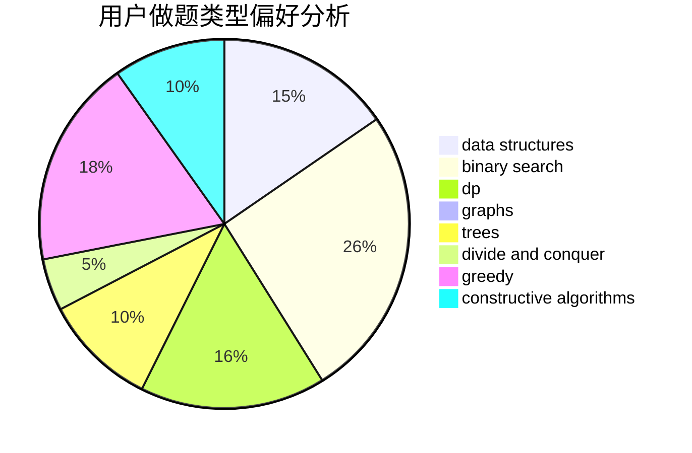
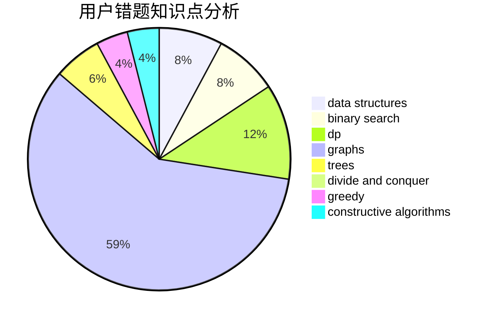

# cym_

<!-- tabs:start -->

#### **用户提交结果分析**

#### **用户做题类型偏好分析**

#### **用户错题知识点分析**

<!-- tabs:end -->
# 推荐题目
[1500E](https://codeforces.com/contest/1500/problem/E)		binary search,
                        data structures		  
[1479E](https://codeforces.com/contest/1479/problem/E)		dp,
                        fft,
                        math,
                        number theory,
                        probabilities		  
[849B](https://codeforces.com/contest/849/problem/B)		brute force,
                        geometry		  
[1015C](https://codeforces.com/contest/1015/problem/C)		sortings		  
[851D](https://codeforces.com/contest/851/problem/D)		dsu,graphs,sortings,trees		  
[269D](https://codeforces.com/contest/269/problem/D)		data structures,
                        dp,
                        graphs,
                        sortings		  
[1417D](https://codeforces.com/contest/1417/problem/D)		dsu,graphs,sortings,trees		  
[704C](https://codeforces.com/contest/704/problem/C)		dp,
                        graphs,
                        implementation,
                        math		  
[1240F](https://codeforces.com/contest/1240/problem/F)		graphs		  
[1012C](https://codeforces.com/contest/1012/problem/C)		dp		  
