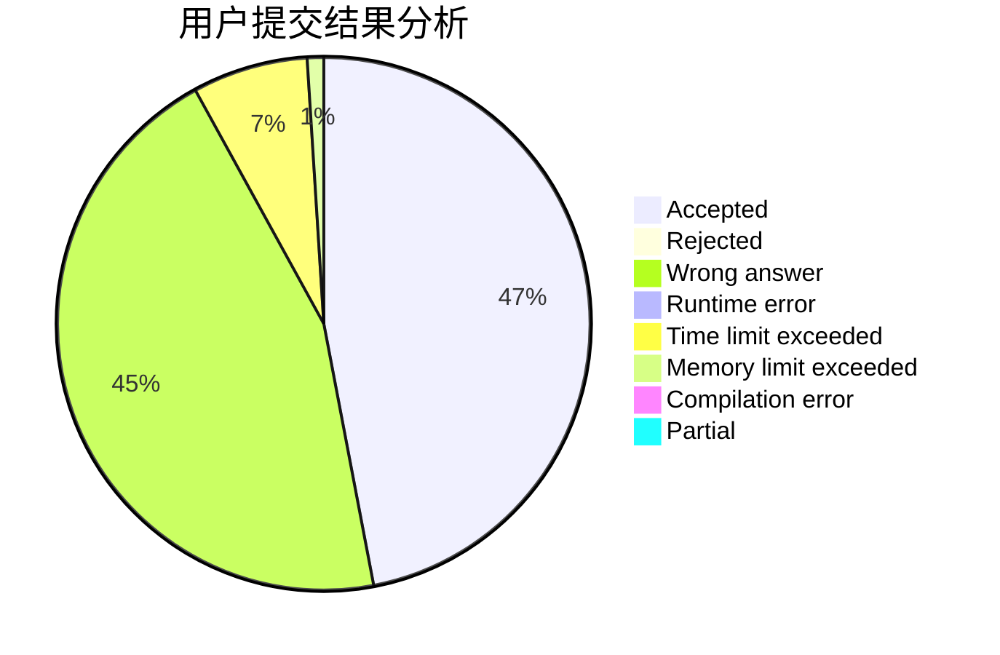
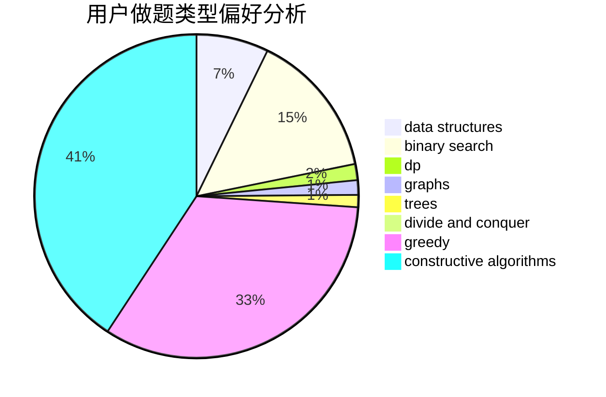
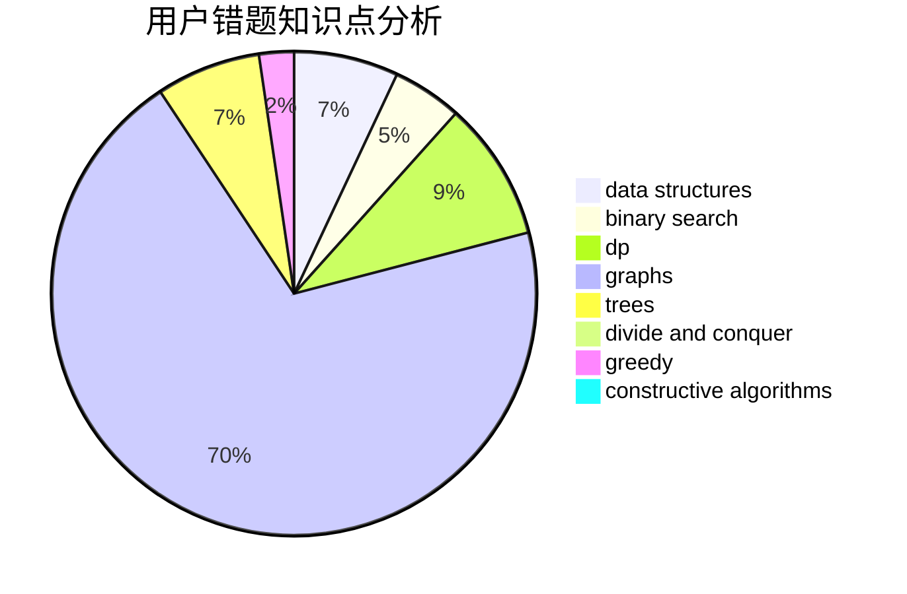

# cym_

<!-- tabs:start -->

#### **用户提交结果分析**

#### **用户做题类型偏好分析**

#### **用户错题知识点分析**

<!-- tabs:end -->
# 推荐题目
[1510K](https://codeforces.com/contest/1510/problem/K)		brute force,
                        graphs,
                        implementation		  
[1488C](https://codeforces.com/contest/1488/problem/C)		*special problem,
                        binary search,
                        brute force,
                        math		  
[868D](https://codeforces.com/contest/868/problem/D)		bitmasks,
                        brute force,
                        dp,
                        implementation,
                        strings		  
[1015D](https://codeforces.com/contest/1015/problem/D)		constructive algorithms,
                        greedy		  
[870A](https://codeforces.com/contest/870/problem/A)		brute force,
                        implementation		  
[285E](https://codeforces.com/contest/285/problem/E)		combinatorics,
                        dp,
                        math		  
[1425A](https://codeforces.com/contest/1425/problem/A)		games,
                        greedy		  
[723C](https://codeforces.com/contest/723/problem/C)		greedy		  
[1246C](https://codeforces.com/contest/1246/problem/C)		dsu,graphs,sortings,trees		  
[1013A](https://codeforces.com/contest/1013/problem/A)		math		  
